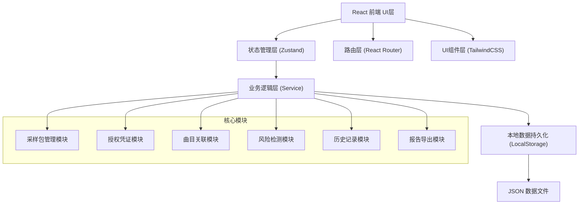
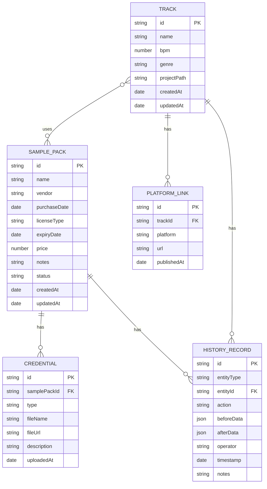

## 1. 架构设计



**设计说明**：
- 纯前端本地应用，无需后端服务，数据全部存储在浏览器 LocalStorage
- 采用分层架构，UI层与业务逻辑分离，便于维护
- 状态集中管理，确保状态与历史一致性
- 所有变更操作自动记录历史，永不覆盖原始数据

## 2. 技术描述

- **前端框架**：React@18 + TypeScript
- **构建工具**：Vite@5
- **样式方案**：TailwindCSS@3 + PostCSS
- **状态管理**：Zustand（轻量级，适合本地工具）
- **路由管理**：React Router@6
- **图标库**：Lucide React（线性简约图标）
- **日期处理**：date-fns（轻量级日期工具）
- **数据持久化**：LocalStorage + 自动备份机制
- **导出功能**：原生 JS 实现 HTML/Markdown 导出

## 3. 目录结构

```
src/
├── components/          # 可复用组件
│   ├── ui/             # 基础UI组件（按钮、卡片、标签等）
│   ├── layout/         # 布局组件（侧边栏、导航等）
│   └── features/       # 业务组件
├── pages/              # 页面组件
│   ├── Dashboard.tsx
│   ├── SamplePackList.tsx
│   ├── SamplePackDetail.tsx
│   ├── TrackDetail.tsx
│   └── Report.tsx
├── store/              # Zustand 状态管理
│   └── useStore.ts
├── services/           # 业务逻辑层
│   ├── samplePackService.ts
│   ├── trackService.ts
│   ├── riskDetectionService.ts
│   ├── historyService.ts
│   └── exportService.ts
├── types/              # TypeScript 类型定义
│   └── index.ts
├── data/               # 初始演示数据
│   └── mockData.ts
├── hooks/              # 自定义 Hooks
├── utils/              # 工具函数
├── App.tsx
├── main.tsx
└── index.css
```

## 4. 路由定义

| 路由路径 | 页面名称 | 说明 |
|---------|----------|------|
| `/` | 仪表盘 | 首页概览，风险提醒，快速操作 |
| `/sample-packs` | 采样包列表 | 所有采样包卡片展示 |
| `/sample-packs/:id` | 采样包详情 | 采样包信息、凭证、曲目、历史 |
| `/tracks/:id` | 曲目详情 | 曲目信息、关联采样包、平台链接 |
| `/report` | 授权报告 | 报告生成与导出 |

## 5. 数据模型

### 5.1 ER 图



### 5.2 核心类型定义

```typescript
// 授权状态枚举
type LicenseStatus = 'active' | 'expiring' | 'expired' | 'incomplete';

// 采样包
interface SamplePack {
  id: string;
  name: string;
  vendor: string;
  purchaseDate: string;
  licenseType: 'perpetual' | 'annual' | 'single-use' | 'custom';
  expiryDate?: string;
  price?: number;
  notes?: string;
  status: LicenseStatus;
  createdAt: string;
  updatedAt: string;
}

// 授权凭证
interface Credential {
  id: string;
  samplePackId: string;
  type: 'invoice' | 'receipt' | 'email' | 'contract' | 'other';
  fileName: string;
  fileUrl?: string;
  description?: string;
  uploadedAt: string;
}

// 曲目
interface Track {
  id: string;
  name: string;
  bpm?: number;
  genre?: string;
  projectPath?: string;
  samplePackIds: string[];
  createdAt: string;
  updatedAt: string;
}

// 平台链接
interface PlatformLink {
  id: string;
  trackId: string;
  platform: 'spotify' | 'netease' | 'apple' | 'tencent' | 'youtube' | 'other';
  url: string;
  publishedAt?: string;
}

// 历史记录（关键：永不覆盖）
interface HistoryRecord {
  id: string;
  entityType: 'samplePack' | 'track' | 'credential';
  entityId: string;
  action: 'create' | 'update' | 'delete' | 'link' | 'unlink';
  beforeData?: Record<string, unknown>;
  afterData: Record<string, unknown>;
  operator: string;
  timestamp: string;
  notes?: string;
}

// 风险检测结果
interface RiskAlert {
  id: string;
  type: 'expiry' | 'multi-use' | 'missing-credential' | 'other';
  severity: 'error' | 'warning' | 'info';
  title: string;
  message: string;
  relatedEntityId: string;
  relatedEntityType: string;
}
```

## 6. 核心业务规则

### 6.1 风险检测规则

1. **授权过期检测**：
   - 过期日 - 当前日期 ≤ 0 → 状态：expired，严重度：error
   - 过期日 - 当前日期 ≤ 30天 → 状态：expiring，严重度：warning
   - 永久授权 → 状态：active

2. **多曲共用检测**：
   - 一个采样包关联 ≥ 2 首曲目 → 触发 warning
   - 消息模板："「{采样包名}」被 {n} 首曲目使用，如果是单曲授权建议与法务确认"

3. **凭证缺失检测**：
   - 采样包无任何凭证 → 状态：incomplete，严重度：error
   - 凭证仅为截图/订单但无正式发票 → 触发 warning

### 6.2 历史记录规则

- **每次修改必须记录**：create/update/delete/link/unlink 操作全部记录
- **保存完整快照**：beforeData（修改前）和 afterData（修改后）完整保存
- **不可删除历史**：历史记录一旦生成，不可修改或删除
- **操作人记录**：默认记录为"本地用户"，支持自定义备注

### 6.3 状态一致性规则

- 状态由风险检测自动计算，用户不可手动修改
- 每次数据变更后重新运行检测，确保状态与数据一致
- 状态变更也会记录到历史记录中

## 7. 数据导出格式

### 7.1 HTML 导出
- 完整的单页 HTML，内联 CSS，无需外部依赖
- 可直接在浏览器打开或作为邮件附件发送
- 包含风险高亮、状态标签、完整数据表格

### 7.2 Markdown 导出
- 结构化 Markdown 文档
- 适合在团队协作工具（飞书、钉钉、Notion）中粘贴
- 包含元数据、风险摘要、详细数据表格
