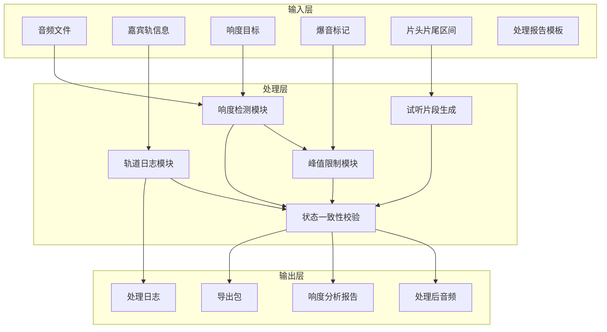

## 1. 产品概述

播客响度批量修正工具，为播客剪辑师提供一站式音频响度标准化解决方案。解决多嘉宾音量不均衡、平台响度要求不达标、爆音片段处理繁琐等核心痛点。

- 核心目标：批量处理多轨音频，自动拉齐嘉宾音量，满足平台响度标准，一键导出合规成品
- 目标用户：播客剪辑师、音频后期制作人员、播客创作者
- 市场价值：将传统手动逐段调整的工作流自动化，效率提升80%以上，避免人为失误导致的平台审核驳回

## 2. 核心功能

### 2.1 用户角色

| 角色 | 注册方式 | 核心权限 |
|------|----------|----------|
| 剪辑师 | 无需注册，本地工具 | 完整功能：音频导入、参数配置、响度处理、历史追溯、报告导出 |

### 2.2 功能模块

1. **音频列表页**：批量导入音频文件，显示处理状态、响度指标、进度概览
2. **音频详情页**：单轨波形可视化，响度曲线，爆音标记，嘉宾轨道分配
3. **参数编辑页**：响度目标配置，峰值限制，片头片尾保护区间，爆音阈值设置
4. **处理历史页**：操作日志，版本对比，参数回溯，一键回滚
5. **导出中心**：处理报告生成，多格式导出，批量下载，状态校验

### 2.3 页面详情

| 页面名称 | 模块名称 | 功能描述 |
|-----------|-------------|---------------------|
| 音频列表页 | 批量导入 | 支持拖拽上传，多文件同时导入，自动识别音频格式 |
| 音频列表页 | 状态卡片 | 显示文件名、时长、当前响度、目标响度、处理状态、操作按钮 |
| 音频列表页 | 批量操作 | 全选/反选，批量开始处理，批量删除，批量导出 |
| 音频详情页 | 波形可视化 | 时间轴缩放，波形预览，播放进度，选区标记 |
| 音频详情页 | 响度曲线 | 实时LUFS曲线，目标线对比，超标区域高亮 |
| 音频详情页 | 爆音标记 | 自动检测+手动标记，峰值数值显示，一键修复 |
| 音频详情页 | 嘉宾轨道 | 多轨分离显示，轨道命名，单独调整增益 |
| 参数编辑页 | 响度配置 | 目标LUFS设置（-16/-18/-23可选+自定义），响度范围容差 |
| 参数编辑页 | 峰值限制 | True Peak阈值设置，防止过冲的压缩器参数 |
| 参数编辑页 | 区间保护 | 片头片尾标记，保护区间不被压缩，淡入淡出时长 |
| 参数编辑页 | 爆音检测 | 阈值设置，检测灵敏度，自动修复开关 |
| 处理历史页 | 操作日志 | 时间戳，操作类型，参数变更记录，操作人员 |
| 处理历史页 | 版本管理 | 版本列表，参数对比，一键回滚到历史版本 |
| 导出中心 | 处理报告 | PDF/HTML格式，包含响度统计、峰值检测、处理时间线 |
| 导出中心 | 音频导出 | 支持WAV/MP3/AAC，批量命名规则，元数据保留 |

## 3. 核心流程

### 3.1 主处理流程

### 3.2 用户操作路径

1. 打开应用 → 拖拽或点击导入音频文件 → 系统自动解析并显示在列表中
2. 点击单条音频进入详情 → 查看波形和响度曲线 → 确认自动检测的爆音标记
3. 进入编辑页 → 设置目标响度（如-16 LUFS）→ 配置峰值限制（如-1 dBTP）→ 标记片头片尾保护区间
4. 试听处理前后对比片段 → 确认参数无误 → 点击开始处理
5. 处理完成后查看处理报告 → 确认所有指标达标 → 导出音频和报告
6. 可在历史页查看所有操作记录，必要时回滚到之前的参数版本

### 3.3 数据流说明

## 4. 用户界面设计

### 4.1 设计风格

**设计方向：专业音频工作站风格（极简黑底 + 霓虹点缀）**

- 主色调：深灰黑背景 `#121217`，营造专业音频工作环境
- 强调色：荧光青 `#00F0FF`（波形/曲线），霓虹紫 `#A855F7`（选中状态），警示橙 `#FF6B35`（爆音标记），成功绿 `#10B981`（达标状态）
- 字体：标题使用 `JetBrains Mono` 等宽字体，正文使用 `Inter`，数字显示使用 `Roboto Mono`
- 按钮风格：扁平直角，微渐变，hover时有霓虹发光效果
- 布局：左侧导航 + 主内容区 + 右侧参数面板的三栏布局
- 图标：使用线性风格，与音频工作站软件视觉语言一致

### 4.2 页面设计概览

| 页面名称 | 模块名称 | UI元素 |
|-----------|-------------|-------------|
| 音频列表页 | 顶部工具栏 | 导入按钮（大尺寸，拖拽区）、批量操作栏、搜索筛选 |
| 音频列表页 | 列表卡片 | 缩略波形、文件名、时长、响度数值（达标绿色/未达标红色）、状态标签、操作按钮组 |
| 音频详情页 | 波形区域 | 可缩放时间轴、波形渲染、响度曲线叠加、爆音标记点、播放头 |
| 音频详情页 | 轨道面板 | 多轨列表、轨道名称、静音/独奏按钮、增益滑块、电平表 |
| 音频详情页 | 播放控制 | 播放/暂停、前进/后退、循环、试听切换（处理前/后） |
| 参数编辑页 | 配置表单 | 滑块+数值输入联动、下拉选择、开关切换、实时预览 |
| 参数编辑页 | 区间标记 | 时间轴可视化标记、拖拽调整边界、数值精确输入 |
| 处理历史页 | 时间线 | 垂直时间轴、节点图标、参数差异高亮 |
| 导出中心 | 报告预览 | 数据可视化图表、关键指标卡片、下载按钮 |

### 4.3 响应式设计

- 采用桌面端优先设计，主窗口推荐分辨率 1440×900 及以上
- 支持窗口缩放，波形区域自适应宽度，最小支持 1024×768
- 移动端简化为单列布局，重点保留列表和播放功能
- 触摸优化：滑块、按钮最小尺寸 44×44px，手势支持双指缩放波形

### 4.4 交互动效

- 页面加载：采用骨架屏 + 渐入动画，波形区域从左到右逐段渲染
- 处理进度：进度条采用霓虹流动效果，伴随数值实时跳动
- 爆音标记：检测到爆音时，标记点脉冲闪烁提醒
- 参数调整：滑块拖动时有实时波形预览反馈
- 状态切换：处理完成时，达标指示器有平滑的颜色过渡动画
