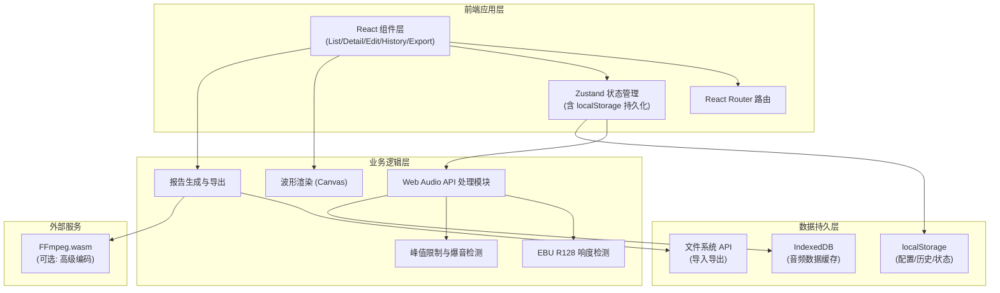
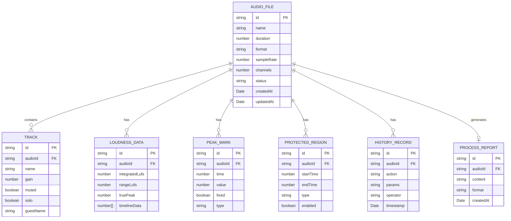

## 1. 架构设计



## 2. 技术描述

### 2.1 核心技术栈

| 层级 | 技术选型 | 版本 | 用途说明 |
|------|----------|------|----------|
| 构建工具 | Vite | 5.x | 快速开发构建，支持 HMR |
| 前端框架 | React | 18.x | 组件化开发，使用 Hooks |
| 语言 | TypeScript | 5.x | 类型安全，减少运行时错误 |
| 样式 | Tailwind CSS | 3.x | 原子化 CSS，快速构建 UI |
| 路由 | React Router | 6.x | 单页应用路由管理 |
| 状态管理 | Zustand | 4.x | 轻量级状态管理，支持 persist |
| 音频处理 | Web Audio API | - | 浏览器原生音频处理 |
| 波形绘制 | Canvas API | - | 高性能波形可视化 |
| 图标 | Lucide React | 0.x | 线性风格图标库 |

### 2.2 初始化方式

- 使用 `npm create vite@latest podcast-loudness -- --template react-ts` 初始化项目
- 手动安装依赖：`npm install react-router-dom zustand lucide-react tailwindcss@3 postcss autoprefixer`
- Tailwind CSS 初始化：`npx tailwindcss init -p`

### 2.3 目录结构

```
src/
├── components/          # 通用组件
│   ├── layout/         # 布局组件（Sidebar, Header）
│   ├── audio/          # 音频相关（Waveform, TrackList, Player）
│   ├── forms/          # 表单组件（Slider, Input, Toggle）
│   └── ui/             # 基础UI（Button, Card, Modal）
├── pages/              # 页面组件
│   ├── List.tsx        # 音频列表页
│   ├── Detail.tsx      # 音频详情页
│   ├── Edit.tsx        # 参数编辑页
│   ├── History.tsx     # 处理历史页
│   └── Export.tsx      # 导出中心页
├── store/              # 状态管理
│   ├── useAudioStore.ts    # 音频数据 store
│   ├── useConfigStore.ts   # 配置参数 store
│   └── useHistoryStore.ts  # 历史记录 store
├── utils/              # 工具函数
│   ├── audio/          # 音频处理工具
│   │   ├── loudness.ts    # 响度检测
│   │   ├── peak.ts        # 峰值检测
│   │   └── waveform.ts    # 波形生成
│   ├── export/         # 导出工具
│   │   ├── report.ts      # 报告生成
│   │   └── file.ts        # 文件处理
│   └── storage/        # 存储工具
│       ├── persist.ts     # 状态持久化
│       └── validator.ts   # 数据校验
├── types/              # TypeScript 类型定义
│   └── index.ts
├── hooks/              # 自定义 Hooks
│   ├── useAudioPlayer.ts
│   ├── useWaveform.ts
│   └── useLocalStorage.ts
├── mock/               # Mock 数据
│   └── sampleData.ts
├── App.tsx             # 根组件
├── main.tsx            # 入口文件
└── index.css           # 全局样式
```

## 3. 路由定义

| 路由路径 | 页面名称 | 功能说明 |
|----------|----------|----------|
| `/` | 音频列表页 | 首页，显示所有导入的音频文件列表 |
| `/audio/:id` | 音频详情页 | 显示单个音频的波形、响度曲线、轨道信息 |
| `/audio/:id/edit` | 参数编辑页 | 配置响度目标、峰值限制、区间保护等参数 |
| `/history` | 处理历史页 | 显示所有操作记录和版本管理 |
| `/export` | 导出中心 | 生成处理报告，导出音频文件 |

## 4. 数据模型

### 4.1 实体关系图



### 4.2 TypeScript 类型定义

```typescript
// 音频文件
export interface AudioFile {
  id: string;
  name: string;
  duration: number;
  format: string;
  sampleRate: number;
  channels: number;
  status: 'pending' | 'analyzing' | 'ready' | 'processing' | 'completed' | 'error';
  audioBuffer?: AudioBuffer;
  waveformData?: number[];
  createdAt: number;
  updatedAt: number;
}

// 嘉宾轨道
export interface Track {
  id: string;
  audioId: string;
  name: string;
  guestName: string;
  gain: number;
  muted: boolean;
  solo: boolean;
  color: string;
}

// 响度数据
export interface LoudnessData {
  id: string;
  audioId: string;
  integratedLufs: number;
  rangeLufs: number;
  truePeak: number;
  momentaryLufs: number[];
  shortTermLufs: number[];
  samplePoints: number[];
}

// 爆音标记
export interface PeakMark {
  id: string;
  audioId: string;
  time: number;
  value: number;
  fixed: boolean;
  type: 'clip' | 'overshoot' | 'manual';
}

// 保护区域
export interface ProtectedRegion {
  id: string;
  audioId: string;
  startTime: number;
  endTime: number;
  type: 'intro' | 'outro' | 'music' | 'custom';
  enabled: boolean;
}

// 处理参数配置
export interface ProcessConfig {
  targetLufs: number;
  lufsTolerance: number;
  truePeakLimit: number;
  compressorThreshold: number;
  compressorRatio: number;
  attackTime: number;
  releaseTime: number;
  enableAutoGain: boolean;
  enablePeakLimiter: boolean;
  protectIntro: boolean;
  protectOutro: boolean;
  introDuration: number;
  outroDuration: number;
  fadeInDuration: number;
  fadeOutDuration: number;
}

// 历史记录
export interface HistoryRecord {
  id: string;
  audioId: string;
  action: string;
  params: Record<string, any>;
  previousParams?: Record<string, any>;
  operator: string;
  timestamp: number;
}

// 处理报告
export interface ProcessReport {
  id: string;
  audioId: string;
  originalLufs: number;
  processedLufs: number;
  originalPeak: number;
  processedPeak: number;
  peakMarksCount: number;
  fixedPeaksCount: number;
  processingTime: number;
  appliedConfig: ProcessConfig;
  createdAt: number;
}

// 应用状态
export interface AppState {
  audioFiles: AudioFile[];
  tracks: Track[];
  loudnessData: Record<string, LoudnessData>;
  peakMarks: PeakMark[];
  protectedRegions: ProtectedRegion[];
  processConfig: ProcessConfig;
  historyRecords: HistoryRecord[];
  reports: ProcessReport[];
  currentAudioId: string | null;
  isPlaying: boolean;
  currentTime: number;
  selection: { start: number; end: number } | null;
}
```

## 5. 核心模块设计

### 5.1 响度检测模块

**文件位置**：`src/utils/audio/loudness.ts`

**核心算法**：基于 EBU R128 标准实现响度计算
- 输入：AudioBuffer 音频数据
- 输出：综合响度 (Integrated LUFS)、响度范围 (Loudness Range)、瞬时响度时间序列
- 关键步骤：K加权滤波 → 平方 → 均值 → 对数转换 → 门限处理

### 5.2 峰值限制模块

**文件位置**：`src/utils/audio/peak.ts`

**功能**：
- 实时峰值检测，识别超过阈值的爆音片段
- 峰值限制器实现，防止响度过冲
- 爆音自动修复：压缩/限幅/插值平滑

### 5.3 状态持久化模块

**文件位置**：`src/utils/storage/persist.ts`

**实现**：
- 使用 Zustand persist 中间件
- 存储键：`podcast-loudness-state-v1`
- 白名单：audioFiles, processConfig, historyRecords, peakMarks, protectedRegions
- 黑名单：audioBuffer, waveformData（大数据不存 localStorage）
- 版本迁移：支持数据结构升级

### 5.4 波形渲染模块

**文件位置**：`src/utils/audio/waveform.ts`

**性能优化**：
- 降采样：根据显示宽度计算采样步长
- 离屏 Canvas 预渲染
- 增量渲染：只重绘变化区域
- 虚拟滚动：处理长音频时只渲染可见区域

## 6. 状态管理设计

### 6.1 Store 划分

1. **useAudioStore** - 音频数据管理
   - 音频文件列表 CRUD
   - 波形数据缓存
   - 播放状态控制

2. **useConfigStore** - 处理参数配置
   - 响度目标、峰值限制等参数
   - 预设方案管理
   - 参数变更历史

3. **useHistoryStore** - 操作历史管理
   - 记录所有参数变更
   - 版本对比
   - 回滚功能

### 6.2 状态校验机制

**文件位置**：`src/utils/storage/validator.ts`

**校验规则**：
- 响度目标范围：-30 ~ -10 LUFS
- 峰值限制范围：-6 ~ 0 dBTP
- 时间区间有效性：start < end
- 数据完整性：必填字段非空
- 状态一致性：处理完成后参数不可随意修改

## 7. 边界条件处理

### 7.1 响度过冲保护
- 采用前瞻型峰值限制器（look-ahead limiter）
- 设置 5ms 预读时间，提前检测峰值
- 压缩比渐变，避免 abrupt 变化

### 7.2 静音误删防护
- 静音检测阈值：-60 LUFS
- 最短静音长度：500ms
- 静音区间不进行增益调整

### 7.3 片头片尾保护
- 可配置保护区间，不应用动态压缩
- 保护区间内只做线性增益调整
- 过渡区域采用平滑淡入淡出

### 7.4 状态一致性保障
- 处理完成后锁定关键参数
- 修改参数自动创建新版本
- 历史记录不可删除，可追溯
- 导入新数据时校验时间戳
