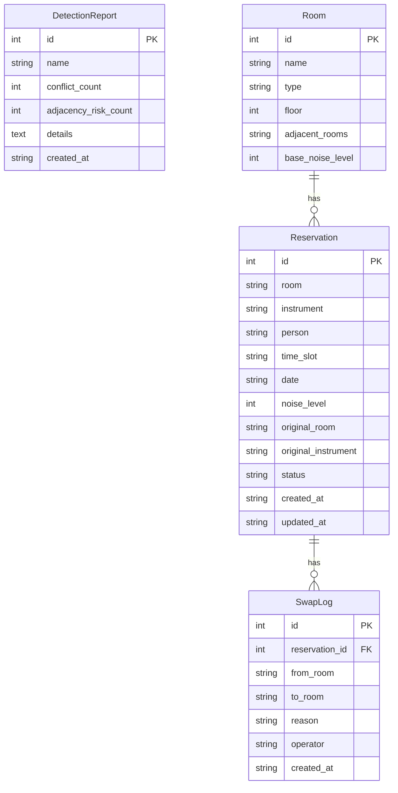

## 1. 架构设计

```mermaid
flowchart TD
    "React 前端 (Vite)" --> "Express API 层"
    "Express API 层" --> "业务逻辑层 (检测/换房/导出)"
    "业务逻辑层" --> "SQLite 持久层"
    "SQLite 持久层" --> "数据文件 (data/app.db)"
```

## 2. 技术说明
- 前端：React@18 + Tailwind CSS@3 + Vite
- 初始化工具：Vite (react-ts template)
- 后端：Express@4 + better-sqlite3
- 数据库：SQLite（文件持久化，重启不丢失）
- 状态管理：React Context + useReducer
- 图标：Lucide React

## 3. 路由定义
| 路由 | 用途 |
|------|------|
| / | 排班总览页：预约记录表格、筛选、修正、换房 |
| /detect | 排班检测页：冲突检测、噪声邻接分析、报告保存 |

## 4. API 定义

### 预约记录
- `GET /api/reservations` — 获取预约列表（支持 query 筛选：room, instrument, person, dateFrom, dateTo, noiseLevel）
- `POST /api/reservations` — 新增预约
- `PUT /api/reservations/:id` — 修改预约
- `DELETE /api/reservations/:id` — 删除预约

### 换房留痕
- `POST /api/reservations/:id/swap` — 执行换房，body: { newRoom, reason }
- `GET /api/swap-logs` — 获取换房记录

### 排班检测
- `POST /api/detect/conflicts` — 执行时段冲突检测，返回冲突列表
- `POST /api/detect/noise-adjacency` — 执行噪声邻接分析，返回风险列表

### 报告
- `POST /api/reports` — 保存检测报告
- `GET /api/reports` — 获取历史报告列表
- `GET /api/reports/:id` — 获取报告详情

### 导出
- `GET /api/export/reservations` — 导出预约 CSV
- `GET /api/export/swap-logs` — 导出换房记录 CSV
- `GET /api/export/notification` — 导出检测通知文本

### 琴房配置
- `GET /api/rooms` — 获取琴房列表及相邻关系
- `PUT /api/rooms/:id` — 修改琴房信息（含相邻关系）

### TypeScript 类型定义
```typescript
interface Reservation {
  id: number
  room: string
  instrument: string
  person: string
  timeSlot: string
  date: string
  noiseLevel: number
  originalRoom?: string
  originalInstrument?: string
  status: 'normal' | 'conflict' | 'high_noise' | 'swapped'
  createdAt: string
  updatedAt: string
}

interface SwapLog {
  id: number
  reservationId: number
  fromRoom: string
  toRoom: string
  reason: string
  operator: string
  createdAt: string
}

interface ConflictResult {
  type: 'time_conflict'
  reservationIds: number[]
  room: string
  timeSlot: string
  date: string
  description: string
  status: 'pending' | 'resolved'
}

interface NoiseAdjacencyResult {
  type: 'noise_adjacency'
  reservationIds: number[]
  roomA: string
  roomB: string
  timeSlot: string
  date: string
  noiseA: number
  noiseB: number
  combinedRisk: 'high' | 'medium' | 'low'
  suggestion: string
  status: 'pending' | 'resolved'
}

interface DetectionReport {
  id: number
  name: string
  conflictCount: number
  adjacencyRiskCount: number
  details: string
  createdAt: string
}

interface Room {
  id: number
  name: string
  type: string
  floor: number
  adjacentRooms: string[]
  baseNoiseLevel: number
}
```

## 5. 服务端架构图

```mermaid
flowchart TD
    "Controller 层 (路由处理)" --> "Service 层 (业务逻辑)"
    "Service 层" --> "Repository 层 (数据访问)"
    "Repository 层" --> "better-sqlite3"
```

## 6. 数据模型

### 6.1 数据模型定义



### 6.2 数据定义语言

```sql
CREATE TABLE IF NOT EXISTS rooms (
  id INTEGER PRIMARY KEY AUTOINCREMENT,
  name TEXT NOT NULL UNIQUE,
  type TEXT NOT NULL,
  floor INTEGER NOT NULL DEFAULT 1,
  adjacent_rooms TEXT NOT NULL DEFAULT '',
  base_noise_level INTEGER NOT NULL DEFAULT 3
);

CREATE TABLE IF NOT EXISTS reservations (
  id INTEGER PRIMARY KEY AUTOINCREMENT,
  room TEXT NOT NULL,
  instrument TEXT NOT NULL,
  person TEXT NOT NULL,
  time_slot TEXT NOT NULL,
  date TEXT NOT NULL,
  noise_level INTEGER NOT NULL DEFAULT 3,
  original_room TEXT,
  original_instrument TEXT,
  status TEXT NOT NULL DEFAULT 'normal',
  created_at TEXT NOT NULL DEFAULT (datetime('now')),
  updated_at TEXT NOT NULL DEFAULT (datetime('now'))
);

CREATE TABLE IF NOT EXISTS swap_logs (
  id INTEGER PRIMARY KEY AUTOINCREMENT,
  reservation_id INTEGER NOT NULL,
  from_room TEXT NOT NULL,
  to_room TEXT NOT NULL,
  reason TEXT NOT NULL DEFAULT '',
  operator TEXT NOT NULL DEFAULT 'admin',
  created_at TEXT NOT NULL DEFAULT (datetime('now')),
  FOREIGN KEY (reservation_id) REFERENCES reservations(id)
);

CREATE TABLE IF NOT EXISTS detection_reports (
  id INTEGER PRIMARY KEY AUTOINCREMENT,
  name TEXT NOT NULL,
  conflict_count INTEGER NOT NULL DEFAULT 0,
  adjacency_risk_count INTEGER NOT NULL DEFAULT 0,
  details TEXT NOT NULL DEFAULT '',
  created_at TEXT NOT NULL DEFAULT (datetime('now'))
);

CREATE INDEX IF NOT EXISTS idx_reservations_room_date ON reservations(room, date);
CREATE INDEX IF NOT EXISTS idx_reservations_time_slot ON reservations(time_slot);
CREATE INDEX IF NOT EXISTS idx_reservations_person ON reservations(person);
CREATE INDEX IF NOT EXISTS idx_reservations_status ON reservations(status);
```

### 初始数据

琴房配置：
- A101 钢琴房 (1F, 相邻 A102/A103, 基础噪声 2)
- A102 钢琴房 (1F, 相邻 A101/A103, 基础噪声 2)
- A103 鼓房 (1F, 相邻 A102/B201, 基础噪声 5)
- B201 声乐教室 (2F, 相邻 A103/B202, 基础噪声 4)
- B202 钢琴房 (2F, 相邻 B201/B203, 基础噪声 2)
- B203 鼓房 (2F, 相邻 B202, 基础噪声 5)

时段：08:00-10:00, 10:00-12:00, 14:00-16:00, 16:00-18:00, 19:00-21:00

初始预约记录（含冲突和噪声邻接示例）：
- A101 08:00-10:00 张老师 钢琴 噪声2
- A103 08:00-10:00 李老师 架子鼓 噪声5
- B201 08:00-10:00 王老师 声乐 噪声4  (与A103高噪声相邻)
- A102 10:00-12:00 张老师 钢琴 噪声2
- A102 10:00-12:00 赵老师 钢琴 噪声2  (与张老师冲突)
- B203 14:00-16:00 刘老师 架子鼓 噪声5
- B202 14:00-16:00 陈老师 钢琴 噪声2  (与B203高噪声相邻)
- A103 16:00-18:00 李老师 架子鼓 噪声5
