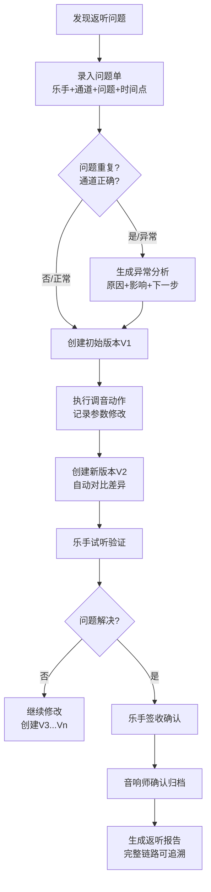

## 1. 产品概述

现场返听问题单系统是为演出音响师设计的专业工具，用于彩排时记录、追踪和管理每个乐手的返听问题，确保调音修改全程可追溯，历史版本永不丢失。

- **核心价值**：解决彩排现场返听问题记录混乱、修改无痕迹、责任不清晰的痛点
- **目标用户**：音响师、调音助理、舞台技术总监
- **关键特性**：全链路可追溯、版本留痕、问题去重、签收确认、报告导出

## 2. 核心功能

### 2.1 用户角色

| 角色 | 注册方式 | 核心权限 |
|------|----------|----------|
| 音响师 | 本地创建 | 创建问题单、记录调音动作、导出报告、确认签收 |
| 乐手 | 扫码查看 | 查看自己的返听问题、确认问题已解决 |
| 技术总监 | 本地创建 | 全量查看、问题去重、版本对比、审计追溯 |

### 2.2 功能模块

1. **问题单工作台**：问题列表、快速录入、通道状态总览
2. **问题详情页**：完整追溯链、版本对比、影响分析
3. **版本历史页**：每次修改的完整记录、差异对比
4. **报告导出页**：按彩排场次生成正式返听报告
5. **签收确认页**：乐手/音响师双确认、责任闭环

### 2.3 页面详情

| 页面名称 | 模块名称 | 功能描述 |
|-----------|-------------|---------------------|
| 问题单工作台 | 通道状态面板 | 实时显示各监听通道状态（正常/待处理/已修改待确认） |
| 问题单工作台 | 快速录入区 | 一键记录：乐手姓名、监听通道、问题描述、时间点 |
| 问题单工作台 | 问题列表 | 按通道/时间/状态筛选，高亮重复问题和异常记录 |
| 问题详情页 | 追溯时间线 | 从发现问题→调音动作→修改验证→签收确认的完整链路 |
| 问题详情页 | 异常分析卡 | 通道写错、问题重复、旧值覆盖时，显示原因、影响范围、下一步动作 |
| 问题详情页 | 版本对比器 | 相邻版本字段级差异高亮，可回退任意历史版本 |
| 版本历史页 | 版本瀑布流 | 所有修改记录按时间倒序，显示操作人、修改内容、备注 |
| 报告导出页 | 报告生成器 | 按场次/日期/乐手维度导出PDF，包含完整追溯链 |
| 签收确认页 | 双签面板 | 乐手确认问题解决 + 音响师确认调音完成 |

## 3. 核心流程

## 4. 用户界面设计

### 4.1 设计风格
- **主色调**：深灰蓝 `#0f172a`（舞台低光环境友好）+ 琥珀橙 `#f59e0b`（高亮警示）+ 翠绿 `#10b981`（正常状态）
- **按钮风格**：直角、细边框、hover时轻微发光，专业控制台风格
- **字体**：主字体 `JetBrains Mono`（等宽字体，时间和参数对齐美观）+ 标题字体 `Space Grotesk`
- **布局风格**：左右分栏，左侧通道状态树，右侧问题详情时间线
- **视觉元素**：细网格背景、垂直时间线、发光状态指示灯、复古VU表风格的状态指示器

### 4.2 页面设计概述

| 页面名称 | 模块名称 | UI元素 |
|-----------|-------------|-------------|
| 问题单工作台 | 通道状态面板 | 通道编号+乐手姓名卡片，状态指示灯（绿/黄/红），hover显示最新问题 |
| 问题单工作台 | 问题列表 | 斑马纹表格，异常行橙色描边，重复问题带重复标记徽章 |
| 问题详情页 | 追溯时间线 | 左侧垂直时间轴，每个节点带版本号、操作人、时间戳，右侧卡片显示内容 |
| 问题详情页 | 异常分析卡 | 橙色边框卡片，顶部警示图标，分三栏：原因→影响范围→下一步动作 |
| 问题详情页 | 版本对比器 | 左右分栏对比，差异字段红绿色高亮，可切换相邻版本对比 |
| 报告导出页 | 报告预览 | A4比例预览区，页眉带场次信息，页脚带签收区 |

### 4.3 响应式
- 桌面端（1920px）：三栏布局（通道树+问题列表+详情）
- 平板端（1024px）：两栏布局（通道树折叠为图标，问题列表+详情）
- 移动端：单栏堆叠，底部Tab导航，优化触控区域

## 5. 数据追溯设计

### 5.1 追溯链路字段
每条问题记录必须包含：
- **来源标识**：乐手姓名、所属声部、监听通道编号
- **问题域**：问题描述、发现时间、彩排场次
- **动作域**：调音动作（EQ/压缩/增益/延迟）、修改前后参数、操作人
- **确认域**：试听结果、乐手签名、音响师确认、最终时间戳
- **版本域**：版本号、父版本ID、变更字段、变更原因

### 5.2 异常检测规则
- **通道写错**：通道号超出物理范围（如1-32）或与乐手历史通道不匹配
- **问题重复**：同一通道+同一问题描述在30分钟内重复录入
- **旧值覆盖**：同一字段在无新版本的情况下被直接修改

### 5.3 验收路径
1. 通道状态 → 点击异常通道 → 查看异常分析
2. 问题列表 → 筛选重复问题 → 查看去重合并记录
3. 问题详情 → 点击版本历史 → 对比任意两版差异
4. 签收面板 → 查看乐手+音响师双签记录
5. 报告导出 → 验证导出内容与页面数据一致性
