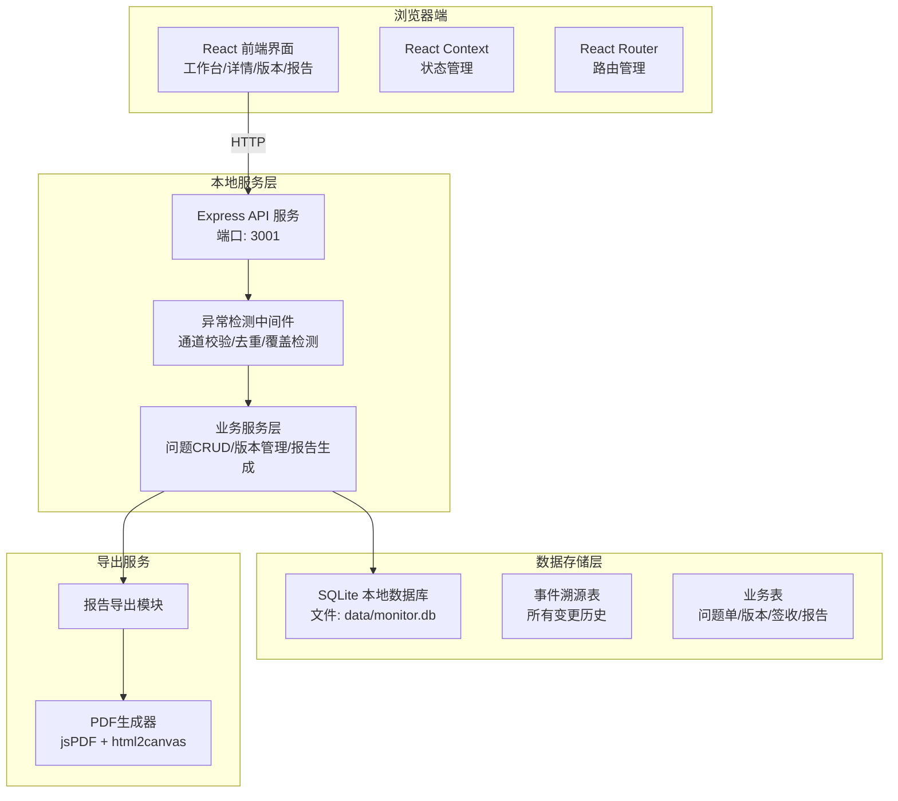
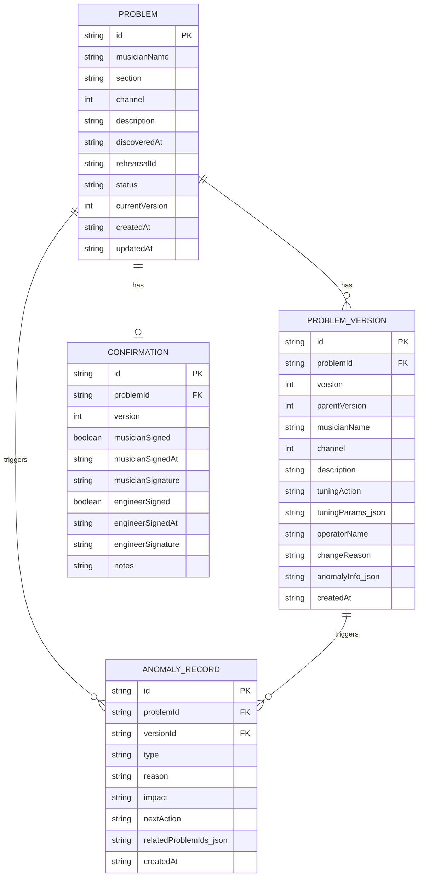

## 1. 架构设计



## 2. 技术描述

- **前端**：React@18 + TypeScript + TailwindCSS@3 + Vite@5 + React Router@6
- **后端**：Express@4 + TypeScript + better-sqlite3（同步SQLite，本地高性能）
- **初始化工具**：npm create vite@latest + 手动搭建Express服务
- **数据库**：SQLite 本地文件存储，无需外部服务，开箱即用
- **数据追溯**：事件溯源(Event Sourcing)模式，所有修改均为追加新记录，永不删除旧版本
- **PDF导出**：jspdf + html2canvas，前端生成，无需后端依赖

## 3. 目录结构

```
/
├── client/                 # 前端代码
│   ├── src/
│   │   ├── components/     # 可复用组件
│   │   │   ├── ChannelStatusPanel.tsx
│   │   │   ├── ProblemTimeline.tsx
│   │   │   ├── VersionDiffViewer.tsx
│   │   │   ├── AnomalyCard.tsx
│   │   │   └── SignaturePanel.tsx
│   │   ├── pages/          # 页面组件
│   │   │   ├── Dashboard.tsx
│   │   │   ├── ProblemDetail.tsx
│   │   │   ├── VersionHistory.tsx
│   │   │   ├── ReportExport.tsx
│   │   │   └── Confirmation.tsx
│   │   ├── services/       # API调用
│   │   ├── types/          # TypeScript类型定义
│   │   └── utils/          # 工具函数（版本对比、PDF导出）
│   └── package.json
├── server/                 # 后端代码
│   ├── src/
│   │   ├── routes/         # API路由
│   │   ├── middleware/     # 异常检测中间件
│   │   ├── services/       # 业务逻辑
│   │   ├── db/             # 数据库初始化和操作
│   │   └── types/          # 类型定义
│   ├── data/               # SQLite数据库文件目录
│   └── package.json
└── package.json            # 根目录，并发启动前后端
```

## 4. 路由定义

| 路由 | 页面 | 用途 |
|-------|------|------|
| `/` | 问题单工作台 | 通道状态、问题列表、快速录入 |
| `/problem/:id` | 问题详情 | 追溯时间线、异常分析、版本对比 |
| `/problem/:id/versions` | 版本历史 | 完整版本瀑布流、任意版本对比 |
| `/export` | 报告导出 | 按维度筛选、预览、导出PDF |
| `/confirm/:id` | 签收确认 | 乐手和音响师双确认 |

## 5. API 定义

### 5.1 类型定义

```typescript
// 问题单主记录
interface Problem {
  id: string;
  musicianName: string;
  section: string;        // 声部：主唱/吉他/贝斯/鼓/键盘等
  channel: number;        // 监听通道号 1-32
  description: string;    // 问题描述
  discoveredAt: string;   // 发现时间 ISO
  rehearsalId: string;    // 彩排场次ID
  status: 'pending' | 'in_progress' | 'resolved' | 'confirmed';
  currentVersion: number;
  createdAt: string;
  updatedAt: string;
}

// 版本记录（每次修改创建新版本）
interface ProblemVersion {
  id: string;
  problemId: string;
  version: number;
  parentVersion: number | null;
  musicianName: string;
  channel: number;
  description: string;
  tuningAction: string | null;   // 调音动作描述
  tuningParams: TuningParams | null;  // 具体参数修改
  operatorName: string;          // 操作人
  changeReason: string | null;   // 修改原因
  anomalyDetected: AnomalyInfo | null;  // 异常检测结果
  createdAt: string;
}

// 调音参数
interface TuningParams {
  eq?: { freq: number; gain: number; q: number }[];
  compression?: { threshold: number; ratio: number; attack: number; release: number };
  gain?: number;
  delay?: number;
  pan?: number;
}

// 异常信息
interface AnomalyInfo {
  type: 'channel_invalid' | 'duplicate' | 'overwrite';
  reason: string;
  impact: string;
  nextAction: string;
  relatedProblemIds?: string[];  // 关联的重复问题
}

// 签收记录
interface Confirmation {
  id: string;
  problemId: string;
  version: number;
  musicianSigned: boolean;
  musicianSignedAt: string | null;
  musicianSignature: string | null;
  engineerSigned: boolean;
  engineerSignedAt: string | null;
  engineerSignature: string | null;
  notes: string | null;
}
```

### 5.2 接口列表

| 方法 | 路径 | 描述 |
|------|------|------|
| GET | `/api/problems` | 获取问题列表（支持筛选：status, channel, musician） |
| GET | `/api/problems/:id` | 获取问题详情（含当前版本） |
| POST | `/api/problems` | 创建新问题（自动创建V1版本，检测异常） |
| GET | `/api/problems/:id/versions` | 获取问题的所有版本历史 |
| GET | `/api/problems/:id/versions/:v1/:v2` | 对比两个版本的差异 |
| POST | `/api/problems/:id/versions` | 创建新版本（调音修改，自动对比差异） |
| POST | `/api/problems/:id/confirm` | 签收确认（乐手/音响师） |
| GET | `/api/channels/status` | 获取所有通道状态 |
| GET | `/api/report` | 生成报告数据（支持按场次、日期筛选） |
| GET | `/api/anomalies` | 获取所有异常记录 |

## 6. 数据模型

### 6.1 ER图



### 6.2 DDL 语句

```sql
-- 问题单主表
CREATE TABLE IF NOT EXISTS problems (
  id TEXT PRIMARY KEY,
  musician_name TEXT NOT NULL,
  section TEXT NOT NULL,
  channel INTEGER NOT NULL,
  description TEXT NOT NULL,
  discovered_at TEXT NOT NULL,
  rehearsal_id TEXT NOT NULL,
  status TEXT NOT NULL DEFAULT 'pending',
  current_version INTEGER NOT NULL DEFAULT 1,
  created_at TEXT NOT NULL,
  updated_at TEXT NOT NULL
);

CREATE INDEX idx_problems_channel ON problems(channel);
CREATE INDEX idx_problems_status ON problems(status);
CREATE INDEX idx_problems_rehearsal ON problems(rehearsal_id);

-- 版本历史表（永不删除，只追加）
CREATE TABLE IF NOT EXISTS problem_versions (
  id TEXT PRIMARY KEY,
  problem_id TEXT NOT NULL,
  version INTEGER NOT NULL,
  parent_version INTEGER,
  musician_name TEXT NOT NULL,
  channel INTEGER NOT NULL,
  description TEXT NOT NULL,
  tuning_action TEXT,
  tuning_params TEXT,
  operator_name TEXT NOT NULL,
  change_reason TEXT,
  anomaly_info TEXT,
  created_at TEXT NOT NULL,
  FOREIGN KEY (problem_id) REFERENCES problems(id),
  UNIQUE(problem_id, version)
);

CREATE INDEX idx_versions_problem ON problem_versions(problem_id);
CREATE INDEX idx_versions_version ON problem_versions(version);

-- 签收确认表
CREATE TABLE IF NOT EXISTS confirmations (
  id TEXT PRIMARY KEY,
  problem_id TEXT NOT NULL,
  version INTEGER NOT NULL,
  musician_signed INTEGER NOT NULL DEFAULT 0,
  musician_signed_at TEXT,
  musician_signature TEXT,
  engineer_signed INTEGER NOT NULL DEFAULT 0,
  engineer_signed_at TEXT,
  engineer_signature TEXT,
  notes TEXT,
  created_at TEXT NOT NULL,
  FOREIGN KEY (problem_id) REFERENCES problems(id)
);

CREATE UNIQUE INDEX idx_confirmations_problem ON confirmations(problem_id, version);

-- 异常记录表
CREATE TABLE IF NOT EXISTS anomaly_records (
  id TEXT PRIMARY KEY,
  problem_id TEXT NOT NULL,
  version_id TEXT NOT NULL,
  type TEXT NOT NULL,
  reason TEXT NOT NULL,
  impact TEXT NOT NULL,
  next_action TEXT NOT NULL,
  related_problem_ids TEXT,
  created_at TEXT NOT NULL,
  FOREIGN KEY (problem_id) REFERENCES problems(id),
  FOREIGN KEY (version_id) REFERENCES problem_versions(id)
);

-- 彩排场次表
CREATE TABLE IF NOT EXISTS rehearsals (
  id TEXT PRIMARY KEY,
  name TEXT NOT NULL,
  date TEXT NOT NULL,
  venue TEXT,
  created_at TEXT NOT NULL
);

-- 初始化默认场次
INSERT OR IGNORE INTO rehearsals (id, name, date, venue, created_at) 
VALUES ('default', '默认彩排场次', datetime('now'), '本地场地', datetime('now'));
```

### 6.3 初始Mock数据

系统启动时自动插入10条示例数据，覆盖以下场景：
- 3条正常流程的问题（待处理→处理中→已解决→已确认）
- 2条通道写错的问题（异常检测触发）
- 2条重复问题（30分钟内同一通道同一问题）
- 2条有多版本修改记录的问题
- 1条已完成双签确认的问题

## 7. 异常检测中间件逻辑

### 7.1 通道写错检测
```
IF channel < 1 OR channel > 32:
   → 异常类型: channel_invalid
   → 原因: "通道号超出物理范围 (1-32)"
   → 影响: "调音台无此通道，无法执行调音动作"
   → 下一步: "请核实乐手对应的监听通道编号"
ELSE IF 乐手历史通道存在 AND 当前通道 ≠ 历史通道:
   → 异常类型: channel_invalid
   → 原因: "乐手{name}历史使用通道为{old}，当前填写{new}"
   → 影响: "可能导致调音到错误的通道，乐手听不到调整"
   → 下一步: "确认通道是否变更，或修正通道号"
```

### 7.2 问题重复检测
```
SELECT * FROM problems 
WHERE channel = 当前通道 
  AND description LIKE 当前问题描述（相似度>80%）
  AND created_at > 30分钟前

IF 找到匹配记录:
   → 异常类型: duplicate
   → 原因: "30分钟内同一通道已记录相似问题"
   → 影响: "重复记录可能导致调音动作冲突或遗漏"
   → 下一步: "建议合并到已有问题 #{id}，或确认是新问题"
```

### 7.3 旧值覆盖检测
```
IF 更新操作未携带新版本号 AND 修改了已存在的字段:
   → 异常类型: overwrite
   → 原因: "直接修改已有版本字段值，未创建新版本"
   → 影响: "历史修改记录丢失，无法追溯调整过程"
   → 下一步: "请通过创建新版本的方式进行修改，保留历史轨迹"
```

## 8. 启动脚本

```json
{
  "scripts": {
    "dev": "concurrently \"npm run dev:server\" \"npm run dev:client\"",
    "dev:server": "cd server && npm run dev",
    "dev:client": "cd client && npm run dev",
    "build": "cd client && npm run build",
    "start": "cd server && npm start"
  }
}
```

- 后端端口：3001
- 前端端口：5173（Vite默认）
- 启动命令：`npm install && npm run dev`
- 访问地址：http://localhost:5173
