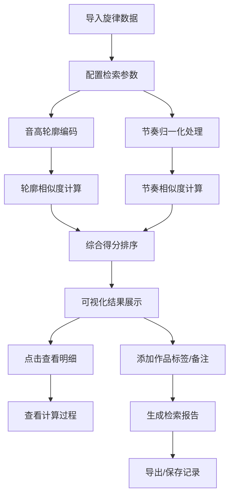

## 1. 产品概述

旋律相似度检索工具是一款面向音乐教育场景的专业数据分析工具，帮助作曲教师快速发现学生作品中的旋律相似片段，支持音高轮廓匹配、节奏归一化分析、相似片段可视化溯源，提供可复盘的检索报告。

- **核心价值**：解决作曲课上"旋律撞了"的人工排查效率问题，实现从可视化图谱到明细数据的完整溯源
- **目标用户**：作曲教师、音乐理论研究员、学生作品评审人员
- **解决痛点**：表格间数据复制繁琐、移调后漏匹配、节奏拉伸难以识别、相似结果缺乏计算过程透明性

## 2. 核心功能

### 2.1 用户角色

| 角色 | 注册方式 | 核心权限 |
|------|----------|----------|
| 教师用户 | 本地配置 | 数据导入、相似度检索、报告导出、记录管理 |
| 学生用户 | 无需注册 | 查看自己作品的检索结果、添加备注 |

### 2.2 功能模块

1. **检索工作台**：旋律片段输入、参数配置、实时检索、结果可视化
2. **记录中心**：历史检索记录、作品标签管理、备注编辑、数据筛选
3. **分析面板**：音高轮廓编码展示、节奏归一化对比、相似度计算过程、匹配明细
4. **报告导出**：检索报告生成、PDF/JSON导出、计算过程留存

### 2.3 页面详情

| 页面名称 | 模块名称 | 功能描述 |
|----------|----------|----------|
| 检索工作台 | 旋律输入区 | 支持钢琴卷帘输入、MIDI导入、简谱/五线谱文本解析 |
| 检索工作台 | 参数配置 | 轮廓匹配权重、节奏匹配权重、移调容错、节奏拉伸阈值 |
| 检索工作台 | 结果可视化 | 相似片段高亮对比、时间轴对齐、钢琴卷帘叠加显示 |
| 记录中心 | 记录列表 | 检索历史、作品标签筛选、学生维度聚合 |
| 记录中心 | 明细查看 | 点击图谱跳转至对应明细行、计算过程展开 |
| 分析面板 | 轮廓编码 | 音高轮廓序列可视化、编码规则说明 |
| 分析面板 | 节奏归一 | 节奏型归一化前后对比、时间拉伸系数 |
| 分析面板 | 相似排序 | 综合得分拆解、各维度得分明细、排序规则 |
| 报告导出 | 报告生成 | 自动生成检索报告、保留关键中间值、支持备注追加 |

## 3. 核心流程

**核心流程说明**：
1. 用户导入旋律片段（支持多种输入方式）并配置检索参数
2. 系统并行进行音高轮廓编码和节奏归一化处理
3. 分别计算轮廓相似度和节奏相似度，加权得到综合得分
4. 结果按综合得分排序，可视化展示相似片段
5. 支持从可视化图谱点击跳转到对应明细行，查看完整计算过程
6. 添加作品标签和学生备注后生成报告，导出并形成可查记录

## 4. 用户界面设计

### 4.1 设计风格

- **主色调**：深靛蓝 (#1E3A5F) - 代表专业、严谨的音乐分析工具气质
- **辅助色**：琥珀橙 (#F59E0B) - 用于高亮匹配片段、关键操作按钮
- **强调色**：翠绿 (#10B981) - 表示通过/正常，玫红 (#EC4899) - 表示警告/高相似度
- **背景系统**：深灰蓝渐变背景 (#0F172A → #1E293B)，营造专业数据分析氛围
- **按钮风格**：微圆角 (6px)、轻微悬浮上浮效果、点击反馈
- **字体选择**：标题使用 Playfair Display（衬线字体，音乐艺术感），正文使用 JetBrains Mono（等宽字体，数据可读性）
- **布局风格**：三栏式专业布局 + 钢琴卷帘可视化区域，信息密度高但层次清晰
- **图标风格**：线性音乐图标（音符、谱号、钢琴键等），统一2px线条宽度

### 4.2 页面设计概述

| 页面名称 | 模块名称 | UI 元素 |
|----------|----------|---------|
| 检索工作台 | 顶部导航 | Logo、功能页签、用户信息、快捷导出 |
| 检索工作台 | 左侧输入区 | 钢琴卷帘编辑器、MIDI导入按钮、简谱输入框 |
| 检索工作台 | 中间可视化 | 双轨对比钢琴卷帘、时间轴、片段高亮 |
| 检索工作台 | 右侧参数 | 权重滑块、阈值输入、实时匹配预览 |
| 记录中心 | 顶部筛选 | 标签筛选器、日期范围、学生姓名搜索 |
| 记录中心 | 数据表格 | 可展开明细行、计算过程折叠面板 |
| 分析面板 | 轮廓编码区 | 序列图表、编码图例、差异标记 |
| 分析面板 | 节奏对比区 | 节奏型堆叠图、归一化前后对照 |
| 报告导出 | 报告预览 | 报告结构导航、关键指标卡片、计算过程留存区 |

### 4.3 响应性

- **桌面优先**：针对 1440px+ 宽屏优化三栏布局
- **平板适配**：1024px 切换为上下布局，可视化区域占满宽度
- **触控优化**：钢琴卷帘支持触控缩放、滑动浏览
- **断点设计**：1920px（极致宽屏）、1440px（标准桌面）、1024px（平板）、768px（移动）

### 4.4 动效与交互

- **页面加载**：钢琴卷帘从左到右渐入绘制，数据行 staggered 上浮
- **匹配高亮**：发现匹配时，琥珀色光条从匹配点扩散至整个片段
- **明细展开**：点击图谱时，对应表格行平滑滚动并展开，带有连接线条动效
- **参数调节**：滑块拖动时实时预览匹配结果变化，带有数字跳动动效
- **钢琴卷帘悬停**：悬停音符时显示音高、时长、所属作品信息 tooltip
