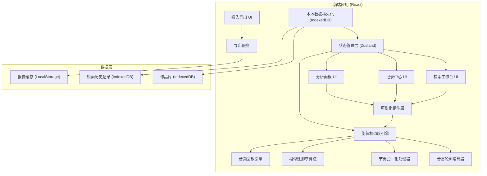
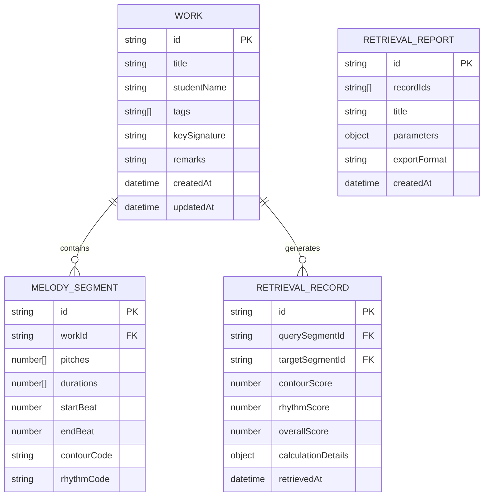
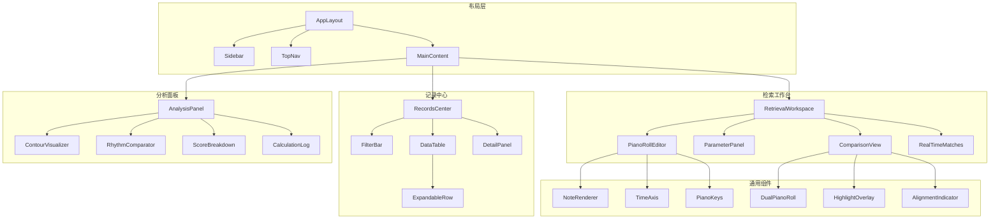

## 1. 架构设计



## 2. 技术描述

- **前端框架**：React@18 + TypeScript@5
- **构建工具**：Vite@5
- **样式方案**：TailwindCSS@3 + CSS Variables
- **状态管理**：Zustand（轻量级，适合音乐数据状态）
- **可视化**：Canvas 2D API（钢琴卷帘）+ SVG（图表）
- **音频处理**：Web Audio API（片段回放）
- **本地存储**：IndexedDB (Dexie.js) + LocalStorage
- **图表库**：Recharts（相似度趋势、得分拆解）
- **导出功能**：jsPDF (PDF导出) + JSON 原生序列化
- **图标**：Lucide React（音乐相关图标）

## 3. 核心算法模块

### 3.1 音高轮廓编码 (Pitch Contour Encoding)

| 算法名称 | 描述 | 参数 |
|----------|------|------|
| 相对音高编码 | 将绝对音高转换为相对音高变化序列 | 窗口大小、量化级别 |
| 轮廓方向编码 | 编码音高变化方向（上升/下降/平稳） | 平稳阈值 |
| 区间量化编码 | 将音程大小量化为离散级别 | 量化级数 |

### 3.2 节奏归一化 (Rhythm Normalization)

| 处理步骤 | 描述 | 关键参数 |
|----------|------|----------|
| 时长比例化 | 将绝对时长转换为相对比例 | 基准节拍单位 |
| 节奏型抽象 | 提取节奏型特征向量 | 最小音符单位 |
| 时间拉伸容差 | 允许一定比例的节奏伸缩 | 拉伸阈值 (0.7-1.4) |

### 3.3 相似性计算

| 维度 | 算法 | 权重范围 |
|------|------|----------|
| 轮廓相似度 | DTW (动态时间规整) | 0.4 - 0.7 |
| 节奏相似度 | 编辑距离 + 归一化 | 0.3 - 0.6 |
| 音程匹配度 | 余弦相似度 | 0.0 - 0.3 |

### 3.4 移调不变性处理

- 采用相对音高编码，消除绝对音高影响
- 支持 12 个半音范围内的移调检测
- 保留调号信息用于报告，但不影响匹配结果

## 4. 路由定义

| 路由 | 页面 | 核心功能 |
|------|------|----------|
| / | 检索工作台 | 旋律输入、实时检索、可视化对比 |
| /records | 记录中心 | 历史检索、作品管理、明细查看 |
| /analysis | 分析面板 | 编码展示、计算过程、得分拆解 |
| /report | 报告导出 | 报告生成、预览、导出 |

## 5. 数据模型

### 5.1 ER 图



### 5.2 核心数据结构

```typescript
// 旋律片段
interface MelodySegment {
  id: string;
  workId: string;
  pitches: number[];      // MIDI 音高编号
  durations: number[];    // 相对时长 (以四分音符为1)
  startBeat: number;
  endBeat: number;
  contour: ContourCode;
  rhythm: RhythmCode;
}

// 音高轮廓编码
interface ContourCode {
  relative: number[];     // 相对音高序列
  direction: ('up' | 'down' | 'flat')[];
  intervals: number[];    // 音程序列
  rawSequence: string;    // 编码字符串
}

// 节奏编码
interface RhythmCode {
  normalized: number[];   // 归一化时长序列
  pattern: string;        // 节奏型字符串
  stretchFactor: number;  // 时间拉伸系数
}

// 检索结果
interface RetrievalResult {
  id: string;
  querySegment: MelodySegment;
  targetSegment: MelodySegment;
  targetWork: Work;
  scores: {
    contour: {
      raw: number;
      normalized: number;
      weight: number;
      details: DTWResult;
    };
    rhythm: {
      raw: number;
      normalized: number;
      weight: number;
      details: EditDistanceResult;
    };
    overall: number;
  };
  transposition: number;  // 移调半音数
  timeStretch: number;    // 时间拉伸比例
  matched: boolean;
}

// 计算过程留存
interface CalculationDetails {
  parameters: RetrievalParams;
  contourEncoding: {
    input: number[];
    output: string;
    steps: string[];
  };
  rhythmNormalization: {
    input: number[];
    output: number[];
    stretchFactor: number;
  };
  similarityCalc: {
    contourDTW: {
      distance: number;
      path: [number, number][];
    };
    rhythmEdit: {
      distance: number;
      operations: string[];
    };
  };
}
```

## 6. 组件架构



## 7. 关键技术决策

1. **Canvas 而非 SVG 用于钢琴卷帘**：音符数量多时性能更好，支持平滑缩放平移
2. **Web Audio API 实现回放**：无需后端，实时生成音频，支持变速播放
3. **IndexedDB 存储作品库**：支持大量旋律数据的本地存储和索引查询
4. **DTW 算法用于轮廓匹配**：处理节奏变化时的轮廓匹配更鲁棒
5. **Zustand 状态管理**：比 Redux 更轻量，适合音乐应用的实时状态更新
6. **计算过程完整留存**：每个相似度得分都保存中间计算值，支持溯源复盘
