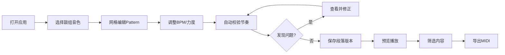

## 1. 产品概述

鼓机节奏生成器是面向电子音乐社的专业节奏创作工具，支持业务同事通过拖拽方式自主编辑鼓点pattern，自动检测节奏问题（过密/空拍），实现多人协作创作与MIDI导出。

- 解决手工跑流程效率低的问题，让非技术人员独立完成节奏创作
- 暴露协作中的常见问题（力度越界、段落空拍、保存覆盖），降低后续沟通成本
- 目标用户：电子音乐社业务人员、编曲师、节奏创作者

## 2. 核心功能

### 2.1 用户角色
| 角色 | 注册方式 | 核心权限 |
|------|----------|----------|
| 协作创作者 | 无需注册，本地存储 | 编辑pattern、调整参数、导出MIDI、查看历史 |

### 2.2 功能模块
1. **主编辑页面**：网格编辑器、鼓组选择、参数控制
2. **校验面板**：力度检测、密度分析、问题高亮
3. **历史记录**：段落版本、协作痕迹、覆盖提醒
4. **导出预览**：播放控制、筛选导出、MIDI生成

### 2.3 页面详情
| 页面名称 | 模块名称 | 功能描述 |
|-----------|-------------|---------------------|
| 主编辑页面 | 网格编辑器 | 16步/32步切换、拖拽打点、力度调节、多轨显示 |
| 主编辑页面 | 鼓组音色库 | 音色选择、加载状态、脏数据标识 |
| 主编辑页面 | 控制面板 | BPM调节、全局力度、段落切换 |
| 校验面板 | 力度校验 | 越界检测、可视化警告、一键修正 |
| 校验面板 | 密度分析 | 过密警示、空拍标记、建议提示 |
| 历史记录 | 段落历史 | 版本列表、对比视图、恢复功能 |
| 历史记录 | 协作追踪 | 操作日志、覆盖提醒、冲突标记 |
| 导出预览 | 播放控制 | 实时预览、循环播放、节拍器 |
| 导出预览 | MIDI导出 | 筛选导出、格式选择、导出预览 |

## 3. 核心流程

用户打开应用 → 选择/加载鼓组音色 → 在网格编辑器创建/编辑pattern → 调整BPM和力度参数 → 系统自动校验节奏问题 → 用户查看并修正问题 → 保存段落版本 → 预览播放 → 筛选需要的内容 → 导出MIDI文件

## 4. 用户界面设计

### 4.1 设计风格
- **主题色彩**：深色工业风，主色为霓虹蓝（#00F0FF），辅色为警示橙（#FF6B35）、危险红（#FF3366）、成功绿（#00FF88）
- **按钮风格**：几何硬朗，微立体效果，悬停时有荧光边框
- **字体**：显示屏用 Orbitron（科技感），正文用 JetBrains Mono（程序员等宽字体）
- **布局风格**：模块化卡片布局，网格编辑器占主导地位，侧边面板可折叠
- **图标风格**：线性+填充混合，科技感SVG图标，带微发光效果

### 4.2 页面设计概述
| 页面名称 | 模块名称 | UI Elements |
|-----------|-------------|-------------|
| 主编辑页面 | 网格编辑器 | 深色背景、荧光网格线、力度渐变柱、问题高亮闪烁动画 |
| 主编辑页面 | 鼓组音色库 | 卡片式布局、脏数据角标、加载状态骨架屏 |
| 校验面板 | 问题列表 | 时间轴布局、颜色编码警告、一键修复按钮 |
| 历史记录 | 版本列表 | 时间线设计、冲突标记、对比预览弹窗 |
| 导出预览 | 播放器 | 霓虹进度条、波形可视化、节拍器闪烁指示 |

### 4.3 响应式
- Desktop-first设计，针对1280px以上宽度优化
- 侧边面板在平板尺寸可折叠为图标栏
- 网格编辑器在移动端支持横向滚动
- 触摸设备优化：增大点击区域，支持手势缩放

### 4.4 视觉动效
- 页面加载：模块依次滑入，带有淡入效果
- 网格点击：粒子爆炸反馈 + 力度柱生长动画
- 问题检测：警告图标脉冲闪烁
- 播放时：当前节拍位置荧光扫过效果
- 保存成功：绿色勾号弹性动画
