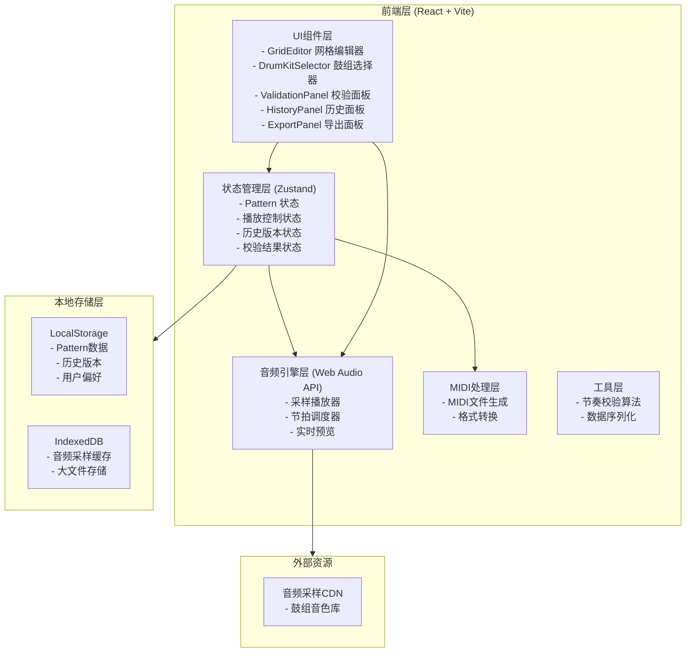

## 1. 架构设计



## 2. 技术描述

- **前端框架**: React@18 + TypeScript + Vite@5
- **样式方案**: TailwindCSS@3 + CSS Variables
- **状态管理**: Zustand@4 (轻量级，适合音频应用低延迟要求)
- **音频引擎**: Web Audio API (原生) + 自定义调度器
- **MIDI生成**: @tonejs/midi 库
- **图标**: Lucide React (科技感线性图标)
- **后端**: 无服务端架构，纯前端应用
- **数据存储**: LocalStorage + IndexedDB
- **部署**: 静态站点，可直接部署到任何静态托管

## 3. 目录结构

```
src/
├── components/          # UI组件
│   ├── GridEditor/     # 网格编辑器核心
│   ├── DrumKit/        # 鼓组选择与管理
│   ├── Controls/       # 播放与参数控制
│   ├── Validation/     # 校验面板
│   ├── History/        # 历史记录
│   └── Export/         # 导出功能
├── hooks/              # 自定义Hooks
│   ├── useAudioEngine.ts
│   ├── usePattern.ts
│   └── useValidation.ts
├── store/              # Zustand状态
│   ├── patternStore.ts
│   ├── playerStore.ts
│   └── historyStore.ts
├── utils/              # 工具函数
│   ├── audio/
│   ├── midi/
│   └── validation/
├── types/              # TypeScript类型
├── assets/             # 静态资源
└── App.tsx             # 主应用入口
```

## 4. 核心数据模型

### 4.1 数据模型定义

```mermaid
erDiagram
    PATTERN {
        string id PK
        string name
        number bpm
        number steps "16或32"
        string createdAt
        string updatedAt
        string author "协作标识"
    }

    DRUM_TRACK {
        string id PK
        string patternId FK
        string name "Kick, Snare, HiHat等"
        string sampleUrl
        number volume
        number pan
    }

    NOTE {
        string id PK
        string trackId FK
        number step "0-31"
        number velocity "0-127"
        boolean isActive
    }

    HISTORY_VERSION {
        string id PK
        string patternId FK
        string snapshot JSON
        string timestamp
        string author
        string message
        boolean isConflict
    }

    VALIDATION_ISSUE {
        string id PK
        string patternId FK
        string type "velocity/density/empty"
        string severity "warning/error"
        number trackId
        number step
        string message
    }

    PATTERN ||--o{ DRUM_TRACK : contains
    DRUM_TRACK ||--o{ NOTE : contains
    PATTERN ||--o{ HISTORY_VERSION : has
    PATTERN ||--o{ VALIDATION_ISSUE : generates
```

### 4.2 TypeScript 类型定义

```typescript
// 音符定义
interface Note {
  id: string;
  step: number;
  velocity: number;
  isActive: boolean;
}

// 鼓轨定义
interface DrumTrack {
  id: string;
  name: string;
  sampleUrl: string;
  volume: number;
  pan: number;
  notes: Note[];
}

// Pattern定义
interface Pattern {
  id: string;
  name: string;
  bpm: number;
  steps: 16 | 32;
  tracks: DrumTrack[];
  createdAt: string;
  updatedAt: string;
  author: string;
  isDirty: boolean;
}

// 历史版本
interface HistoryVersion {
  id: string;
  patternId: string;
  snapshot: Pattern;
  timestamp: string;
  author: string;
  message: string;
  isConflict: boolean;
}

// 校验问题
interface ValidationIssue {
  id: string;
  type: 'velocity_over' | 'velocity_low' | 'density_high' | 'empty_measure';
  severity: 'warning' | 'error';
  trackId: string;
  step: number;
  message: string;
  suggestion?: string;
}
```

## 5. 核心算法说明

### 5.1 节奏校验算法
- **力度越界检测**: velocity < 20 或 velocity > 110 标记警告
- **密度过密检测**: 连续3步内有2个以上同轨音符
- **空拍检测**: 4小节内无任何音符标记为潜在问题
- **校验时机**: 每次编辑后300ms防抖触发

### 5.2 音频调度算法
- 使用 Web Audio API 的 AudioContext 时间轴
- 预调度下一个16分音符，保证节拍精准
- 查找表(LUT)方式计算音符时间，避免运行时复杂计算

### 5.3 MIDI导出
- 使用 @tonejs/midi 生成标准MIDI 1.0文件
- 导出时应用当前筛选条件（只导出可见轨道/选中区域）
- 确保导出内容与屏幕显示完全一致
