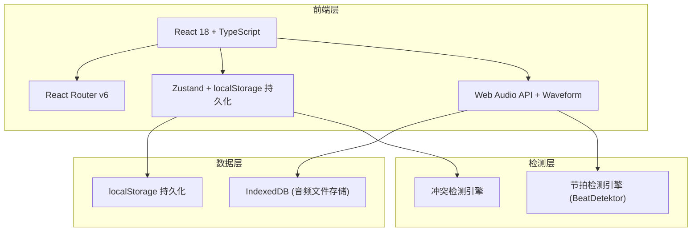
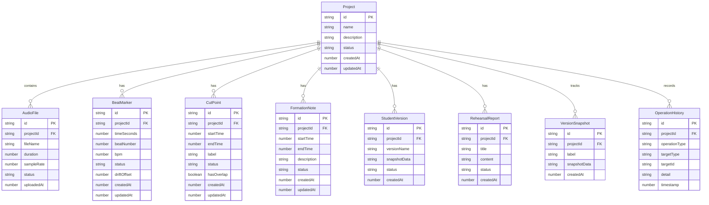

## 1. 架构设计



## 2. 技术说明

- **前端框架**：React@18 + TypeScript + Vite
- **样式方案**：Tailwind CSS@3 + CSS Variables（主题色）
- **状态管理**：Zustand + zustand/middleware persist（localStorage 持久化）
- **路由**：React Router@6
- **音频处理**：Web Audio API（解码播放）+ WaveSurfer.js（波形可视化）
- **节拍检测**：BeatDetektor（轻量级BPM检测库）
- **音频文件存储**：IndexedDB（通过 idb 库封装，支持大文件存储）
- **数据持久化**：Zustand persist middleware → localStorage（状态）+ IndexedDB（音频二进制）
- **导出功能**：JSZip（打包导出）+ html2canvas（报告截图）
- **初始化工具**：Vite

## 3. 路由定义

| 路由 | 用途 |
|------|------|
| `/` | 项目列表页，展示所有舞蹈音乐项目 |
| `/project/:id` | 项目详情页，音频播放、八拍时间线、队形备注、状态仪表盘 |
| `/project/:id/edit` | 切点编辑页，波形编辑、标记增删改、冲突检测 |
| `/project/:id/compare` | 版本对比页，双版本差异对比 |
| `/project/:id/history` | 历史与导出页，操作历史、标记导出、报告保存 |

## 4. 数据模型

### 4.1 数据模型定义



### 4.2 状态枚举定义

```
ConfirmStatus:
  - "confirmed"    // 已确认
  - "temporary"    // 临时备注
  - "conflict"     // 冲突状态

ConflictType:
  - "beat_drift"       // 八拍漂移
  - "cut_overlap"      // 剪辑点重叠
  - "note_overwrite"   // 备注覆盖
```

### 4.3 数据存储策略

| 数据类型 | 存储位置 | 说明 |
|----------|----------|------|
| 项目元数据、标记、备注 | localStorage (Zustand persist) | JSON 序列化，刷新不丢失 |
| 音频文件二进制 | IndexedDB | 支持大文件，独立于状态管理 |
| 操作历史 | localStorage (Zustand persist) | 最近 200 条操作记录 |
| 版本快照 | localStorage (Zustand persist) | JSON 字符串快照 |

### 4.4 冲突检测规则

1. **八拍漂移检测**：相邻八拍间隔与平均间隔偏差超过 15% 时标记为漂移，计算 `driftOffset` 值
2. **剪辑点重叠检测**：任意两个剪辑点的 `[startTime, endTime]` 区间有交集时标记重叠
3. **备注覆盖检测**：同一时间段内存在多个队形备注时标记为覆盖

## 5. 关键技术实现

### 5.1 节拍检测流程

1. 使用 Web Audio API 解码音频文件获取 AudioBuffer
2. 将 AudioBuffer 传入 BeatDetektor 进行 BPM 检测
3. 根据 BPM 计算八拍间隔，生成初始八拍标记（均为 temporary 状态）
4. 编导可手动微调标记位置，调整后可逐个确认

### 5.2 状态持久化方案

- Zustand store 通过 `persist` middleware 自动同步到 localStorage
- 每次状态变更后自动序列化保存
- 页面加载时从 localStorage 恢复状态
- IndexedDB 存储音频文件，通过 `idb` 库封装异步读写
- 如果 localStorage 数据损坏，给出明确提示并提供"重置项目"选项

### 5.3 错误处理策略

- 不吞异常：所有 try-catch 块必须将错误信息传递到 UI 层
- 错误分级：致命错误（数据损坏）→ 阻断操作 + 提供修复步骤；一般错误（检测失败）→ 提示 + 允许手动操作
- 下一步指引：每个错误提示都附带"您可以尝试：1... 2... 3..."的明确操作指引
