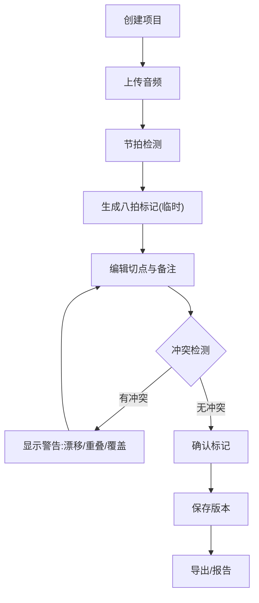

## 1. 产品概述

舞蹈音乐切点助手——面向舞蹈编导和队员的音乐编排工具，核心解决音乐八拍标注、队形切换备注、剪辑点管理三大痛点。通过节拍检测自动生成八拍标记，支持切点编辑与版本对比，确保排练报告、学生版本等数据可追溯、可导出，刷新不丢失。

- 目标用户：舞蹈老师、编导、队员
- 核心价值：将零散的音乐切点、八拍标注、队形备注统一管理，避免八拍漂移、剪辑点重叠、备注覆盖等常见问题

## 2. 核心功能

### 2.1 用户角色

| 角色 | 说明 | 核心权限 |
|------|------|----------|
| 编导（老师） | 项目创建者 | 创建/编辑/确认所有数据，导出报告 |
| 队员 | 查看者 | 查看已确认数据，查看学生版本 |

### 2.2 功能模块

1. **项目列表页**：所有舞蹈音乐项目一览，快速筛选与搜索
2. **项目详情页**：音频波形可视化、八拍标记时间线、队形备注面板、状态总览
3. **切点编辑页**：可视化波形编辑、八拍标记增删改、剪辑点拖拽调整、实时冲突检测
4. **版本对比页**：学生版本与主版本差异对比、标记变更高亮
5. **历史与导出页**：操作历史回溯、标记/报告导出

### 2.3 页面详情

| 页面名称 | 模块名称 | 功能描述 |
|----------|----------|----------|
| 项目列表页 | 项目卡片列表 | 展示项目名、曲目、八拍数、状态标签（已确认/临时备注）、最近编辑时间 |
| 项目列表页 | 搜索与筛选 | 按项目名搜索，按确认状态筛选 |
| 项目详情页 | 音频播放器 | 波形可视化、播放/暂停、跳转到指定八拍 |
| 项目详情页 | 八拍时间线 | 纵向八拍标记轴，区分已确认（实心）与临时（虚线），标注漂移警告 |
| 项目详情页 | 队形备注面板 | 按时间段关联队形描述，标记确认/临时状态 |
| 项目详情页 | 剪辑点列表 | 所有剪辑点列表，重叠检测红标提示 |
| 项目详情页 | 状态仪表盘 | 各类标记确认率、待处理问题数 |
| 切点编辑页 | 波形编辑器 | 可缩放波形图，支持拖拽调整标记位置 |
| 切点编辑页 | 八拍标记编辑 | 增加/删除/移动八拍标记，自动计算BPM |
| 切点编辑页 | 剪辑点编辑 | 增加/删除剪辑点，重叠实时检测与警告 |
| 切点编辑页 | 队形备注编辑 | 为指定时间段添加队形切换备注 |
| 切点编辑页 | 冲突检测面板 | 实时显示八拍漂移、剪辑点重叠、备注覆盖问题 |
| 版本对比页 | 版本选择器 | 选择两个版本进行对比 |
| 版本对比页 | 差异视图 | 并排/叠加显示八拍标记差异，新增/删除/移动高亮 |
| 版本对比页 | 变更日志 | 记录每次变更的时间、操作人、内容 |
| 历史与导出页 | 操作历史 | 按时间线展示所有编辑操作，支持回滚 |
| 历史与导出页 | 导出面板 | 导出标记（JSON/CSV）、排练报告（PDF格式预览） |

## 3. 核心流程

### 3.1 项目创建与节拍检测流程
用户创建项目 → 上传音频文件 → 系统自动节拍检测 → 生成八拍标记（临时状态）→ 编导审核确认 → 标记转为已确认状态

### 3.2 切点编辑流程
选择项目进入编辑 → 在波形上定位剪辑点 → 添加/调整八拍标记和队形备注 → 系统实时检测冲突 → 解决冲突后保存 → 标记状态更新

### 3.3 版本对比与导出流程
选择项目 → 进入版本对比 → 选择基准版本与对比版本 → 查看差异 → 确认后导出标记或报告

## 4. 用户界面设计

### 4.1 设计风格

- **主色调**：深紫红 (#8B2252) + 金色点缀 (#D4A843)，舞台感与专业感并存
- **辅助色**：暗色背景 (#1A1A2E)，卡片 (#16213E)，状态色-已确认绿 (#2ECC71)，临时黄 (#F39C12)，冲突红 (#E74C3C)
- **按钮风格**：圆角 8px，微渐变，悬浮时轻微上浮阴影
- **字体**：标题用 "Playfair Display"，正文用 "Noto Sans SC"，数据用 "JetBrains Mono"
- **布局**：左侧导航栏 + 右侧主内容区，卡片式模块布局
- **图标**：线性图标风格 (Lucide Icons)

### 4.2 页面设计概览

| 页面名称 | 模块名称 | UI要素 |
|----------|----------|--------|
| 项目列表页 | 项目卡片 | 深色卡片、左侧色条标识状态、悬浮微动画 |
| 项目列表页 | 筛选栏 | 圆角搜索框、状态下拉筛选、紧凑排列 |
| 项目详情页 | 音频播放器 | 波形深色背景、绿色播放进度、金色八拍标记线 |
| 项目详情页 | 状态仪表盘 | 环形进度条显示确认率、数字高亮 |
| 切点编辑页 | 波形编辑器 | 大面积波形区、可缩放、拖拽手柄、底部时间轴 |
| 切点编辑页 | 冲突面板 | 右侧滑出面板，冲突项红底列表 |
| 版本对比页 | 差异视图 | 双栏并排、差异高亮色块 |
| 历史与导出页 | 时间线 | 竖向时间线、节点图标、导出按钮金色 |

### 4.3 响应式设计
- 桌面优先设计，最小宽度 1024px
- 平板适配：侧边栏可折叠为图标模式
- 移动端暂不支持（专业编辑场景需要大屏操作）

### 4.4 状态标识体系

| 数据类型 | 已确认状态 | 临时备注状态 | 冲突状态 |
|----------|-----------|-------------|----------|
| 音频文件 | ✅ 绿色实心图标 | 🟡 黄色虚线图标 | 🔴 红色警告 |
| 八拍标记 | 实线标记 + 锁定图标 | 虚线标记 + 铅笔图标 | 漂移图标 + 偏移值 |
| 队形备注 | 绿色标签 | 黄色标签 | 覆盖警告标签 |
| 学生版本 | 已发布徽章 | 草稿徽章 | — |
| 剪辑点 | 实线竖线 | 虚线竖线 | 重叠红色区域 |
| 排练报告 | 已签章图标 | 草稿图标 | — |
