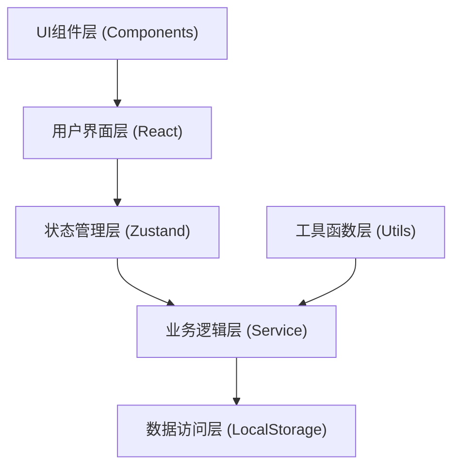

# 管弦乐谱缺页检查系统 技术架构文档

## 1. 架构设计



## 2. 技术选型

### 2.1 前端技术栈
- **框架**: React@18 + TypeScript
- **构建工具**: Vite@5
- **样式方案**: TailwindCSS@3
- **状态管理**: Zustand
- **路由管理**: React Router v6
- **UI组件**: Headless UI + Heroicons
- **图表库**: Recharts
- **文件处理**: xlsx (Excel导出), jspdf (PDF导出)
- **日期处理**: date-fns

### 2.2 数据存储
- 本地存储: LocalStorage (持久化数据)
- 内存存储: Zustand Store (运行时状态)
- 文件导入: 支持 CSV / Excel / JSON 格式

### 2.3 开发工具
- ESLint + Prettier (代码规范)
- TypeScript (类型安全)

## 3. 路由定义

| 路由路径 | 页面名称 | 功能描述 |
|---------|---------|----------|
| `/` | 工作台 | 仪表盘概览、统计展示、快速操作 |
| `/import` | 数据导入 | 6类数据源独立导入管理 |
| `/check` | 检查执行 | 页码校验、声部分发、修订追踪 |
| `/exceptions` | 异常汇总 | 所有异常分类展示和处理 |
| `/signoff` | 签收管理 | 乐手签收确认和记录查询 |
| `/compare` | 变更对比 | 版本对比、差异展示 |
| `/report` | 报告导出 | 报告配置、预览、导出 |

## 4. 数据模型

### 4.1 核心数据结构

```typescript
// 数据版本
interface DataVersion {
  id: string;
  name: string;
  createdAt: string;
  description: string;
  data: AllData;
}

// 全量数据
interface AllData {
  parts: Part[];           // 声部谱
  pageRules: PageRule[];   // 页码规则
  musicians: Musician[];   // 乐手名单
  revisions: Revision[];   // 修订页
  distributions: Distribution[]; // 发放记录
  checkReports: CheckReport[];   // 检查报告
}

// 声部谱
interface Part {
  id: string;
  name: string;           // 声部名称: 第一小提琴、第二小提琴...
  category: string;       // 声部分类: 弦乐、木管、铜管、打击乐、色彩
  totalPages: number;     // 总页数
  pages: number[];        // 页码列表
}

// 页码规则
interface PageRule {
  id: string;
  partId: string;
  startPage: number;
  endPage: number;
  exceptions: number[];   // 跳过的页码
}

// 乐手
interface Musician {
  id: string;
  name: string;
  partId: string;         // 所属声部
  role: string;           // 角色: 首席、副首席、乐手
  email?: string;
}

// 修订页
interface Revision {
  id: string;
  name: string;           // 修订页名称
  pageNumber: string;     // 页码（可含字母: 15A, 23B）
  partIds: string[];      // 适用声部ID列表
  issueDate: string;      // 发布日期
  description: string;
}

// 发放记录
interface Distribution {
  id: string;
  musicianId: string;
  partId: string;
  pagesReceived: string[]; // 收到的页码
  revisionIds: string[];   // 收到的修订页
  distributedAt: string;
  distributedBy: string;
}

// 检查报告
interface CheckReport {
  id: string;
  versionId: string;
  checkedAt: string;
  checkedBy: string;
  results: CheckResult[];
  status: 'pending' | 'pass' | 'fail';
}

// 检查结果
interface CheckResult {
  id: string;
  type: 'page' | 'distribution' | 'revision';
  severity: 'error' | 'warning' | 'info';
  partId?: string;
  musicianId?: string;
  revisionId?: string;
  message: string;
  suggestion: string;
  status: 'open' | 'resolved' | 'ignored';
}

// 签收记录
interface SignOff {
  id: string;
  musicianId: string;
  distributionId: string;
  signedAt: string;
  signature: string;
  notes?: string;
}
```

### 4.2 数据版本管理
- 每次导入数据自动创建新版本
- 版本命名格式: `v{序号} - {日期}`
- 支持版本备注说明
- 版本列表按时间倒序排列

## 5. 核心业务逻辑

### 5.1 页码校验算法
```typescript
// 1. 检查页码连续性
// 2. 检测跳号（如: 1,2,4,5 → 缺页3）
// 3. 检测重复页码
// 4. 检测首尾页码完整性
```

### 5.2 声部分发检查
```typescript
// 1. 按声部分组乐手
// 2. 检查每个乐手应发页数
// 3. 对比实际发放记录
// 4. 标记漏发、多发、错发声部
```

### 5.3 修订页追踪
```typescript
// 1. 获取修订页适用声部
// 2. 检查该声部所有乐手
// 3. 验证修订页发放状态
// 4. 标记未发放修订页
```

### 5.4 差异对比算法
```typescript
// 1. 深度对比两个版本数据
// 2. 识别新增、删除、修改项
// 3. 高亮显示差异内容
// 4. 统计变更数量和类型
```

## 6. 目录结构

```
src/
├── components/          # 通用组件
│   ├── layout/         # 布局组件
│   ├── tables/         # 表格组件
│   ├── forms/          # 表单组件
│   └── charts/         # 图表组件
├── pages/              # 页面组件
│   ├── Dashboard/
│   ├── Import/
│   ├── Check/
│   ├── Exceptions/
│   ├── SignOff/
│   ├── Compare/
│   └── Report/
├── store/              # Zustand 状态管理
│   ├── dataStore.ts
│   ├── checkStore.ts
│   └── versionStore.ts
├── services/           # 业务逻辑
│   ├── pageChecker.ts
│   ├── distributionChecker.ts
│   ├── revisionChecker.ts
│   └── reportGenerator.ts
├── utils/              # 工具函数
│   ├── fileParser.ts
│   ├── diff.ts
│   ├── export.ts
│   └── validation.ts
├── types/              # TypeScript 类型定义
│   └── index.ts
├── data/               # 样例数据
│   └── sampleData.ts
├── hooks/              # 自定义 Hooks
├── routes/             # 路由配置
└── App.tsx
```

## 7. 状态管理设计

### 7.1 Data Store
- 管理所有导入的原始数据
- 数据版本切换和管理
- 数据导入、导出、备份

### 7.2 Check Store
- 检查执行状态
- 检查结果缓存
- 异常状态管理

### 7.3 UI Store
- 导航状态
- 弹窗/抽屉状态
- 全局通知

## 8. 关键实现要点

### 8.1 文件导入
- 支持 CSV, Excel, JSON 格式
- 数据预览和验证
- 错误提示和修正建议
- 大文件分片处理

### 8.2 报告导出
- PDF: 使用 jsPDF + html2canvas
- Excel: 使用 xlsx 库
- 支持自定义模板
- 打印预览功能

### 8.3 性能优化
- 检查计算使用 Web Worker
- 虚拟滚动处理大表格
- 数据变更防抖处理
- 计算结果缓存机制

### 8.4 数据安全
- 所有数据本地存储
- 支持加密存储（可选）
- 导出数据格式标准化
- 操作日志留痕
