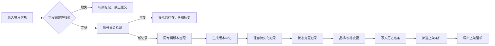

## 1. 产品概述

唱片店黑胶库存版号核对系统，解决老表格版本写混、字段不齐、历史追溯难的问题。面向唱片店库存管理人员，提供版号匹配、品相历史追踪、价格版本管理、上架导出和异常清单功能，确保状态与历史全程一致。

核心价值：杜绝同专辑不同版本混淆，完整追踪品相变化和价格调整，字段缺失即时标红不假设默认值，所有操作基于同一份持久化记录。

## 2. 核心功能

### 2.1 用户角色

| 角色 | 注册方式 | 核心权限 |
|------|----------|----------|
| 库存管理员 | 系统内置 | 录入、核对、修正、导出全部操作 |

### 2.2 功能模块

1. **库存录入**：唱片版号、品相、寄售人、价格、上架位置、核对报告录入，字段不齐自动标记
2. **版号匹配**：同专辑不同版本识别、重复版号检测
3. **品相历史**：品相变更记录、完整追溯链条
4. **价格版本**：寄售价格变更历史、变更对比
5. **筛选查询**：多维度筛选、异常清单
6. **数据修正**：编辑修正、状态流转校验
7. **上架导出**：导出可上架清单

### 2.3 页面详情

| 页面名称 | 模块名称 | 功能描述 |
|----------|----------|----------|
| 库存总览 | 数据仪表盘 | 库存统计、异常数量、待处理条目概览 |
| 库存总览 | 筛选区域 | 按专辑、版号、品相、寄售人、价格区间、状态筛选 |
| 库存总览 | 记录列表 | 展示唱片记录、版本标记、品相标签、价格状态 |
| 录入/编辑 | 表单区域 | 6个核心字段录入，字段缺失标红不设默认值 |
| 录入/编辑 | 版号校验 | 实时检测重复版号、同专辑不同版本提示 |
| 详情面板 | 版本对比 | 同专辑不同版本并列对比 |
| 详情面板 | 品相历史 | 时间线展示品相变更记录 |
| 详情面板 | 价格历史 | 版本化展示价格变更及变更人 |
| 异常清单 | 异常分类 | 缺字段、重复版号、状态异常、价格异常分类展示 |
| 导出功能 | 上架导出 | 筛选符合条件记录导出CSV |

## 3. 核心流程

录入→校验→匹配→保存→变更追踪→导出，全程状态与历史一致。

## 4. 用户界面设计

### 4.1 设计风格
- 主色调：深墨绿 `#1a3c34` 搭配焦糖橙 `#d4a574`，呼应黑胶唱片与怀旧质感
- 辅助色：警戒红 `#c0392b` 标记异常，米白 `#f5f0e8` 背景
- 按钮：圆角2px，轻微下沉阴影，hover时上浮效果
- 字体：标题用 Playfair Display 衬线体体现唱片文化质感，正文用 Source Sans Pro 保证可读性
- 布局：卡片式分区，左侧筛选+右侧主内容，详情抽屉式展开
- 图标：lucide-react 线性图标，保持克制克制

### 4.2 页面设计概览

| 页面名称 | 模块名称 | UI元素 |
|----------|----------|--------|
| 库存总览 | 顶部导航 | 品牌标识、功能入口、异常数量徽章 |
| 库存总览 | 统计卡片 | 总数、异常数、待上架、今日新增 |
| 库存总览 | 筛选栏 | 折叠式筛选器，多条件组合 |
| 库存总览 | 记录表格 | 斑马纹行，版号加粗，异常行红边高亮 |
| 录入抽屉 | 表单 | 标签左对齐，必填红星，缺失字段红框抖动 |
| 详情面板 | 时间线 | 品相历史垂直时间线，价格变更气泡对比 |
| 详情面板 | 版本对比 | 左右两列，差异项黄底高亮 |
| 异常清单 | 分类标签 | 标签页切换异常类型，可批量处理 |

### 4.3 响应式
桌面优先设计，1200px以上三栏布局，768-1200px两栏，768px以下单栏堆叠。表格在移动端转为卡片列表。

### 4.4 微交互
- 页面加载：顶部进度条 + 内容区渐入
- 记录悬停：轻微上浮 + 阴影加深
- 版号匹配成功：绿勾淡入动画
- 异常标记：轻微呼吸效果吸引注意
- 表单提交：按钮loading状态，成功后滑入成功提示
