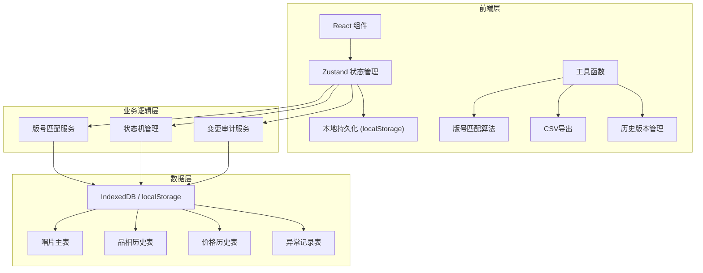
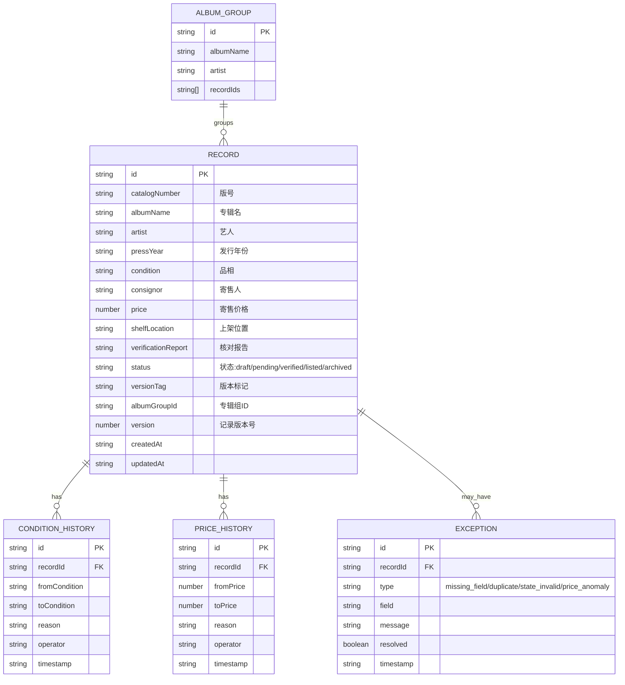

## 1. 架构设计



纯前端架构，数据持久化到浏览器 localStorage，状态与历史通过 Zustand 统一管理，确保所有操作基于同一份数据源。

## 2. 技术描述

- 前端：React@18 + TypeScript + Vite
- 样式：TailwindCSS@3
- 状态管理：Zustand
- 持久化：localStorage + 自定义 IndexedDB 封装
- 图标：lucide-react
- 后端：无（纯前端应用）
- 数据库：localStorage（主存储）+ IndexedDB（大容量历史记录）

## 3. 路由定义

| 路由 | 用途 |
|------|------|
| / | 库存总览页，包含列表、筛选、统计 |
| /record/:id | 唱片详情页，版本对比、历史时间线 |
| /exceptions | 异常清单页，分类展示异常 |

## 4. 数据模型

### 4.1 数据模型定义



### 4.2 状态流转规则

```
draft → pending → verified → listed
            ↓           ↓
          archived    archived
```

- draft: 草稿，字段不齐时的初始状态，不可导出
- pending: 待核对，字段齐全但未完成版号核对
- verified: 已核对，版号匹配完成，可导出上架
- listed: 已上架，已导出
- archived: 已归档，不可修改

状态不允许逆向流转（如 verified 不能回退到 draft），状态变更必须记录原因。

### 4.3 核心字段校验规则

所有字段（版号、品相、寄售人、价格、上架位置、核对报告）均为必填，缺失时：
1. 标红对应表单字段
2. 记录状态设为 draft
3. 生成 missing_field 类型异常
4. 禁止提交到 pending 及以后状态

**不设任何默认值**，必须由用户明确填写。

## 5. 核心算法

### 5.1 版号匹配算法
```typescript
// 标准化版号：移除空格、转大写、标准化特殊字符
function normalizeCatalogNumber(cn: string): string

// 模糊匹配：同专辑名+不同版号识别为同专辑不同版本
function findAlbumMatches(albumName: string, catalogNumber: string): Record[]

// 重复检测：版号完全一致（标准化后）判定为重复
function isDuplicate(catalogNumber: string): boolean
```

### 5.2 品相等级
```
M (全新) → NM (近新) → EX (优秀) → VG+ (很好) → VG (好) → G (一般) → F (一般) → P (差)
```

品相变更需记录原因，历史时间线不可删除。

## 6. 测试策略

### 6.1 测试覆盖场景

| 测试场景 | 测试点 | 预期结果 |
|----------|--------|----------|
| 重复提交 | 两次录入完全相同版号 | 第二次提交被拦截，提示重复，关联到已有记录 |
| 缺字段 | 提交时缺少价格字段 | 状态停留在 draft，生成异常记录，无法进入 pending |
| 状态不允许 | 尝试从 verified 回退到 draft | 状态机拒绝变更，返回错误信息 |
| 版号匹配 | 录入同专辑不同版号 | 自动归为同一专辑组，生成版本标记 |
| 品相历史 | 修改品相等级 | 自动写入品相历史表，时间线可追溯 |
| 价格变更 | 修改寄售价格 | 自动记录价格版本，可对比变更 |
| 导出筛选 | 导出 verified 状态记录 | 仅导出符合条件记录，CSV格式正确 |
| 异常清单 | 缺字段记录 | 在异常清单中分类展示，可定位处理 |
