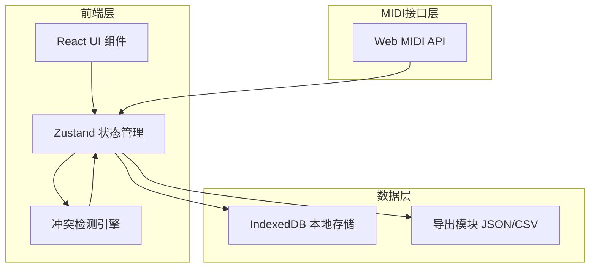
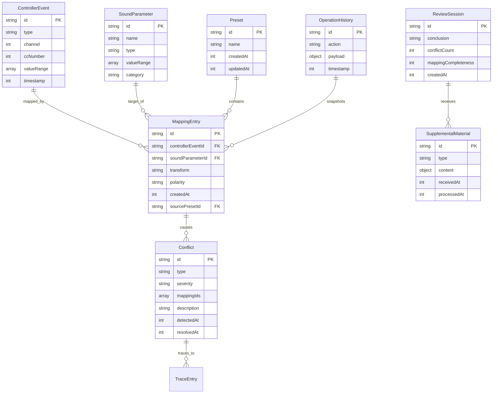

## 1. 架构设计



## 2. 技术说明
- 前端：React@18 + TailwindCSS@3 + Vite
- 初始化工具：Vite
- 状态管理：Zustand（轻量、支持中间件持久化）
- 本地存储：IndexedDB（通过idb库封装），存储预设、映射历史、操作日志
- MIDI接口：Web MIDI API（浏览器原生，无需后端）
- 后端：无（纯前端应用，所有数据本地存储）
- 数据库：无服务端数据库，使用浏览器IndexedDB

## 3. 路由定义
| 路由 | 用途 |
|------|------|
| / | 映射工作台主页面 |
| /conflicts | 冲突检测面板 |
| /presets | 预设管理（含回滚历史） |
| /review | 复盘入口 |

## 4. API定义
无后端API。MIDI数据通过Web MIDI API获取，所有状态通过Zustand store管理。

### 4.1 核心TypeScript类型定义

```typescript
interface ControllerEvent {
  id: string;
  type: 'cc' | 'note' | 'pitchbend' | 'aftertouch';
  channel: number;
  ccNumber?: number;
  noteNumber?: number;
  valueRange: [number, number];
  timestamp: number;
}

interface SoundParameter {
  id: string;
  name: string;
  type: 'continuous' | 'toggle' | 'enum';
  valueRange: [number, number] | string[];
  category: string;
}

interface MappingEntry {
  id: string;
  controllerEventId: string;
  soundParameterId: string;
  transform?: 'linear' | 'inverse' | 'logarithmic';
  polarity: 'normal' | 'reversed';
  createdAt: number;
  sourcePresetId?: string;
}

interface Conflict {
  id: string;
  type: 'channel_collision' | 'polarity_reversed' | 'preset_override';
  severity: 'warning' | 'critical';
  mappingIds: string[];
  description: string;
  sourceTrace: TraceEntry[];
  detectedAt: number;
  resolvedAt?: number;
}

interface TraceEntry {
  type: 'mapping' | 'preset' | 'event' | 'parameter';
  targetId: string;
  label: string;
}

interface Preset {
  id: string;
  name: string;
  mappings: string[];
  createdAt: number;
  updatedAt: number;
  snapshot: MappingEntry[];
}

interface OperationHistory {
  id: string;
  action: 'create_mapping' | 'delete_mapping' | 'update_mapping' | 'save_preset' | 'load_preset' | 'resolve_conflict' | 'supplement_material';
  payload: Record<string, unknown>;
  timestamp: number;
  snapshot: MappingEntry[];
  conflictsSnapshot: Conflict[];
}

interface ReviewSession {
  id: string;
  createdAt: number;
  conclusion: string;
  conflictCount: number;
  mappingCompleteness: number;
  historySnapshotId: string;
  supplementalMaterials: SupplementalMaterial[];
}

interface SupplementalMaterial {
  id: string;
  type: 'controller_event' | 'sound_parameter' | 'preset_file';
  content: unknown;
  receivedAt: number;
  processedAt?: number;
}
```

## 5. 服务端架构
不适用（纯前端应用）。

## 6. 数据模型

### 6.1 数据模型定义



### 6.2 数据定义语言
使用IndexedDB对象仓库：

- `controllerEvents` — keyPath: `id`，索引：`channel`, `type`
- `soundParameters` — keyPath: `id`，索引：`category`, `name`
- `mappings` — keyPath: `id`，索引：`controllerEventId`, `soundParameterId`, `sourcePresetId`
- `conflicts` — keyPath: `id`，索引：`type`, `severity`, `resolvedAt`
- `presets` — keyPath: `id`，索引：`name`, `createdAt`
- `operationHistory` — keyPath: `id`，索引：`action`, `timestamp`
- `reviewSessions` — keyPath: `id`，索引：`createdAt`
- `supplementalMaterials` — keyPath: `id`，索引：`type`, `reviewSessionId`
