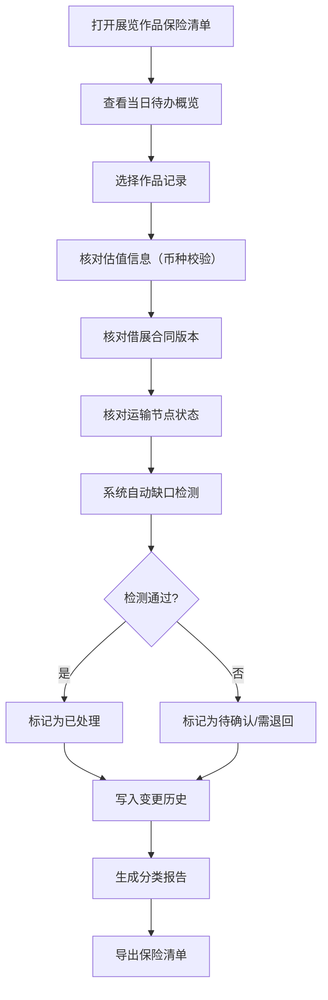

## 1. 产品概述

展览作品保险清单管理系统是为美术馆、画廊策展助理设计的专业工具，用于在展览筹备期间对作品估值、运输状态和借展合同进行统一管理和对齐校验，确保保险材料的准确性和可追溯性。

- **核心问题**：策展助理在打包保险材料时，面临估值币种错误、运输节点缺失、合同版本不一等问题，且历史变更无法追溯
- **目标用户**：美术馆策展助理、艺术品保险专员、展览项目协调人
- **产品价值**：确保保险材料三要素（估值、运输、合同）完全对齐，所有变更可追溯，大幅降低保险理赔风险

## 2. 核心特性

### 2.1 用户角色

| 角色 | 注册方式 | 核心权限 |
|------|----------|----------|
| 策展助理 | 内部账号登录 | 保险清单管理、材料导入、状态变更、报告导出 |
| 保险专员 | 内部账号登录 | 审核确认、风险评估、合同版本管理 |
| 管理员 | 管理员授权 | 系统配置、用户管理、审计日志 |

### 2.2 功能模块

1. **保险清单首页**：待办概览、作品清单列表、快速操作入口
2. **作品详情页**：估值管理、借展合同、运输追踪、保险条款、变更历史
3. **报告导出页**：分类统计、缺口提示、正式报告生成

### 2.3 页面详情

| 页面名称 | 模块名称 | 功能描述 |
|---------|----------|----------|
| 保险清单首页 | 待办概览卡片 | 展示待确认、需补材料、已处理的记录数量统计 |
| 保险清单首页 | 作品清单列表 | 表格展示所有作品，支持搜索、筛选、按状态分组 |
| 保险清单首页 | 快速操作栏 | 新建记录、批量导入、导出报告、缺口检查 |
| 作品详情页 | 作品基本信息 | 作品名称、编号、艺术家、尺寸、材质等基础信息 |
| 作品详情页 | 估值管理 | 估值金额、币种、估值日期、估值机构、自动换算校验 |
| 作品详情页 | 借展合同 | 合同版本、出借方、出借期限、合同附件、版本比对 |
| 作品详情页 | 运输追踪 | 起运地、中转节点、目的地、当前状态、时间戳、缺失预警 |
| 作品详情页 | 保险条款 | 险种、保额、免赔额、保险期限、特殊条款 |
| 作品详情页 | 变更历史 | 所有字段的变更时间、操作人、变更前后对比 |
| 报告导出页 | 分类统计 | 按已处理、待确认、需退回补材料分类展示 |
| 报告导出页 | 缺口提示 | 自动检测缺失字段、不一致信息、风险项 |
| 报告导出页 | 报告生成 | 导出正式保险清单报告（PDF/Excel），带审计追踪 |

## 3. 核心流程

策展助理打开系统后，首先查看待办概览了解当天需要处理的材料。点击进入具体作品记录，依次核对估值信息（含币种换算校验）、借展合同版本、运输节点状态。系统自动检测数据缺口和不一致项，提示需要补全的材料。确认无误后标记为已处理，所有变更实时写入历史记录。最后可生成分类报告，明确区分已处理、待确认和需退回补材料的记录。

## 4. 用户界面设计

### 4.1 设计风格

**设计方向**：专业稳重的档案管理风格，强调信息的清晰度和可追溯性

- **主色调**：深靛蓝 `#1e3a5f`（代表专业、信任）
- **辅助色**：
  - 琥珀金 `#d4a574`（强调、重要信息）
  - 翡翠绿 `#059669`（已处理/正常状态）
  - 暖橙 `#f59e0b`（待确认状态）
  - 朱红 `#dc2626`（需退回/错误状态）
- **中性色**：象牙白 `#faf8f5` 背景，炭灰 `#292524` 文字
- **按钮风格**：微立体圆角按钮，hover有微妙阴影变化
- **字体**：
  - 标题："Noto Serif SC" 宋体（正式感）
  - 正文："Noto Sans SC" 无衬线（可读性）
- **布局风格**：卡片式分区布局，左侧导航+右侧内容区，表格为主
- **图标风格**：线性Lucide图标，统一24px尺寸

### 4.2 页面设计概述

| 页面名称 | 模块名称 | UI元素 |
|---------|----------|--------|
| 保险清单首页 | 待办概览卡片 | 4张状态卡片，数字+描述+状态色，进入动画依次延迟 |
| 保险清单首页 | 作品清单表格 | 固定表头可滚动表格，行悬停高亮，状态标签颜色区分 |
| 保险清单首页 | 顶部操作栏 | 左侧标题+日期，右侧操作按钮组带下拉菜单 |
| 作品详情页 | 信息分区标签 | 标签页切换，带变更数量徽章 |
| 作品详情页 | 字段编辑区 | 分组表单，每个字段带"历史变更"小图标，点击查看变更记录 |
| 作品详情页 | 变更历史面板 | 右侧抽屉式面板，时间轴布局展示变更详情 |
| 报告导出页 | 分类统计面板 | 三栏布局，每栏为一个状态分类，带筛选功能 |
| 报告导出页 | 缺口提示列表 | 警告图标+问题描述+修复链接，可展开查看详情 |
| 报告导出页 | 报告预览区 | 分页预览，可切换页面，一键导出按钮 |

### 4.3 响应式

- 桌面优先设计，1280px以上最佳体验
- 平板端：导航折叠为图标，表格支持横向滚动
- 移动端：卡片堆叠布局，表格转卡片列表展示
- 所有操作按钮保持最小44px触控尺寸

### 4.4 动效设计

- 页面加载：卡片依次淡入（staggered fade-in），延迟50ms
- 状态变更：数值变化时数字滚动动画
- 标签切换：内容区左右滑动过渡
- 抽屉展开：平滑滑入动画（300ms ease-out）
- 错误提示：轻微抖动+红色边框高亮
