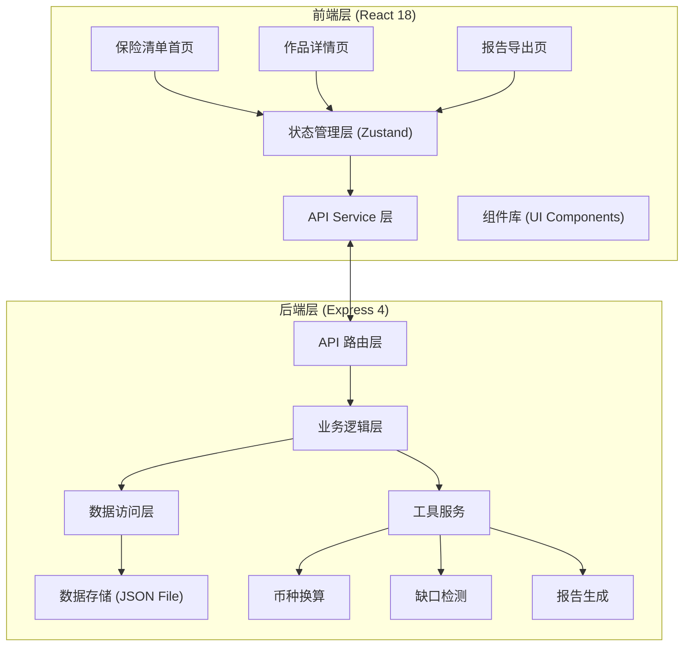
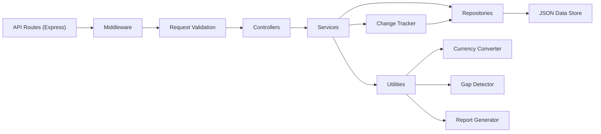
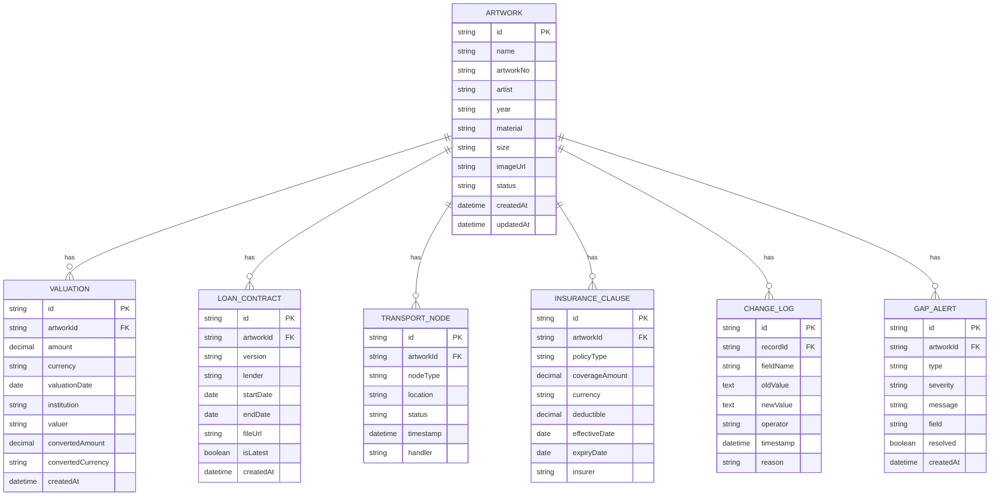

## 1. 架构设计

本系统采用前后端分离架构，前端负责交互展示和业务逻辑，后端提供API接口和数据持久化。由于是内部工具且第一版侧重快速迭代，采用轻量级技术栈。



## 2. 技术描述

- **前端**：React@18 + TypeScript@5 + Vite@5 + tailwindcss@3 + zustand@4 + react-router-dom@6 + lucide-react@0.344
- **初始化工具**：vite-init (react-express-ts模板)
- **后端**：Express@4 + TypeScript@5
- **数据库**：本地JSON文件存储（第一版），使用lowdb轻量级库
- **报告导出**：xlsx (Excel导出) + jspdf + jspdf-autotable (PDF导出)

## 3. 路由定义

| 路由 | 页面 | 说明 |
|------|------|------|
| `/` | 保险清单首页 | 待办概览 + 作品清单列表 |
| `/artwork/:id` | 作品详情页 | 估值、合同、运输、保险条款、变更历史 |
| `/reports` | 报告导出页 | 分类统计 + 缺口提示 + 报告导出 |

## 4. API 定义

### TypeScript 类型定义

```typescript
// 基础类型
type RecordStatus = 'processed' | 'pending' | 'rejected';
type Currency = 'CNY' | 'USD' | 'EUR' | 'GBP' | 'JPY';
type TransportStatus = 'pending' | 'in_transit' | 'arrived' | 'delivered';

// 作品基础信息
interface Artwork {
  id: string;
  name: string;
  artworkNo: string;
  artist: string;
  year: string;
  material: string;
  size: string;
  imageUrl?: string;
  createdAt: string;
  updatedAt: string;
  status: RecordStatus;
}

// 估值信息
interface Valuation {
  id: string;
  artworkId: string;
  amount: number;
  currency: Currency;
  valuationDate: string;
  institution: string;
  valuer: string;
  remarks?: string;
  convertedAmount?: number;
  convertedCurrency: Currency;
}

// 借展合同
interface LoanContract {
  id: string;
  artworkId: string;
  version: string;
  lender: string;
  lenderContact: string;
  startDate: string;
  endDate: string;
  specialTerms?: string;
  fileUrl?: string;
  signedDate?: string;
  isLatest: boolean;
}

// 运输节点
interface TransportNode {
  id: string;
  artworkId: string;
  nodeType: 'origin' | 'transit' | 'destination';
  location: string;
  status: TransportStatus;
  timestamp?: string;
  handler?: string;
  remarks?: string;
}

// 保险条款
interface InsuranceClause {
  id: string;
  artworkId: string;
  policyType: string;
  coverageAmount: number;
  currency: Currency;
  deductible: number;
  effectiveDate: string;
  expiryDate: string;
  specialClauses?: string;
  insurer: string;
  policyNo?: string;
}

// 变更记录
interface ChangeLog {
  id: string;
  recordId: string;
  fieldName: string;
  oldValue: any;
  newValue: any;
  operator: string;
  timestamp: string;
  reason?: string;
}

// 缺口检测结果
interface GapAlert {
  id: string;
  artworkId: string;
  type: 'valuation' | 'contract' | 'transport' | 'insurance';
  severity: 'error' | 'warning' | 'info';
  message: string;
  field?: string;
  resolved: boolean;
}

// API 响应结构
interface ApiResponse<T> {
  success: boolean;
  data?: T;
  error?: string;
  message?: string;
}
```

### API 接口列表

| 方法 | 路径 | 说明 |
|------|------|------|
| GET | `/api/artworks` | 获取作品列表（支持筛选、搜索、分页） |
| GET | `/api/artworks/:id` | 获取作品完整信息（含所有关联数据） |
| POST | `/api/artworks` | 新建作品记录 |
| PUT | `/api/artworks/:id` | 更新作品信息 |
| PATCH | `/api/artworks/:id/status` | 更新作品状态 |
| GET | `/api/artworks/:id/changelog` | 获取变更历史 |
| POST | `/api/valuations` | 新增/更新估值信息 |
| POST | `/api/contracts` | 新增合同版本 |
| GET | `/api/contracts/:id/compare` | 合同版本比对 |
| POST | `/api/transport-nodes` | 新增运输节点 |
| PUT | `/api/transport-nodes/:id` | 更新运输状态 |
| POST | `/api/insurance-clauses` | 新增/更新保险条款 |
| GET | `/api/gap-check/:artworkId` | 单条记录缺口检测 |
| GET | `/api/gap-check/batch` | 批量缺口检测 |
| GET | `/api/reports/summary` | 获取报告汇总数据 |
| POST | `/api/reports/export` | 导出报告（Excel/PDF） |
| GET | `/api/currency/convert` | 币种换算 |

## 5. 服务端架构图



## 6. 数据模型

### 6.1 数据模型定义



### 6.2 数据存储结构

使用 `db.json` 文件存储，结构如下：

```json
{
  "artworks": [],
  "valuations": [],
  "loanContracts": [],
  "transportNodes": [],
  "insuranceClauses": [],
  "changeLogs": [],
  "gapAlerts": [],
  "exchangeRates": {
    "CNY": 1,
    "USD": 7.25,
    "EUR": 7.85,
    "GBP": 9.15,
    "JPY": 0.048
  }
}
```

### 6.3 初始数据

系统初始化时内置10-15条模拟数据，覆盖各种状态和场景：
- 3-5条已处理完整记录
- 4-6条待确认记录（含部分数据）
- 2-4条需退回补材料记录（含明显缺口）
- 1-2条多版本合同记录
- 2-3条多币种估值记录
