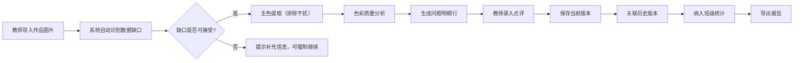

## 1. 产品概述

面向美术教师的学生作品色彩分析与点评数据工具，解决人工配色点评效率低、历史追踪难、数据不完整等问题，实现主色自动提取、色彩质量智能检测、点评历史可追溯、班级对比可量化。

- 核心价值：将主观配色点评转化为可复盘的数据记录，保留历史变化轨迹，识别数据缺口而非假装完整
- 目标用户：中小学/培训机构美术教师

---

## 2. 核心功能

### 2.1 用户角色
| 角色 | 注册方式 | 核心权限 |
|------|---------|----------|
| 美术教师 | 本地账号/无需注册 | 作品导入、色彩分析、点评记录、历史追溯、班级报告导出 |

### 2.2 功能模块
1. **作品导入页**：单张/批量上传作品图片，录入学生信息，自动识别数据缺口
2. **色彩分析页**：主色提取展示、色彩质量检测（重复/偏灰/过饱和）、问题明细标注
3. **点评历史页**：同一作品多次导入对比、变化轨迹记录、历史版本回溯
4. **班级概览页**：班级色彩统计对比、问题分布热力图、整体质量趋势
5. **报告导出页**：Excel/CSV格式导出、自定义报告字段、缺口标记

### 2.3 页面详情
| 页面名称 | 模块名称 | 功能描述 |
|---------|----------|----------|
| 作品导入页 | 上传区域 | 拖拽/点击上传，支持JPG/PNG，透明图层自动检测 |
| 作品导入页 | 信息录入 | 学生姓名、主题、班级，缺失字段高亮标红 |
| 作品导入页 | 缺口识别 | 数据完整性检查，明确列出缺失项而非静默处理 |
| 色彩分析页 | 主色提取 | 排除背景色/极端色/透明像素，提取5-8个主色 |
| 色彩分析页 | 质量检测 | 配色重复度、灰度占比、饱和度分布三项核心指标 |
| 色彩分析页 | 问题明细 | 每个问题定位到具体颜色块，可点击在图上标记 |
| 色彩分析页 | 教师点评 | 结构化点评模板，支持自由文本 |
| 点评历史页 | 版本列表 | 同一作品多次导入的时间线，版本号+导入人 |
| 点评历史页 | 差异对比 | 颜色变化、点评变化、质量评分变化的前后对比 |
| 班级概览页 | 统计看板 | 班级平均分、问题类型分布、优秀作品展示 |
| 班级概览页 | 学生对比 | 按主题/时间维度的学生色彩能力对比 |
| 报告导出页 | 导出配置 | 选择字段、时间范围、班级，预览后导出 |

---

## 3. 核心流程

**关键防呆设计：**
1. 每次导入生成独立版本号，历史数据永不覆盖
2. 背景色/透明像素/极端黑白灰在提取阶段即排除，不参与后续分析
3. 数据缺口在导入时明确标记，导出报告时保留缺口标记

---

## 4. 用户界面设计

### 4.1 设计风格
- **主色调**：深靛蓝 (#1e3a5f) - 专业稳重，适合教育场景
- **辅助色**：赭石橙 (#d46c3a) - 警示高亮，用于标记问题和缺口
- **成功色**：森林绿 (#2d6a4f) - 正常状态
- **警告色**：土黄 (#e9c46a) - 轻度问题
- **危险色**：砖红 (#bc4749) - 严重问题/数据缺失
- **字体**：
  - 标题：思源宋体 - 人文气息，贴合美术教育
  - 正文：思源黑体 - 清晰易读
  - 数字：JetBrains Mono - 数据表格对齐
- **布局**：左侧导航 + 右侧内容区，卡片式模块划分
- **按钮风格**：微圆角 (4px)，轻微阴影，点击有下沉反馈
- **图标风格**：线性细描边，24px标准尺寸，颜色与功能对应

### 4.2 页面设计概述
| 页面名称 | 模块名称 | UI 元素 |
|---------|----------|---------|
| 作品导入页 | 上传区域 | 虚线边框拖拽区，悬停变实，支持多图预览缩略图 |
| 作品导入页 | 缺口提示 | 醒目的橙色卡片，列出缺失字段，带"补充"和"跳过"按钮 |
| 色彩分析页 | 主色展示 | 横向色卡条，每个色卡带占比百分比，悬停显示HEX/RGB |
| 色彩分析页 | 问题明细 | 表格形式，每行一个问题：问题类型、颜色块、严重程度、位置坐标 |
| 色彩分析页 | 画布叠加 | 可切换"显示问题标记"，在原图上用半透明色块标注问题区域 |
| 点评历史页 | 时间线 | 垂直时间线，每个节点带版本号、日期、操作人 |
| 点评历史页 | 对比视图 | 左右分栏，前后版本并排对比，差异处用连接线高亮 |
| 班级概览页 | 统计卡片 | 四个核心指标卡片：作品数、平均分、问题率、完整率 |
| 班级概览页 | 对比图表 | 横向条形图，每个学生一根条，按颜色维度分段 |
| 报告导出页 | 字段选择 | 复选框列表，必填字段默认勾选且不可取消 |

### 4.3 响应性
- 桌面端优先（教师主要在电脑上使用），1280px以上最佳体验
- 平板端：左侧导航收起为图标，内容区自适应
- 移动端：仅支持查看和简单点评，不支持图片上传和报告导出

### 4.4 动效设计
- 页面加载：顶部进度条 + 内容区淡入
- 颜色提取：色卡逐个滑入，伴随占比数字滚动动画
- 问题标记：画布上问题区域呼吸闪烁效果，可关闭
- 时间线：滚动时节点逐个浮现
- 导出进度：环形进度条，完成后有下载弹跳动效
