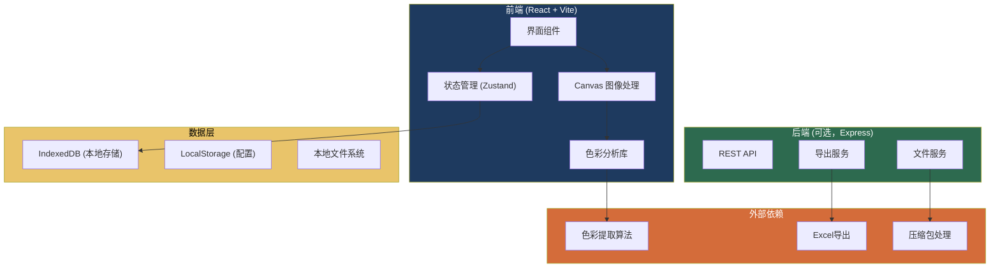

## 1. 架构设计



**架构原则：**
- 优先本地运行，不依赖服务器，教师离线也能使用
- 所有数据默认存在本地 IndexedDB，支持导出备份
- 后端为可选扩展，用于多设备同步和集中管理

---

## 2. 技术描述

### 2.1 核心技术栈
| 层级 | 技术选择 | 版本 | 用途 |
|------|---------|------|------|
| 前端框架 | React | ^18.2.0 | UI 组件化开发 |
| 构建工具 | Vite | ^5.0.0 | 快速开发构建 |
| 样式方案 | Tailwind CSS | ^3.4.0 | 原子化样式 |
| 状态管理 | Zustand | ^4.4.0 | 轻量状态管理 |
| 路由 | React Router | ^6.20.0 | 单页路由 |
| 数据库 | IndexedDB (Dexie.js) | ^4.0.0 | 本地数据持久化 |
| 图表 | Recharts | ^2.10.0 | 数据可视化 |
| 色彩处理 | 自研 + ColorThief | - | 主色提取与分析 |
| 导出 | SheetJS (xlsx) | ^0.18.5 | Excel 导出 |

### 2.2 色彩分析核心算法
- **主色提取**：中位切分算法 (Median Cut)，优化版
  - 预处理：排除透明像素 (alpha < 0.5)
  - 背景检测：四角像素聚类，排除占比 > 30% 的背景色
  - 极端色过滤：排除饱和度 < 5% 或 亮度 < 5% 或 亮度 > 95% 的像素
  - 颜色量化：LAB 颜色空间聚类，减少相似色合并误差

- **质量检测指标**：
  1. **配色重复度**：计算颜色熵值，熵 < 2.0 标记为重复
  2. **偏灰检测**：饱和度 < 20% 的颜色占比 > 40% 标记为偏灰
  3. **过饱和检测**：饱和度 > 85% 且 亮度 > 70% 的颜色占比 > 25% 标记为过饱和

---

## 3. 路由定义

| 路由路径 | 页面名称 | 核心功能 |
|---------|---------|----------|
| `/` | 首页/仪表盘 | 快捷入口、最近作品、数据概览 |
| `/import` | 作品导入 | 图片上传、信息录入、缺口识别 |
| `/analysis/:workId` | 色彩分析 | 主色展示、问题明细、教师点评 |
| `/history/:workId` | 点评历史 | 版本列表、差异对比、回溯 |
| `/class/:classId` | 班级概览 | 统计看板、学生对比、趋势分析 |
| `/export` | 报告导出 | 配置导出、预览、下载 |
| `/samples` | 样例中心 | 内置样例数据、失败操作演示 |

---

## 4. 核心数据模型

### 4.1 ER 图

```mermaid
erDiagram
    CLASS ||--o{ STUDENT : contains
    STUDENT ||--o{ WORK : submits
    WORK ||--o{ WORK_VERSION : has
    WORK_VERSION ||--o{ COLOR_SAMPLE : extracts
    WORK_VERSION ||--o{ COLOR_ISSUE : detects
    WORK_VERSION ||--o| TEACHER_COMMENT : has
    
    CLASS {
        string id PK
        string name
        string grade
        datetime createdAt
    }
    
    STUDENT {
        string id PK
        string classId FK
        string name
        string studentNo
        datetime createdAt
    }
    
    WORK {
        string id PK
        string studentId FK
        string title
        string theme
        datetime createdAt
    }
    
    WORK_VERSION {
        string id PK
        string workId FK
        int versionNumber
        string imageHash
        string imagePath
        int width
        int height
        boolean hasTransparency
        string backgroundColor
        json dataGaps
        datetime importedAt
        string importedBy
    }
    
    COLOR_SAMPLE {
        string id PK
        string versionId FK
        string hex
        int rgb_r
        int rgb_g
        int rgb_b
        float hsl_h
        float hsl_s
        float hsl_l
        float percentage
        boolean isBackground
        boolean isExtreme
        int pixelCount
    }
    
    COLOR_ISSUE {
        string id PK
        string versionId FK
        string type "duplicate/gray/over_saturated"
        string severity "low/medium/high"
        string colorHex
        float percentage
        int pos_x
        int pos_y
        int width
        int height
        string description
    }
    
    TEACHER_COMMENT {
        string id PK
        string versionId FK
        string content
        int overallScore
        json structuredTags
        datetime createdAt
        string teacherName
    }
```

### 4.2 数据缺口标记规范
`WORK_VERSION.dataGaps` 字段存储数据完整性检查结果：
```json
{
  "missingFields": ["studentName", "theme"],
  "incomplete": true,
  "warnings": [
    "图片包含透明图层，已自动排除",
    "背景色占比45%，已排除"
  ],
  "forcedImport": true
}
```

---

## 5. API 定义（可选后端）

### 5.1 类型定义
```typescript
interface WorkImportRequest {
  studentId?: string;
  studentName?: string;
  classId?: string;
  title: string;
  theme?: string;
  imageFile: File;
  forceImport?: boolean;
}

interface WorkImportResponse {
  success: boolean;
  workId: string;
  versionId: string;
  dataGaps: DataGaps;
  warnings: string[];
  requiresConfirmation: boolean;
}

interface ColorAnalysisResult {
  dominantColors: ColorSample[];
  issues: ColorIssue[];
  overallScore: number;
  metrics: {
    colorEntropy: number;
    grayPercentage: number;
    overSaturatedPercentage: number;
    averageSaturation: number;
  };
}

interface ExportRequest {
  classId?: string;
  studentIds?: string[];
  startDate?: string;
  endDate?: string;
  fields: string[];
  format: 'xlsx' | 'csv';
  includeGaps: boolean;
}
```

### 5.2 接口列表
| 方法 | 路径 | 描述 |
|------|------|------|
| POST | `/api/works/import` | 导入作品（含图片上传） |
| GET | `/api/works/:workId` | 获取作品详情 |
| GET | `/api/works/:workId/versions` | 获取作品版本列表 |
| GET | `/api/works/:workId/versions/:versionId` | 获取指定版本详情 |
| GET | `/api/works/:workId/versions/:versionId/analyze` | 执行色彩分析 |
| POST | `/api/works/:workId/versions/:versionId/comment` | 保存教师点评 |
| GET | `/api/classes/:classId/overview` | 获取班级概览数据 |
| GET | `/api/classes/:classId/compare` | 获取学生对比数据 |
| POST | `/api/export` | 导出报告 |

---

## 6. 项目目录结构

```
src/
├── components/          # UI 组件
│   ├── layout/         # 布局组件
│   ├── upload/         # 上传相关
│   ├── color/          # 色彩展示
│   ├── issues/         # 问题明细
│   └── common/         # 通用组件
├── pages/              # 页面组件
│   ├── Dashboard.tsx
│   ├── Import.tsx
│   ├── Analysis.tsx
│   ├── History.tsx
│   ├── ClassOverview.tsx
│   ├── Export.tsx
│   └── Samples.tsx
├── store/              # 状态管理
│   ├── useWorkStore.ts
│   ├── useClassStore.ts
│   └── useUISettings.ts
├── db/                 # 数据库
│   ├── index.ts        # Dexie 实例
│   └── schema.ts       # 表结构定义
├── lib/                # 核心算法
│   ├── colorExtractor.ts  # 主色提取
│   ├── colorAnalyzer.ts   # 质量分析
│   ├── backgroundDetector.ts # 背景检测
│   └── gapDetector.ts     # 缺口识别
├── types/              # TypeScript 类型定义
│   └── index.ts
├── utils/              # 工具函数
│   ├── export.ts       # 导出工具
│   ├── image.ts        # 图片处理
│   └── color.ts        # 颜色转换
├── hooks/              # 自定义 Hooks
│   ├── useColorAnalysis.ts
│   └── useWorkHistory.ts
├── router/             # 路由配置
│   └── index.tsx
└── App.tsx
```

---

## 7. 关键技术决策

### 7.1 为什么用 IndexedDB 而不是后端？
- 教师数据敏感（学生信息、作品），本地存储更安全
- 离线可用，不依赖网络环境
- 单用户场景，无需多设备同步时足够用
- 后续可扩展同步功能，不阻碍演进

### 7.2 为什么自研色彩算法而不是完全依赖开源库？
- 开源库（如 ColorThief）不处理背景排除、透明像素、极端色过滤
- LAB 空间聚类比 RGB 空间更符合人眼感知
- 需要生成问题明细行，定位到具体坐标，开源库不提供

### 7.3 为什么每次导入都生成新版本？
- 防止误操作覆盖历史数据
- 支持追踪学生进步轨迹
- 明确记录每次导入的处理细节（排除了哪些像素、有什么警告）
