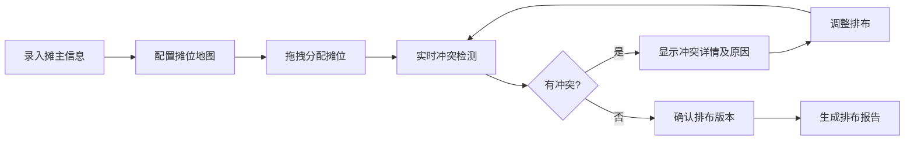

## 1. 产品概述
艺术市集摊位排布管理系统，用于市集主办方高效管理摊主信息、摊位分配、用电约束，并自动检测排布冲突，保留完整的操作历史以便追溯。

- 解决手工排摊位效率低、易出错、无历史记录的问题
- 目标用户：艺术市集主办方、场地管理人员

## 2. 核心功能

### 2.1 用户角色
| 角色 | 注册方式 | 核心权限 |
|------|----------|----------|
| 管理员 | 系统内置 | 全部功能：摊主管理、摊位排布、冲突检测、导出报告 |

### 2.2 功能模块
1. **摊主管理**：摊主信息录入、品类维护、用电需求登记
2. **摊位管理**：摊位地图配置、人流入口设置、用电容量标注
3. **排布工作台**：拖拽式摊位分配、实时冲突检测、换位操作
4. **历史记录**：版本追溯、变更对比、换位日志
5. **报告导出**：排布地图导出、冲突报告、摊位清单

### 2.3 页面详情
| 页面名称 | 模块名称 | 功能描述 |
|----------|----------|----------|
| 摊主管理页 | 摊主列表 | 增删改查摊主信息、批量导入、数据校验 |
| 摊主管理页 | 品类配置 | 预设品类（陶瓷/版画/食品等）、品类分散规则 |
| 摊位地图页 | 摊位配置 | 可视化摊位网格编辑、用电容量标注、人流入口设置 |
| 排布工作台 | 摊位分配 | 拖拽摊主到摊位、自动冲突检测、实时提示 |
| 排布工作台 | 冲突面板 | 高功率错配、同类集中、无记录换位的详细清单 |
| 历史记录页 | 版本管理 | 排布版本快照、版本回滚、变更对比 |
| 报告导出页 | 导出功能 | PNG地图导出、Excel摊位清单、冲突报告PDF |

## 3. 核心流程

### 3.1 摊位排布主流程

### 3.2 换位操作流程

## 4. 用户界面设计

### 4.1 设计风格
- 主色调：深青色 (#0D9488) 代表艺术与秩序
- 辅助色：琥珀色 (#F59E0B) 用于冲突警告、红色 (#EF4444) 用于严重错误
- 中性色：石板灰系列，确保信息层级清晰
- 按钮风格：圆角 6px，微妙阴影，hover 状态轻微上浮
- 字体：标题使用 Noto Serif SC（艺术感），正文使用 Noto Sans SC（可读性）
- 布局风格：左侧导航 + 主内容区的经典后台布局
- 图标风格：Lucide 线性图标，保持简约专业

### 4.2 页面设计概述
| 页面名称 | 模块名称 | UI 元素 |
|----------|----------|---------|
| 排布工作台 | 摊位网格 | 彩色编码的摊位卡片、拖拽状态、冲突高亮 |
| 排布工作台 | 冲突面板 | 按严重程度分组的冲突列表、一键定位功能 |
| 排布工作台 | 摊主待分配区 | 可拖拽的摊主卡片、品类标签、用电标识 |
| 历史记录页 | 时间线 | 垂直时间线展示版本变更、diff 对比视图 |

### 4.3 响应式
- 桌面端优先设计，适配 1440px 及以上分辨率
- 平板端采用两栏布局，移动端简化为单栏滚动
- 拖拽操作在触摸屏上支持长按触发

### 4.4 视觉细节
- 摊位地图使用网格布局，每个摊位有明确的边界和编号
- 冲突摊位使用红色边框 + 闪烁动画提示
- 拖拽过程中有半透明预览和放置指示器
- 页面加载采用骨架屏占位，提升感知速度
