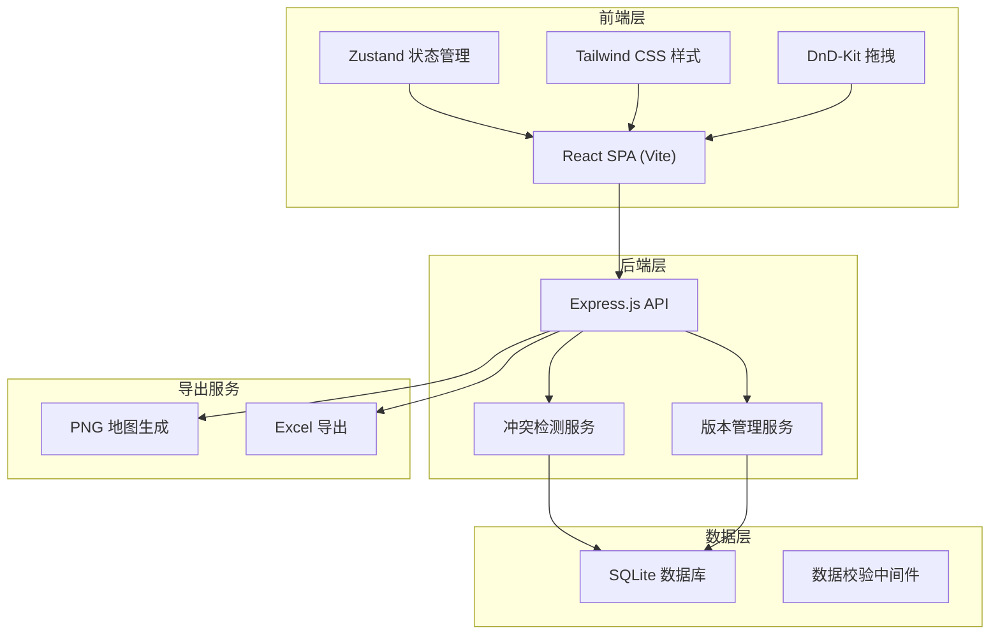
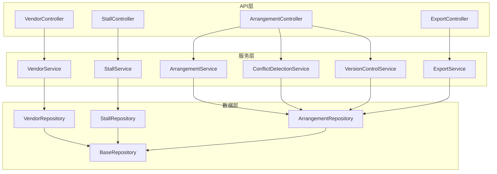
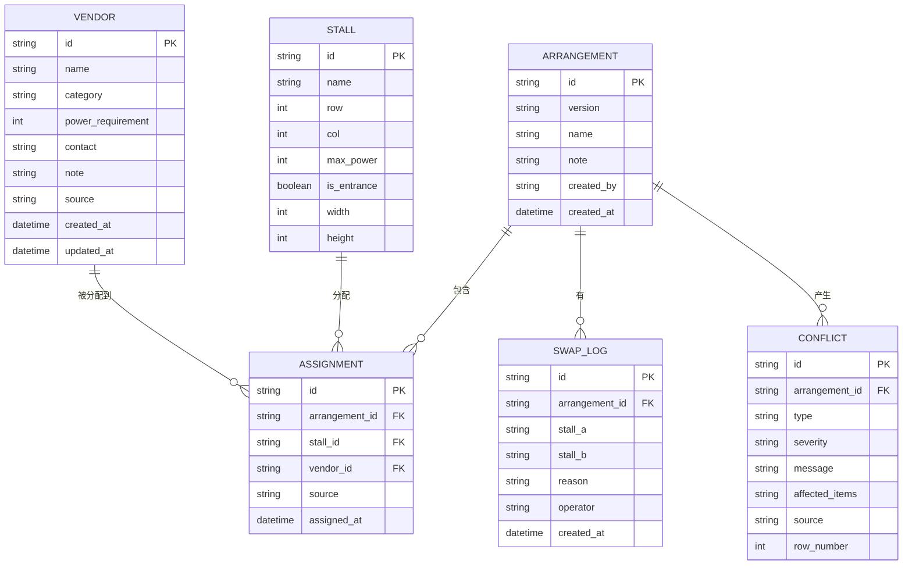

## 1. 架构设计



## 2. 技术描述

- **前端**：React@18 + TypeScript + Vite + TailwindCSS@3 + Zustand + @dnd-kit
- **后端**：Express@4 + TypeScript + better-sqlite3
- **数据库**：SQLite（文件型，无需额外服务）
- **导出工具**：html2canvas（PNG导出）+ xlsx（Excel导出）
- **初始化工具**：vite-init

## 3. 路由定义

### 前端路由
| 路由 | 页面 | 功能 |
|------|------|------|
| / | 仪表盘 | 概览统计、快速入口 |
| /vendors | 摊主管理 | 摊主CRUD、品类管理 |
| /stalls | 摊位配置 | 摊位地图编辑、用电设置 |
| /arrange | 排布工作台 | 拖拽分配、冲突检测 |
| /history | 历史记录 | 版本追溯、变更对比 |
| /export | 报告导出 | 地图、清单、冲突报告导出 |

### 后端 API 路由
| 方法 | 路由 | 功能 |
|------|------|------|
| GET | /api/vendors | 获取摊主列表 |
| POST | /api/vendors | 创建摊主 |
| PUT | /api/vendors/:id | 更新摊主 |
| DELETE | /api/vendors/:id | 删除摊主 |
| GET | /api/stalls | 获取摊位列表 |
| POST | /api/stalls | 创建摊位 |
| PUT | /api/stalls/:id | 更新摊位 |
| GET | /api/arrangements | 获取排布列表 |
| POST | /api/arrangements | 创建排布版本 |
| PUT | /api/arrangements/:id/assign | 分配摊位 |
| POST | /api/arrangements/:id/swap | 换位操作 |
| GET | /api/arrangements/:id/conflicts | 检测冲突 |
| GET | /api/export/map | 导出地图PNG |
| GET | /api/export/excel | 导出Excel清单 |

## 4. API 定义

### 数据类型定义

```typescript
// 摊主
interface Vendor {
  id: string;
  name: string;
  category: 'ceramic' | 'print' | 'food' | 'other';
  powerRequirement: number; // 瓦数
  contact: string;
  note?: string;
  createdAt: string;
  updatedAt: string;
  source?: string; // 数据来源（用于错误追踪）
}

// 摊位
interface Stall {
  id: string;
  name: string;
  row: number;
  col: number;
  maxPower: number; // 最大供电瓦数
  isEntrance: boolean; // 是否靠近入口
  width: number;
  height: number;
}

// 排布记录
interface Arrangement {
  id: string;
  version: string;
  name: string;
  assignments: Assignment[];
  createdAt: string;
  createdBy: string;
  note?: string;
}

// 摊位分配
interface Assignment {
  stallId: string;
  vendorId: string;
  assignedAt: string;
  source?: string; // 操作来源
}

// 换位记录
interface SwapLog {
  id: string;
  arrangementId: string;
  stallA: string;
  stallB: string;
  reason: string;
  operator: string;
  createdAt: string;
}

// 冲突
interface Conflict {
  id: string;
  type: 'power_mismatch' | 'category_cluster' | 'unrecorded_swap';
  severity: 'warning' | 'error';
  message: string;
  affectedItems: string[];
  source?: string; // 原始数据来源
  rowNumber?: number; // 大概行号
}

// 数据导入错误
interface ImportError {
  row: number;
  field: string;
  value: string;
  message: string;
  source: string;
}
```

## 5. 服务架构图



## 6. 数据模型

### 6.1 ER 图



### 6.2 DDL 语句

```sql
-- 摊主表
CREATE TABLE vendors (
  id TEXT PRIMARY KEY,
  name TEXT NOT NULL,
  category TEXT NOT NULL,
  power_requirement INTEGER NOT NULL DEFAULT 0,
  contact TEXT,
  note TEXT,
  source TEXT,
  created_at DATETIME DEFAULT CURRENT_TIMESTAMP,
  updated_at DATETIME DEFAULT CURRENT_TIMESTAMP
);

-- 摊位表
CREATE TABLE stalls (
  id TEXT PRIMARY KEY,
  name TEXT NOT NULL,
  row INTEGER NOT NULL,
  col INTEGER NOT NULL,
  max_power INTEGER NOT NULL DEFAULT 500,
  is_entrance BOOLEAN DEFAULT FALSE,
  width INTEGER NOT NULL DEFAULT 1,
  height INTEGER NOT NULL DEFAULT 1
);

-- 排布版本表
CREATE TABLE arrangements (
  id TEXT PRIMARY KEY,
  version TEXT NOT NULL,
  name TEXT NOT NULL,
  note TEXT,
  created_by TEXT NOT NULL,
  created_at DATETIME DEFAULT CURRENT_TIMESTAMP
);

-- 摊位分配表
CREATE TABLE assignments (
  id TEXT PRIMARY KEY,
  arrangement_id TEXT NOT NULL,
  stall_id TEXT NOT NULL,
  vendor_id TEXT NOT NULL,
  source TEXT,
  assigned_at DATETIME DEFAULT CURRENT_TIMESTAMP,
  FOREIGN KEY (arrangement_id) REFERENCES arrangements(id),
  FOREIGN KEY (stall_id) REFERENCES stalls(id),
  FOREIGN KEY (vendor_id) REFERENCES vendors(id)
);

-- 换位记录表
CREATE TABLE swap_logs (
  id TEXT PRIMARY KEY,
  arrangement_id TEXT NOT NULL,
  stall_a TEXT NOT NULL,
  stall_b TEXT NOT NULL,
  reason TEXT NOT NULL,
  operator TEXT NOT NULL,
  created_at DATETIME DEFAULT CURRENT_TIMESTAMP,
  FOREIGN KEY (arrangement_id) REFERENCES arrangements(id)
);

-- 冲突表
CREATE TABLE conflicts (
  id TEXT PRIMARY KEY,
  arrangement_id TEXT NOT NULL,
  type TEXT NOT NULL,
  severity TEXT NOT NULL,
  message TEXT NOT NULL,
  affected_items TEXT NOT NULL,
  source TEXT,
  row_number INTEGER,
  created_at DATETIME DEFAULT CURRENT_TIMESTAMP,
  FOREIGN KEY (arrangement_id) REFERENCES arrangements(id)
);

-- 索引
CREATE INDEX idx_assignments_arrangement ON assignments(arrangement_id);
CREATE INDEX idx_swap_logs_arrangement ON swap_logs(arrangement_id);
CREATE INDEX idx_conflicts_arrangement ON conflicts(arrangement_id);
```
