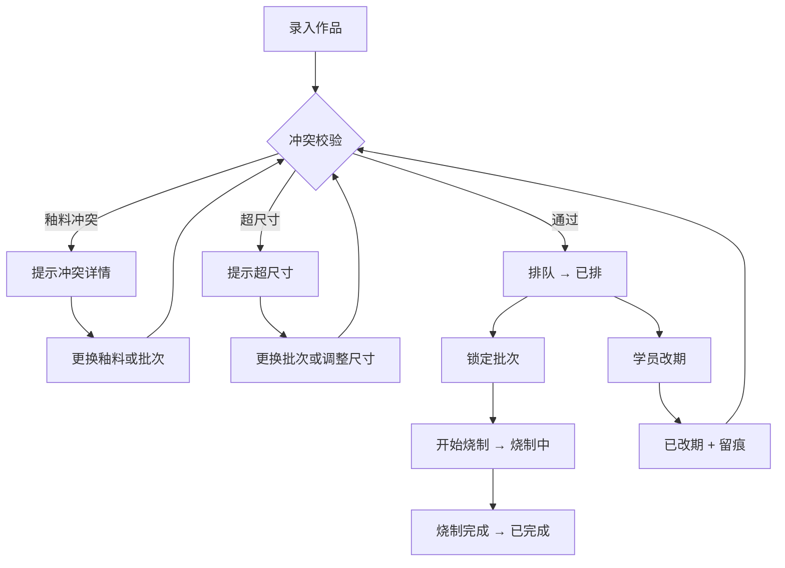

## 1. 产品概述

陶艺窑炉批次排队工具——帮陶艺教室老师把"开窑前排作品"这件事管清楚。厚胎、釉料冲突、学员改期都能自动拦截并留痕，排队结果一键转发给同事。
- 解决问题：开窑前临时重排、釉料冲突漏检、改期无记录、排完队后信息对不齐
- 目标用户：陶艺教室老师、教务同事

## 2. 核心功能

### 2.1 用户角色

| 角色 | 进入方式 | 核心权限 |
|------|----------|----------|
| 老师 | 本地打开即用 | 作品录入、排队、改期、锁定批次、导出报告 |
| 教务同事 | 接收转发链接或文件 | 查看排队状态、查看烧制报告 |

### 2.2 功能模块

1. **排队看板**：全部批次的排队总览，状态筛选、冲突高亮、快捷操作
2. **批次详情**：单批次的作品列表、釉料冲突校验、尺寸校验、锁定/解锁
3. **作品管理**：作品录入、编辑、关联学员和釉料、排队/改期操作
4. **学员管理**：学员信息维护、关联作品查看
5. **釉料管理**：釉料信息及冲突规则维护
6. **改期记录**：改期历史留痕、改期原因
7. **烧制报告**：批次烧制完成后生成报告，支持导出

### 2.3 页面详情

| 页面名称 | 模块名称 | 功能描述 |
|----------|----------|----------|
| 排队看板 | 批次卡片列表 | 按窑炉展示所有批次，每个批次卡片显示状态、作品数、冲突数，支持拖拽排序 |
| 排队看板 | 状态筛选栏 | 按排队状态筛选：待排、已排、烧制中、已完成、已改期 |
| 排队看板 | 冲突预警面板 | 实时展示当前所有冲突项：釉料冲突、超尺寸、改期待处理 |
| 批次详情 | 作品列表 | 批次内作品卡片，显示名称、学员、釉料、尺寸、排队序号 |
| 批次详情 | 冲突校验结果 | 釉料冲突对、超尺寸作品标红，一键排除 |
| 批次详情 | 批次操作栏 | 锁定批次（锁定后不可增删作品）、解锁、开始烧制 |
| 作品管理 | 作品表格 | 全部作品列表，支持新增、编辑、删除、批量排队 |
| 作品管理 | 作品排队弹窗 | 选择目标批次、排队序号，自动触发冲突校验 |
| 学员管理 | 学员列表 | 学员信息及关联作品数 |
| 釉料管理 | 釉料列表 | 釉料名称、烧成温度、冲突规则 |
| 釉料管理 | 冲突规则编辑 | 设置哪些釉料不能同窑烧制 |
| 改期记录 | 改期时间线 | 每次改期记录：原批次→新批次、原因、操作人、时间 |
| 烧制报告 | 报告详情 | 批次信息、作品清单、烧制参数、冲突处理记录 |
| 烧制报告 | 报告导出 | 导出为 JSON/CSV，方便转发 |

## 3. 核心流程

### 3.1 排队状态机

作品排队状态流转：
- **待排** → 作品已录入，等待分配批次
- **已排** → 已分配到某批次某位置
- **烧制中** → 批次已锁定并开始烧制
- **已完成** → 烧制完成
- **已改期** → 学员申请改期，作品从原批次移出，回到待排或直接排入新批次
- **已取消** → 作品取消排队

### 3.2 排队流程

1. 老师录入作品（关联学员、釉料、尺寸）
2. 选择目标批次，触发冲突校验：
   - 釉料冲突：批次内已有作品使用了与当前作品冲突的釉料
   - 尺寸超限：作品尺寸超过窑炉剩余空间
3. 校验通过则排队成功，校验失败则提示冲突详情
4. 批次满意后锁定批次
5. 开始烧制，状态变为"烧制中"
6. 烧制完成，生成报告

### 3.3 改期流程

1. 学员申请改期
2. 老师在作品上操作"改期"
3. 填写改期原因
4. 系统自动将作品从原批次移出，状态变为"已改期"
5. 改期记录自动留痕
6. 老师重新排队

### 3.4 流程图

## 4. 用户界面设计

### 4.1 设计风格

- **主色调**：陶土暖棕 #A0522D，辅色窑火橙 #E8740C，中性色石板灰 #4A5568
- **背景**：米白 #FAF5EF，卡片白 #FFFFFF，带微妙陶土纹理感
- **按钮**：圆角 8px，主按钮暖棕填充，危险操作窑火橙，次要操作灰描边
- **字体**：标题用 Noto Serif SC（宋体感，文化气），正文用 Noto Sans SC
- **布局**：左侧导航 + 右侧内容区，卡片式信息组织
- **图标**：lucide-react 图标库，陶艺相关场景用自定义 emoji 点缀

### 4.2 页面设计概览

| 页面名称 | 模块名称 | UI 元素 |
|----------|----------|----------|
| 排队看板 | 批次卡片列表 | 卡片网格布局，每卡含状态徽章、作品数、冲突数、进度条；颜色按状态区分 |
| 排队看板 | 状态筛选栏 | 顶部 Tab 栏，各状态带计数气泡 |
| 排队看板 | 冲突预警面板 | 右侧浮动面板，冲突项列表，点击跳转对应批次 |
| 批次详情 | 作品列表 | 表格+卡片切换视图，冲突行标红高亮，拖拽排序 |
| 批次详情 | 冲突校验结果 | 红色/橙色警告卡片，冲突釉料对高亮显示 |
| 批次详情 | 批次操作栏 | 顶部操作按钮组，锁定状态带锁图标 |
| 作品管理 | 作品表格 | 行内编辑，批量选择，排队操作列 |
| 作品管理 | 作品排队弹窗 | 居中弹窗，批次选择下拉、序号输入、冲突校验结果预览 |
| 釉料管理 | 冲突矩阵 | 釉料冲突关系的矩阵热力图展示 |
| 改期记录 | 改期时间线 | 垂直时间线，每条含原批次→新批次箭头、原因、时间戳 |
| 烧制报告 | 报告详情 | 打印友好布局，含批次信息、作品表格、冲突处理摘要 |
| 烧制报告 | 报告导出 | 导出按钮，格式选择（JSON/CSV） |

### 4.3 响应式设计

- 桌面优先设计，1280px 以上完整布局
- 平板端（768-1280px）侧边导航收起为图标模式
- 移动端（<768px）单列布局，底部导航

### 4.4 数据一致性原则

导出表、页面统计、单条详情三处展示的数据必须同源：
- 排队看板的统计数字（作品数、冲突数、批次进度）来自同一查询
- 烧制报告导出的数据与页面详情完全一致
- 改期记录在作品详情、批次详情、改期记录页三处可见且内容一致
