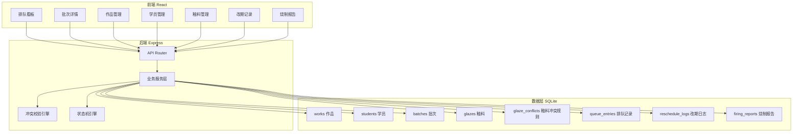
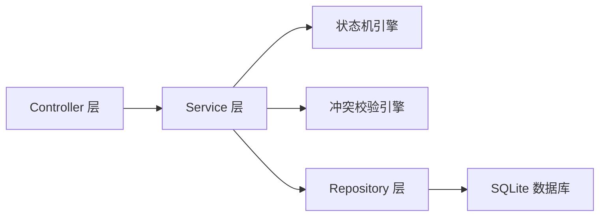
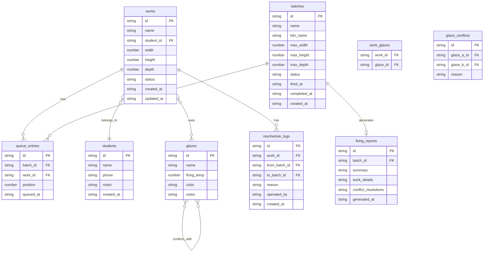

## 1. 架构设计



## 2. 技术说明

- 前端：React@18 + TypeScript + Tailwind CSS@3 + Zustand
- 构建工具：Vite
- 后端：Express@4 + TypeScript（ESM 格式）
- 数据库：SQLite（better-sqlite3），本地文件存储，零配置
- 初始化工具：vite-init（react-express-ts 模板）

## 3. 路由定义

| 路由 | 用途 |
|------|------|
| / | 排队看板，展示所有批次概览、状态筛选、冲突预警 |
| /batch/:id | 批次详情，作品列表、冲突校验、锁定/烧制操作 |
| /works | 作品管理，作品 CRUD、批量排队 |
| /students | 学员管理，学员信息及关联作品 |
| /glazes | 釉料管理，釉料信息及冲突规则 |
| /reschedule | 改期记录，改期时间线 |
| /reports | 烧制报告，报告列表及导出 |

## 4. API 定义

### 4.1 作品 API

```typescript
interface Work {
  id: string
  name: string
  student_id: string
  glaze_ids: string[]
  width: number
  height: number
  depth: number
  status: "pending" | "queued" | "firing" | "completed" | "rescheduled" | "cancelled"
  created_at: string
  updated_at: string
}

GET    /api/works           → Work[]
GET    /api/works/:id       → Work
POST   /api/works           → Work
PUT    /api/works/:id       → Work
DELETE /api/works/:id       → { success: boolean }
```

### 4.2 学员 API

```typescript
interface Student {
  id: string
  name: string
  phone: string
  notes: string
  created_at: string
}

GET    /api/students           → Student[]
GET    /api/students/:id       → Student & { works: Work[] }
POST   /api/students           → Student
PUT    /api/students/:id       → Student
DELETE /api/students/:id       → { success: boolean }
```

### 4.3 批次 API

```typescript
interface Batch {
  id: string
  name: string
  kiln_name: string
  max_width: number
  max_height: number
  max_depth: number
  status: "open" | "locked" | "firing" | "completed"
  fired_at: string | null
  completed_at: string | null
  created_at: string
}

GET    /api/batches           → Batch[]
GET    /api/batches/:id       → Batch & { entries: QueueEntry[], conflicts: Conflict[] }
POST   /api/batches           → Batch
PUT    /api/batches/:id       → Batch
POST   /api/batches/:id/lock  → Batch
POST   /api/batches/:id/unlock → Batch
POST   /api/batches/:id/fire  → Batch
POST   /api/batches/:id/complete → Batch
```

### 4.4 釉料 API

```typescript
interface Glaze {
  id: string
  name: string
  firing_temp: number
  color: string
  notes: string
}

interface GlazeConflict {
  id: string
  glaze_a_id: string
  glaze_b_id: string
  reason: string
}

GET    /api/glazes              → Glaze[]
POST   /api/glazes              → Glaze
PUT    /api/glazes/:id          → Glaze
DELETE /api/glazes/:id          → { success: boolean }
GET    /api/glaze-conflicts     → GlazeConflict[]
POST   /api/glaze-conflicts     → GlazeConflict
DELETE /api/glaze-conflicts/:id → { success: boolean }
```

### 4.5 排队 API

```typescript
interface QueueEntry {
  id: string
  batch_id: string
  work_id: string
  position: number
  queued_at: string
}

POST   /api/queue/enqueue       → { entry: QueueEntry, conflicts: Conflict[] }
DELETE /api/queue/:entryId      → { success: boolean }
PUT    /api/queue/:entryId/position → QueueEntry
POST   /api/queue/reschedule    → { entry: QueueEntry, log: RescheduleLog }

interface Conflict {
  type: "glaze_conflict" | "size_exceeded"
  message: string
  details: Record<string, string>
}
```

### 4.6 改期记录 API

```typescript
interface RescheduleLog {
  id: string
  work_id: string
  from_batch_id: string
  to_batch_id: string | null
  reason: string
  operated_by: string
  created_at: string
}

GET    /api/reschedule-logs     → RescheduleLog[]
GET    /api/works/:id/reschedule-logs → RescheduleLog[]
```

### 4.7 烧制报告 API

```typescript
interface FiringReport {
  id: string
  batch_id: string
  summary: string
  work_details: WorkReportItem[]
  conflict_resolutions: ConflictResolution[]
  generated_at: string
}

interface WorkReportItem {
  work_id: string
  work_name: string
  student_name: string
  glaze_names: string[]
  dimensions: string
  position: number
  status: string
}

interface ConflictResolution {
  type: string
  description: string
  resolution: string
}

GET    /api/reports             → FiringReport[]
GET    /api/reports/:id         → FiringReport
GET    /api/reports/:id/export?format=json|csv → File download
POST   /api/batches/:id/generate-report → FiringReport
```

## 5. 服务器架构图



- **Controller 层**：路由处理、参数校验、响应格式化
- **Service 层**：业务逻辑编排，调用状态机和冲突校验
- **状态机引擎**：管理作品排队状态流转，确保合法转换
- **冲突校验引擎**：入队时检查釉料冲突和尺寸限制
- **Repository 层**：SQL 查询封装、事务管理

## 6. 数据模型

### 6.1 数据模型定义



### 6.2 数据定义语言

```sql
CREATE TABLE students (
  id TEXT PRIMARY KEY,
  name TEXT NOT NULL,
  phone TEXT DEFAULT '',
  notes TEXT DEFAULT '',
  created_at TEXT NOT NULL DEFAULT (datetime('now'))
);

CREATE TABLE glazes (
  id TEXT PRIMARY KEY,
  name TEXT NOT NULL,
  firing_temp INTEGER NOT NULL,
  color TEXT DEFAULT '',
  notes TEXT DEFAULT ''
);

CREATE TABLE glaze_conflicts (
  id TEXT PRIMARY KEY,
  glaze_a_id TEXT NOT NULL REFERENCES glazes(id),
  glaze_b_id TEXT NOT NULL REFERENCES glazes(id),
  reason TEXT NOT NULL DEFAULT '釉料冲突'
);

CREATE UNIQUE INDEX idx_glaze_conflict_pair ON glaze_conflicts(glaze_a_id, glaze_b_id);

CREATE TABLE works (
  id TEXT PRIMARY KEY,
  name TEXT NOT NULL,
  student_id TEXT NOT NULL REFERENCES students(id),
  width REAL NOT NULL DEFAULT 0,
  height REAL NOT NULL DEFAULT 0,
  depth REAL NOT NULL DEFAULT 0,
  status TEXT NOT NULL DEFAULT 'pending' CHECK (status IN ('pending','queued','firing','completed','rescheduled','cancelled')),
  created_at TEXT NOT NULL DEFAULT (datetime('now')),
  updated_at TEXT NOT NULL DEFAULT (datetime('now'))
);

CREATE TABLE work_glazes (
  work_id TEXT NOT NULL REFERENCES works(id) ON DELETE CASCADE,
  glaze_id TEXT NOT NULL REFERENCES glazes(id) ON DELETE CASCADE,
  PRIMARY KEY (work_id, glaze_id)
);

CREATE TABLE batches (
  id TEXT PRIMARY KEY,
  name TEXT NOT NULL,
  kiln_name TEXT NOT NULL DEFAULT '1号窑',
  max_width REAL NOT NULL DEFAULT 60,
  max_height REAL NOT NULL DEFAULT 40,
  max_depth REAL NOT NULL DEFAULT 60,
  status TEXT NOT NULL DEFAULT 'open' CHECK (status IN ('open','locked','firing','completed')),
  fired_at TEXT,
  completed_at TEXT,
  created_at TEXT NOT NULL DEFAULT (datetime('now'))
);

CREATE TABLE queue_entries (
  id TEXT PRIMARY KEY,
  batch_id TEXT NOT NULL REFERENCES batches(id),
  work_id TEXT NOT NULL REFERENCES works(id),
  position INTEGER NOT NULL DEFAULT 0,
  queued_at TEXT NOT NULL DEFAULT (datetime('now'))
);

CREATE INDEX idx_queue_batch ON queue_entries(batch_id);
CREATE INDEX idx_queue_work ON queue_entries(work_id);

CREATE TABLE reschedule_logs (
  id TEXT PRIMARY KEY,
  work_id TEXT NOT NULL REFERENCES works(id),
  from_batch_id TEXT NOT NULL REFERENCES batches(id),
  to_batch_id TEXT REFERENCES batches(id),
  reason TEXT NOT NULL DEFAULT '',
  operated_by TEXT NOT NULL DEFAULT '',
  created_at TEXT NOT NULL DEFAULT (datetime('now'))
);

CREATE INDEX idx_reschedule_work ON reschedule_logs(work_id);

CREATE TABLE firing_reports (
  id TEXT PRIMARY KEY,
  batch_id TEXT NOT NULL REFERENCES batches(id),
  summary TEXT NOT NULL DEFAULT '',
  work_details TEXT NOT NULL DEFAULT '[]',
  conflict_resolutions TEXT NOT NULL DEFAULT '[]',
  generated_at TEXT NOT NULL DEFAULT (datetime('now'))
);

CREATE INDEX idx_report_batch ON firing_reports(batch_id);
```

### 6.3 初始样例数据

样例数据故意包含冲突场景：

- 学员：张小明、李静、王大伟、赵美丽、陈老师
- 釉料：青瓷釉(1280°C)、铜红釉(1280°C)、冰裂纹(1260°C)、天目釉(1280°C)、透明釉(1260°C)
- 釉料冲突规则：铜红釉 与 冰裂纹 不能同窑、天目釉 与 青瓷釉 不能同窑
- 作品含：超尺寸作品（大花瓶 65×50×65 超出默认窑炉限制）、冲突釉料作品、已改期作品
- 批次含：开放批次、已锁定批次、烧制中批次

```sql
INSERT INTO students (id, name, phone, notes) VALUES
  ('s1', '张小明', '13800001111', '周末班学员'),
  ('s2', '李静', '13800002222', '工作日晚班'),
  ('s3', '王大伟', '13800003333', '高级班，偏好大件'),
  ('s4', '赵美丽', '13800004444', '体验课学员'),
  ('s5', '陈老师', '13800005555', '指导老师，偶尔也做作品');

INSERT INTO glazes (id, name, firing_temp, color, notes) VALUES
  ('g1', '青瓷釉', 1280, '#7BA98F', '经典青瓷'),
  ('g2', '铜红釉', 1280, '#C04851', '还原焰烧成'),
  ('g3', '冰裂纹', 1260, '#E0ECE4', '开片效果'),
  ('g4', '天目釉', 1280, '#2F2F2F', '黑釉系'),
  ('g5', '透明釉', 1260, '#F5F5F5', '基础透明');

INSERT INTO glaze_conflicts (id, glaze_a_id, glaze_b_id, reason) VALUES
  ('gc1', 'g2', 'g3', '铜红釉与冰裂纹烧成气氛冲突，同窑会导致釉面互污'),
  ('gc2', 'g4', 'g1', '天目釉与青瓷釉对还原气氛要求不同，同窑烧制效果差');

INSERT INTO batches (id, name, kiln_name, max_width, max_height, max_depth, status, created_at) VALUES
  ('b1', '第3期-A窑', '1号窑', 60, 40, 60, 'open', '2026-05-25T09:00:00'),
  ('b2', '第3期-B窑', '2号窑', 80, 50, 80, 'open', '2026-05-25T09:30:00'),
  ('b3', '第2期-A窑', '1号窑', 60, 40, 60, 'locked', '2026-05-20T08:00:00'),
  ('b4', '第1期-A窑', '1号窑', 60, 40, 60, 'firing', '2026-05-18T10:00:00');

INSERT INTO works (id, name, student_id, width, height, depth, status, created_at, updated_at) VALUES
  ('w1', '茶杯套装', 's1', 12, 8, 12, 'queued', '2026-05-24T10:00:00', '2026-05-24T10:00:00'),
  ('w2', '花瓶', 's2', 15, 25, 15, 'queued', '2026-05-24T11:00:00', '2026-05-24T11:00:00'),
  ('w3', '大花瓶', 's3', 65, 50, 65, 'pending', '2026-05-24T14:00:00', '2026-05-24T14:00:00'),
  ('w4', '茶碗', 's4', 10, 6, 10, 'queued', '2026-05-24T15:00:00', '2026-05-24T15:00:00'),
  ('w5', '香炉', 's5', 20, 15, 20, 'queued', '2026-05-24T16:00:00', '2026-05-24T16:00:00'),
  ('w6', '小碟', 's1', 8, 2, 8, 'pending', '2026-05-25T09:00:00', '2026-05-25T09:00:00'),
  ('w7', '挂件', 's4', 5, 5, 3, 'rescheduled', '2026-05-23T10:00:00', '2026-05-25T10:00:00'),
  ('w8', '茶壶', 's2', 18, 12, 14, 'queued', '2026-05-25T11:00:00', '2026-05-25T11:00:00'),
  ('w9', '笔洗', 's5', 22, 10, 22, 'completed', '2026-05-15T09:00:00', '2026-05-20T18:00:00'),
  ('w10', '烟灰缸', 's3', 14, 6, 14, 'queued', '2026-05-25T14:00:00', '2026-05-25T14:00:00');

INSERT INTO work_glazes (work_id, glaze_id) VALUES
  ('w1', 'g1'),
  ('w2', 'g2'),
  ('w3', 'g2'),
  ('w4', 'g3'),
  ('w5', 'g4'),
  ('w6', 'g5'),
  ('w7', 'g1'),
  ('w8', 'g2'),
  ('w9', 'g1'),
  ('w10', 'g4');

INSERT INTO queue_entries (id, batch_id, work_id, position, queued_at) VALUES
  ('qe1', 'b1', 'w1', 1, '2026-05-24T10:30:00'),
  ('qe2', 'b1', 'w2', 2, '2026-05-24T11:30:00'),
  ('qe3', 'b1', 'w4', 3, '2026-05-24T15:30:00'),
  ('qe4', 'b2', 'w5', 1, '2026-05-24T16:30:00'),
  ('qe5', 'b2', 'w8', 2, '2026-05-25T11:30:00'),
  ('qe6', 'b2', 'w10', 3, '2026-05-25T14:30:00'),
  ('qe7', 'b3', 'w9', 1, '2026-05-20T08:30:00');

INSERT INTO reschedule_logs (id, work_id, from_batch_id, to_batch_id, reason, operated_by, created_at) VALUES
  ('rl1', 'w7', 'b1', NULL, '学员赵美丽出差，无法准时取件，申请改期', '张老师', '2026-05-25T10:00:00');
```
