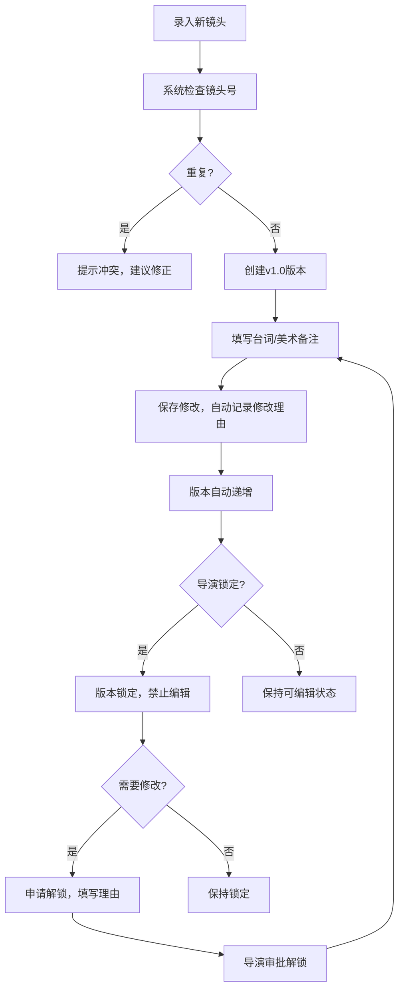
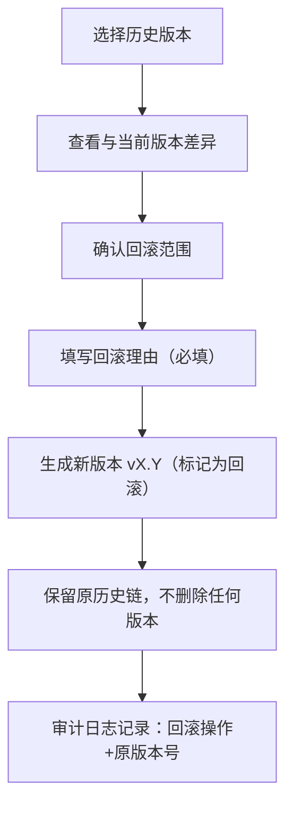
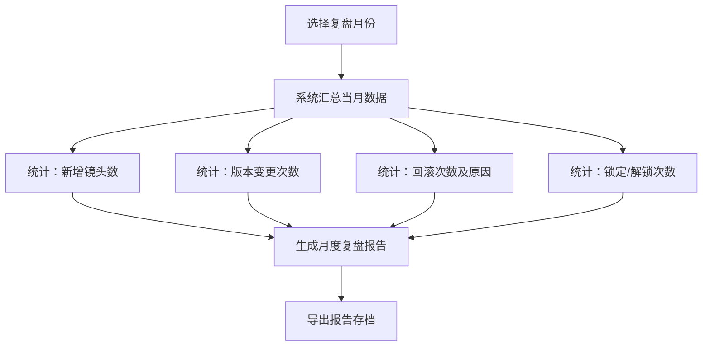

## 1. 产品概述

动画分镜版本锁定系统是为动画导演和制作团队设计的专业版本管理工具，解决分镜迭代过程中旧版台词、镜头号、美术备注被覆盖的核心痛点。系统通过严格的版本锁定制、完整的修改留痕机制和清晰的差异对比，确保每个镜头的历史可追溯、变更可审计、回滚可验证。

### 核心问题
- 镜头号重复录入导致混乱
- 旧版美术备注和台词被无痕迹覆盖
- 版本回退被误认为是正常修改
- 材料不齐时的部分录入导致版本断层
- 月底复盘缺乏完整的变更审计轨迹

### 目标用户
- 动画导演：分镜审定、版本锁定
- 分镜师：镜头录入、版本更新
- 美术指导：美术备注管理
- 后期制作：分镜查阅、导出报告

---

## 2. 核心功能

### 2.1 用户角色
| 角色 | 登录方式 | 核心权限 |
|------|----------|----------|
| 导演 | 本地身份标识 | 版本锁定、解锁、回滚审批 |
| 分镜师 | 本地身份标识 | 镜头录入、编辑、创建新版本 |
| 美术指导 | 本地身份标识 | 美术备注编辑、审核标记 |
| 观察者 | 本地身份标识 | 查看、导出、对比历史 |

### 2.2 功能模块
1. **镜头列表页**：镜头索引、搜索筛选、版本状态、批量操作
2. **分镜详情页**：镜头信息、台词展示、美术备注、版本时间线
3. **编辑页面**：字段级编辑、修改理由、旧值自动留存、镜头号查重
4. **版本历史页**：版本对比、差异高亮、回滚操作、审计轨迹
5. **报告导出页**：变更报告生成、多格式导出、月度复盘汇总

### 2.3 页面详情
| 页面名称 | 模块名称 | 功能描述 |
|----------|----------|----------|
| 镜头列表页 | 镜头索引面板 | 按镜头号排序、显示当前版本号、锁定状态标签 |
| 镜头列表页 | 搜索筛选区 | 按镜头号、场景、状态、修改人筛选；关键词搜索 |
| 镜头列表页 | 批量操作区 | 批量锁定、批量导出、批量版本对比 |
| 分镜详情页 | 镜头信息卡 | 镜头号、场景、时长、分镜图预览、版本号 |
| 分镜详情页 | 台词展示区 | 角色台词、旁白、音效标记，带版本戳 |
| 分镜详情页 | 美术备注区 | 分层展示：美术要求、特效说明、参考资料，每条带修改历史 |
| 分镜详情页 | 版本时间线 | 可视化版本演进、锁定标记、回滚标记 |
| 编辑页面 | 字段编辑器 | 每个字段独立编辑，保存时需填写修改理由 |
| 编辑页面 | 镜头号查重 | 实时检测重复镜头号，提示冲突并建议修正 |
| 编辑页面 | 旧值预览 | 保存前展示新旧值对比，确认后提交 |
| 版本历史页 | 版本对比器 | 左右分屏对比两个版本，差异字段高亮显示 |
| 版本历史页 | 回滚操作 | 回滚需注明理由，回滚版本标记为"回滚生成"，不覆盖历史 |
| 版本历史页 | 审计轨迹 | 完整展示每个修改的：修改人、时间、字段、旧值、新值、理由 |
| 报告导出页 | 变更报告生成 | 按时间范围、镜头范围、修改类型筛选变更 |
| 报告导出页 | 多格式导出 | 支持 Markdown、CSV、JSON 三种格式导出 |
| 报告导出页 | 月度复盘 | 自动汇总当月所有变更、回滚、锁定操作统计 |

---

## 3. 核心流程

### 3.1 分镜录入与迭代流程

### 3.2 版本回滚流程

### 3.3 月底复盘流程

---

## 4. 用户界面设计

### 4.1 设计风格
**专业电影剪辑室风格** —— 深色主题、高对比度、强调数据可读性
- **主色调**：深炭灰 `#1a1a2e`（背景）、电影胶片红 `#e94560`（强调/警告）、胶片青 `#0f3460`（辅助）
- **中性色**：多级灰度，确保文本层级清晰
- **字体**：
  - 标题：`JetBrains Mono` —— 等宽字体，适合显示版本号、镜头号等专业数据
  - 正文：`Noto Sans SC` —— 清晰易读的中文字体
- **视觉元素**：
  - 胶片孔边距装饰、时间码显示风格
  - 版本标签采用胶片卷轴图标
  - 锁定状态使用挂锁图标并加红色边框
  - 回滚版本使用逆时针箭头和特殊标记

### 4.2 关键交互设计
- **字段级编辑**：点击字段进入编辑态，右侧显示"旧值→新值"预览
- **差异高亮**：新增内容绿色下划线，删除内容红色删除线，修改内容黄色背景
- **时间线动画**：版本切换时的平滑过渡动画，回滚操作有特殊的逆时针过渡
- **状态徽章**：
  - 🟢 草稿：可编辑
  - 🟡 待审：提交导演审核
  - 🔴 锁定：不可编辑，边框加粗
  - ⚪ 回滚生成：版本号旁显示回滚标记

### 4.3 页面设计概览
| 页面名称 | 模块名称 | UI 设计要点 |
|----------|----------|-------------|
| 镜头列表页 | 镜头索引 | 左侧时间线样式索引，卡片式列表，每个卡片显示镜头号缩略图、版本号、状态徽章 |
| 镜头列表页 | 筛选区 | 顶部深色工具栏，下拉筛选器采用胶片卷轴风格 |
| 分镜详情页 | 主内容区 | 三栏布局：左导航、中内容（分镜图+台词）、右侧栏（美术备注+版本时间线） |
| 分镜详情页 | 台词展示 | 剧本格式排版，角色名加粗大写，台词缩进，每条带版本小标记 |
| 分镜详情页 | 版本时间线 | 垂直时间线，每个节点可点击，锁定节点红色，回滚节点虚线边框 |
| 编辑页面 | 编辑器 | 模态框形式，左侧编辑区，右侧实时预览差异，底部必填"修改理由" |
| 版本历史页 | 对比器 | 左右分屏，中间可拖动分割线，鼠标悬停显示修改详情 |
| 报告导出页 | 预览区 | 报告实时预览，可点击展开/折叠各部分，导出按钮醒目 |

### 4.4 响应式设计
- **桌面端**（1280px+）：完整三栏布局，所有功能可用
- **平板端**（768-1279px）：两栏布局，右侧栏可折叠
- **移动端**（<768px）：单栏堆叠，核心功能保留（查看、简单编辑）

---

## 5. 数据完整性保障设计

### 5.1 防覆盖机制
- 每次编辑创建**新版本**，永不修改历史记录
- 版本号规则：`主版本.次版本`，锁定时主版本+1，小修改次版本+1
- 所有字段修改均记录：`field_name, old_value, new_value, modified_by, modified_at, reason`

### 5.2 镜头号防重复
- 镜头号格式：`场景号-镜头号`（如 `S01-E012`）
- 录入时实时校验，保存前二次校验
- 重复时显示冲突列表，可跳转查看冲突镜头

### 5.3 回滚审计
- 回滚操作创建新版本，标记 `rollback_from: version_id`
- 回滚版本在时间线上特殊标记
- 月度报告单独统计回滚操作，不与正常修改混淆
