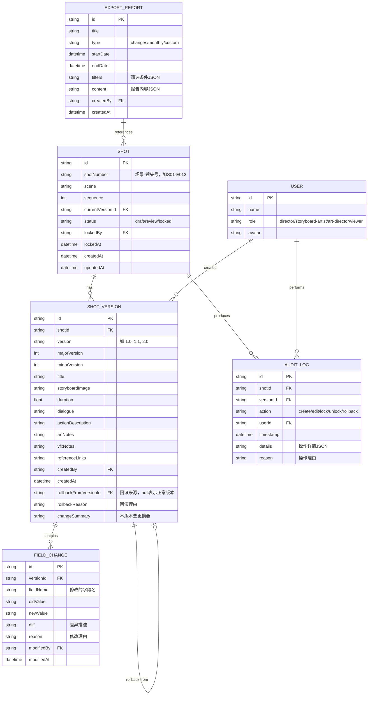

## 1. 架构设计

```mermaid
flowchart TD
    subgraph "Frontend (React 18 + TypeScript)"
        A["Pages (页面层)"] --> B["Components (组件层)"]
        B --> C["Zustand Store (状态管理层)"]
        C --> D["LocalStorage Persist (持久化层)"]
        B --> E["Hooks (自定义Hooks)"]
        E --> F["Utils (工具函数)"]
    end
    
    subgraph "Data Layer"
        G["TypeScript Types (类型定义)"]
        H["Mock Data (示例数据)"]
        I["Diff Engine (差异对比引擎)"]
        J["Export Engine (导出引擎)"]
    end
    
    C --> G
    I --> G
    J --> G
    
    style A fill:#1a1a2e,stroke:#e94560
    style C fill:#0f3460,stroke:#e94560
    style G fill:#16213e,stroke:#e94560
```



---

## 2. 技术描述

### 2.1 技术栈选型
| 层级 | 技术 | 版本 | 用途 |
|------|------|------|------|
| 前端框架 | React | 18.x | UI 渲染 |
| 类型系统 | TypeScript | 5.x | 类型安全 |
| 构建工具 | Vite | 5.x | 构建与开发 |
| 样式方案 | TailwindCSS | 3.x | 原子化样式 |
| 状态管理 | Zustand | 4.x | 状态管理 + 持久化 |
| 路由 | React Router DOM | 6.x | 页面路由 |
| 图标 | Lucide React | 0.x | 图标库 |
| 差异对比 | diff | 5.x | 文本差异计算 |
| 数据持久化 | localStorage API | - | 浏览器本地存储 |

### 2.2 核心设计原则
1. **不可变历史**：所有历史版本一旦创建永不修改，编辑操作永远创建新版本
2. **字段级审计**：每个字段的每次修改都独立记录，包含旧值、新值、修改人、时间、理由
3. **状态可追溯**：任何状态变化都有明确的触发原因和操作记录
4. **持久化优先**：所有状态变更立即写入 localStorage，刷新不丢失

---

## 3. 路由定义

| 路由路径 | 页面名称 | 核心功能 |
|----------|----------|----------|
| `/` | 镜头列表页 | 镜头索引、搜索筛选、状态概览 |
| `/shot/:id` | 分镜详情页 | 镜头信息、台词、美术备注、版本时间线 |
| `/shot/:id/edit` | 分镜编辑页 | 字段编辑、修改理由、镜头号查重、差异预览 |
| `/shot/:id/history` | 版本历史页 | 版本列表、差异对比、回滚操作、审计轨迹 |
| `/export` | 报告导出页 | 变更报告、月度复盘、多格式导出 |
| `/export/:reportId` | 报告预览页 | 单份报告详情预览 |

---

## 4. 数据模型

### 4.1 实体关系图



### 4.2 TypeScript 类型定义

```typescript
// 基础类型
export type UserRole = 'director' | 'storyboard-artist' | 'art-director' | 'viewer';
export type ShotStatus = 'draft' | 'review' | 'locked';
export type AuditAction = 'create' | 'edit' | 'lock' | 'unlock' | 'rollback' | 'export';
export type ExportFormat = 'markdown' | 'csv' | 'json';
export type ReportType = 'changes' | 'monthly' | 'custom';

// 用户
export interface User {
  id: string;
  name: string;
  role: UserRole;
  avatar?: string;
}

// 字段修改记录（核心！每个字段的每次修改都有记录）
export interface FieldChange {
  id: string;
  versionId: string;
  fieldName: string;
  oldValue: string;
  newValue: string;
  diff: string;
  reason: string;
  modifiedBy: string;
  modifiedAt: string;
}

// 分镜版本（每个版本都是完整快照）
export interface ShotVersion {
  id: string;
  shotId: string;
  version: string;
  majorVersion: number;
  minorVersion: number;
  title: string;
  storyboardImage?: string;
  duration: number;
  dialogue: string;
  actionDescription: string;
  artNotes: string;
  vfxNotes: string;
  referenceLinks: string;
  createdBy: string;
  createdAt: string;
  rollbackFromVersionId?: string;
  rollbackReason?: string;
  changeSummary: string;
  fieldChanges: FieldChange[];
}

// 分镜镜头
export interface Shot {
  id: string;
  shotNumber: string;
  scene: string;
  sequence: number;
  currentVersionId: string;
  status: ShotStatus;
  lockedBy?: string;
  lockedAt?: string;
  createdAt: string;
  updatedAt: string;
  versions: ShotVersion[];
}

// 审计日志
export interface AuditLog {
  id: string;
  shotId: string;
  versionId?: string;
  action: AuditAction;
  userId: string;
  timestamp: string;
  details: Record<string, any>;
  reason: string;
}

// 导出报告
export interface ExportReport {
  id: string;
  title: string;
  type: ReportType;
  startDate: string;
  endDate: string;
  filters: Record<string, any>;
  content: ReportContent;
  createdBy: string;
  createdAt: string;
}

export interface ReportContent {
  summary: {
    totalShots: number;
    newShots: number;
    totalVersions: number;
    edits: number;
    rollbacks: number;
    locks: number;
    unlocks: number;
  };
  shotChanges: Array<{
    shotId: string;
    shotNumber: string;
    changes: FieldChange[];
    versions: string[];
  }>;
  rollbackDetails: Array<{
    shotId: string;
    shotNumber: string;
    fromVersion: string;
    toVersion: string;
    reason: string;
    timestamp: string;
  }>;
  auditTrail: AuditLog[];
}

// 差异对比结果
export interface DiffResult {
  fieldName: string;
  oldValue: string;
  newValue: string;
  changes: Array<{
    type: 'added' | 'removed' | 'unchanged';
    value: string;
  }>;
}

// 应用状态
export interface AppState {
  currentUser: User;
  shots: Shot[];
  auditLogs: AuditLog[];
  exportReports: ExportReport[];
  selectedShotId?: string;
  selectedVersionId?: string;
  filters: {
    search: string;
    scene: string;
    status: ShotStatus | 'all';
    modifiedBy: string;
    dateRange: [string, string] | null;
  };
}
```

### 4.3 版本号管理规则
```typescript
// 版本号递增逻辑
function getNextVersion(
  currentVersion: ShotVersion, 
  isMajorChange: boolean
): { major: number; minor: number; versionString: string } {
  if (isMajorChange) {
    // 锁定解锁、重大调整：主版本+1，次版本归零
    return {
      major: currentVersion.majorVersion + 1,
      minor: 0,
      versionString: `${currentVersion.majorVersion + 1}.0`
    };
  } else {
    // 普通编辑：次版本+1
    return {
      major: currentVersion.majorVersion,
      minor: currentVersion.minorVersion + 1,
      versionString: `${currentVersion.majorVersion}.${currentVersion.minorVersion + 1}`
    };
  }
}
```

### 4.4 镜头号防重复算法
```typescript
function validateShotNumber(
  shotNumber: string, 
  excludeShotId?: string
): { valid: boolean; conflicts: Shot[] } {
  const conflicts = shots.filter(shot => 
    shot.shotNumber === shotNumber && 
    shot.id !== excludeShotId
  );
  return {
    valid: conflicts.length === 0,
    conflicts
  };
}

// 镜头号格式校验: S01-E012, S10-E123
function parseShotNumber(shotNumber: string): { 
  scene: string; 
  sequence: number; 
  valid: boolean 
} {
  const match = shotNumber.match(/^S(\d+)-E(\d+)$/);
  if (!match) return { scene: '', sequence: 0, valid: false };
  return {
    scene: `S${match[1]}`,
    sequence: parseInt(match[2], 10),
    valid: true
  };
}
```

---

## 5. 状态管理设计

### 5.1 Zustand Store 结构

```typescript
interface ShotStore {
  // 状态
  shots: Shot[];
  currentUser: User;
  auditLogs: AuditLog[];
  exportReports: ExportReport[];
  filters: AppState['filters'];
  
  // 镜头操作
  addShot: (shot: Omit<Shot, 'id' | 'createdAt' | 'updatedAt' | 'versions'>, 
           versionData: Omit<ShotVersion, 'id' | 'shotId' | 'createdAt' | 'fieldChanges'>,
           reason: string) => Shot;
           
  updateShot: (shotId: string, 
               fieldUpdates: Partial<ShotVersion>, 
               reason: string,
               isMajorChange?: boolean) => ShotVersion;
               
  lockShot: (shotId: string, reason: string) => void;
  unlockShot: (shotId: string, reason: string) => void;
  
  // 版本操作
  rollbackToVersion: (shotId: string, 
                      targetVersionId: string, 
                      reason: string) => ShotVersion;
                      
  compareVersions: (shotId: string, 
                    versionId1: string, 
                    versionId2: string) => DiffResult[];
                    
  // 筛选操作
  setFilters: (filters: Partial<AppState['filters']>) => void;
  getFilteredShots: () => Shot[];
  
  // 审计与导出
  getAuditTrail: (shotId?: string, 
                  startDate?: string, 
                  endDate?: string) => AuditLog[];
                  
  generateReport: (type: ReportType, 
                   startDate: string, 
                   endDate: string,
                   filters?: Record<string, any>) => ExportReport;
                   
  exportReport: (reportId: string, format: ExportFormat) => string;
  
  // 持久化
  hydrate: () => void;
}
```

### 5.2 状态变更与审计流程

```typescript
// 每次状态变更的标准流程
function withAudit<T>(
  action: AuditAction,
  shotId: string,
  userId: string,
  reason: string,
  details: Record<string, any>,
  operation: () => T
): T {
  // 1. 执行操作
  const result = operation();
  
  // 2. 记录审计日志
  const auditLog: AuditLog = {
    id: generateId(),
    shotId,
    action,
    userId,
    timestamp: new Date().toISOString(),
    details,
    reason
  };
  auditLogs.push(auditLog);
  
  // 3. 持久化
  persist();
  
  return result;
}
```

### 5.3 持久化方案
使用 `zustand/middleware` 的 `persist` 中间件：
```typescript
import { persist } from 'zustand/middleware';

export const useShotStore = create<ShotStore>()(
  persist(
    (set, get) => ({
      // ... store 实现
    }),
    {
      name: 'shot-version-lock-storage',
      partialize: (state) => ({
        shots: state.shots,
        auditLogs: state.auditLogs,
        exportReports: state.exportReports,
        currentUser: state.currentUser,
        filters: state.filters,
      }),
      onRehydrateStorage: () => (state) => {
        if (state) {
          state.hydrate();
        }
      },
    }
  )
);
```

---

## 6. 核心算法实现

### 6.1 字段变更检测与记录
```typescript
function detectFieldChanges(
  oldVersion: ShotVersion,
  newData: Partial<ShotVersion>,
  reason: string,
  userId: string
): FieldChange[] {
  const changes: FieldChange[] = [];
  const trackFields: Array<keyof ShotVersion> = [
    'title', 'dialogue', 'actionDescription', 
    'artNotes', 'vfxNotes', 'referenceLinks', 
    'duration', 'storyboardImage'
  ];
  
  for (const field of trackFields) {
    const oldValue = String(oldVersion[field] ?? '');
    const newValue = String(newData[field] ?? oldValue);
    
    if (oldValue !== newValue) {
      changes.push({
        id: generateId(),
        versionId: '',
        fieldName: field as string,
        oldValue,
        newValue,
        diff: computeDiff(oldValue, newValue),
        reason,
        modifiedBy: userId,
        modifiedAt: new Date().toISOString()
      });
    }
  }
  
  return changes;
}
```

### 6.2 差异对比引擎
```typescript
import * as Diff from 'diff';

function computeDiff(oldStr: string, newStr: string): string {
  const diff = Diff.diffWords(oldStr, newStr);
  return JSON.stringify(diff);
}

function renderDiff(diffJson: string): React.ReactNode {
  const changes = JSON.parse(diffJson);
  return changes.map((part, index) => (
    <span
      key={index}
      className={{
        'bg-green-200 text-green-900 underline': part.added,
        'bg-red-200 text-red-900 line-through': part.removed,
      }}
    >
      {part.value}
    </span>
  ));
}
```

### 6.3 月度复盘统计
```typescript
function generateMonthlyStats(
  year: number,
  month: number,
  auditLogs: AuditLog[],
  shots: Shot[]
): ReportContent['summary'] {
  const startOfMonth = new Date(year, month - 1, 1).toISOString();
  const endOfMonth = new Date(year, month, 0, 23, 59, 59).toISOString();
  
  const monthLogs = auditLogs.filter(log => 
    log.timestamp >= startOfMonth && log.timestamp <= endOfMonth
  );
  
  const monthShots = shots.filter(shot => 
    shot.createdAt >= startOfMonth && shot.createdAt <= endOfMonth
  );
  
  return {
    totalShots: shots.length,
    newShots: monthShots.length,
    totalVersions: shots.reduce((sum, s) => sum + s.versions.length, 0),
    edits: monthLogs.filter(l => l.action === 'edit').length,
    rollbacks: monthLogs.filter(l => l.action === 'rollback').length,
    locks: monthLogs.filter(l => l.action === 'lock').length,
    unlocks: monthLogs.filter(l => l.action === 'unlock').length,
  };
}
```

---

## 7. 项目结构

```
src/
├── types/
│   └── index.ts              # 所有类型定义
├── store/
│   └── useShotStore.ts       # Zustand 状态管理
├── utils/
│   ├── version.ts            # 版本号计算
│   ├── diff.ts               # 差异对比引擎
│   ├── export.ts             # 导出引擎（md/csv/json）
│   ├── audit.ts              # 审计日志工具
│   └── validation.ts         # 镜头号校验
├── hooks/
│   ├── useShot.ts            # 镜头操作hook
│   ├── useVersionCompare.ts  # 版本对比hook
│   └── useAuditTrail.ts      # 审计轨迹hook
├── components/
│   ├── layout/
│   │   ├── AppLayout.tsx
│   │   └── Header.tsx
│   ├── shot/
│   │   ├── ShotCard.tsx
│   │   ├── ShotList.tsx
│   │   ├── ShotFilters.tsx
│   │   └── ShotIndex.tsx
│   ├── version/
│   │   ├── VersionTimeline.tsx
│   │   ├── VersionCompare.tsx
│   │   ├── FieldDiffViewer.tsx
│   │   └── RollbackModal.tsx
│   ├── edit/
│   │   ├── FieldEditor.tsx
│   │   ├── EditModal.tsx
│   │   ├── DiffPreview.tsx
│   │   └── ShotNumberValidator.tsx
│   ├── audit/
│   │   ├── AuditLogList.tsx
│   │   └── ChangeHistory.tsx
│   ├── export/
│   │   ├── ReportBuilder.tsx
│   │   ├── ReportPreview.tsx
│   │   └── MonthlyReview.tsx
│   └── common/
│       ├── StatusBadge.tsx
│       ├── VersionTag.tsx
│       ├── LockIndicator.tsx
│       └── FilmBorder.tsx
├── pages/
│   ├── ShotListPage.tsx
│   ├── ShotDetailPage.tsx
│   ├── ShotEditPage.tsx
│   ├── VersionHistoryPage.tsx
│   └── ExportPage.tsx
├── data/
│   └── mockData.ts           # 示例数据
├── App.tsx
├── main.tsx
└── index.css
```
