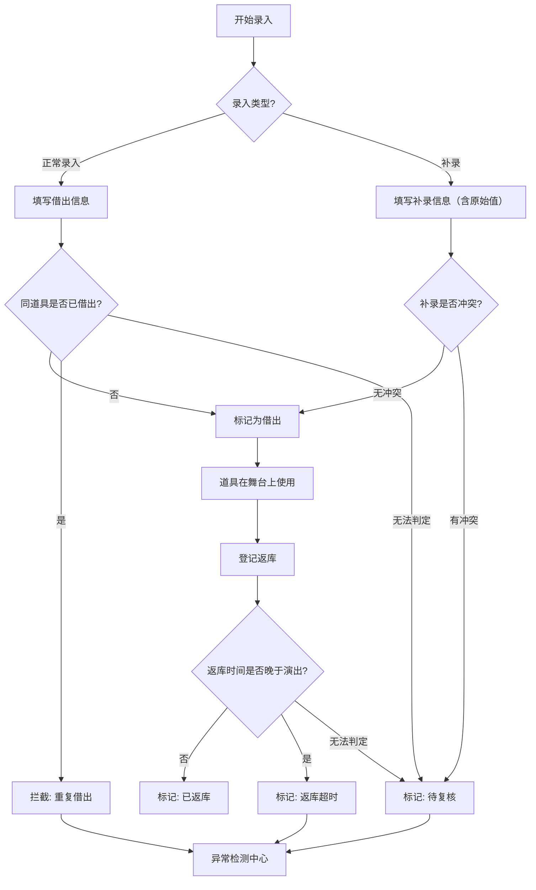

## 1. 产品概述

剧场道具出入库管理系统——为剧场道具管理员在换场时提供道具借出、返库、损伤跟踪与异常拦截的全流程管理工具。系统自动检测同道具重复借出、损伤未确认、返库晚于演出等异常，对暂时无法判定的记录标记为「待复核」而非强行归入正常结论，最终生成可下载的库存报告。

- 目标用户：剧场道具管理员、舞台监督
- 核心价值：杜绝道具重复借出、损伤遗漏、返库时间异常等管理盲区，确保每场演出道具流转可追溯

## 2. 核心功能

### 2.1 用户角色

| 角色 | 注册方式 | 核心权限 |
|------|----------|----------|
| 道具管理员 | 默认登录 | 录入/补录/撤回道具记录、导入样例、导出报告、确认损伤、处理待复核 |
| 舞台监督 | 默认登录（只读） | 查看道具状态、浏览报告、标记待复核项 |

### 2.2 功能模块

1. **出入库看板**：实时展示所有道具当前状态（在库/借出/返库/舞台上），异常项醒目标注
2. **道具录入**：支持正常录入、补录（事后补记）、撤回（误操作回退），拦截重复提交
3. **异常检测中心**：自动识别重复借出、损伤未确认、返库超时等异常，待复核项单独分区
4. **库存报告**：汇总统计与明细，支持导出下载

### 2.3 页面详情

| 页面名称 | 模块名称 | 功能描述 |
|----------|----------|----------|
| 出入库看板 | 状态总览卡片 | 显示在库/借出/舞台上/待复核数量统计 |
| 出入库看板 | 道具列表 | 按状态筛选、搜索道具，显示当前借用人、场次、状态标签 |
| 出入库看板 | 异常提醒条 | 顶部横向滚动展示最新异常（重复借出/损伤未确认/返库超时） |
| 道具录入 | 基本信息表单 | 道具名称、编号、场次、借用人、借出时间、预计返库时间 |
| 道具录入 | 损伤记录 | 损伤描述、损伤照片上传、损伤确认状态 |
| 道具录入 | 返库登记 | 实际返库时间、返库状态（正常/超时/待复核） |
| 道具录入 | 操作模式切换 | 正常录入/补录模式切换，补录时显示原始值与补录值对比 |
| 异常检测中心 | 重复借出列表 | 同一道具被多次借出的记录，含拦截操作 |
| 异常检测中心 | 损伤未确认列表 | 已登记损伤但未确认的道具，含确认操作 |
| 异常检测中心 | 返库超时列表 | 返库时间晚于演出时间的记录，含复核操作 |
| 异常检测中心 | 待复核专区 | 无法自动判定的记录，含人工审核操作 |
| 库存报告 | 汇总统计 | 按状态/场次/借用人统计，含正常/异常/待复核分布 |
| 库存报告 | 明细列表 | 全量记录，保留原始值列与最终结论列 |
| 库存报告 | 导出功能 | 一键导出为 CSV/JSON 报告文件 |

## 3. 核心流程

### 3.1 道具借出流程

管理员录入道具借出信息→系统检查是否重复借出→若无异常则状态标记为「借出」→若重复借出则拦截并提示→若无法判定则标记「待复核」

### 3.2 道具返库流程

管理员登记返库→系统对比实际返库时间与演出时间→返库正常则标记「已返库」→返库晚于演出则标记「返库超时」→无法判定则标记「待复核」

### 3.3 损伤确认流程

发现损伤→登记损伤描述与照片→状态标记为「损伤待确认」→管理员确认损伤→状态更新为「损伤已确认」→若未确认则持续出现在异常列表

## 4. 用户界面设计

### 4.1 设计风格

- **主题色调**：深色剧场风——深炭黑底色（#1a1a2e）搭配暖金色点缀（#d4a843），营造后台管理氛围
- **辅助色**：异常红（#e74c3c）、待复核琥珀（#f39c12）、正常绿（#27ae60）、在库蓝（#3498db）
- **按钮风格**：圆角微凸（subtle 3D），主操作用金色调，危险操作用红色调
- **字体**：标题用衬线体感（Playfair Display），正文用等宽/无衬线体（Source Sans 3）
- **布局风格**：左侧导航栏 + 右侧内容区，卡片式布局，异常项使用左边框高亮
- **图标风格**：线性图标（Lucide），统一 20px 尺寸

### 4.2 页面设计概览

| 页面名称 | 模块名称 | UI 元素 |
|----------|----------|---------|
| 出入库看板 | 状态总览卡片 | 四列卡片（在库/借出/舞台上/待复核），数字大字号，微光动画 |
| 出入库看板 | 道具列表 | 表格布局，状态标签彩色圆角，异常行红底浅色，搜索框顶部 |
| 出入库看板 | 异常提醒条 | 顶部横向滚动条，红色/琥珀色标签，自动轮播最新异常 |
| 道具录入 | 基本信息表单 | 纵向表单，输入框暗色底+金色边框焦点，模式切换按钮组 |
| 道具录入 | 损伤记录 | 可折叠面板，照片上传区虚线边框，确认按钮金色 |
| 道具录入 | 返库登记 | 时间选择器+状态标签，超时显示红色警告图标 |
| 异常检测中心 | 重复借出列表 | 列表卡片式，拦截按钮红色，已拦截灰色 |
| 异常检测中心 | 待复核专区 | 琥珀色左边框卡片，复核按钮金色，原始值/结论双列对比 |
| 库存报告 | 汇总统计 | 图表区域（柱状/饼图），状态分布色块 |
| 库存报告 | 导出功能 | 金色下载按钮，格式选择下拉 |

### 4.3 响应式设计

- 桌面优先设计，最小宽度 1024px
- 平板适配：卡片从四列变两列，表格支持横向滚动
- 移动端：单列卡片布局，底部操作栏

### 4.4 3D 场景

不适用
