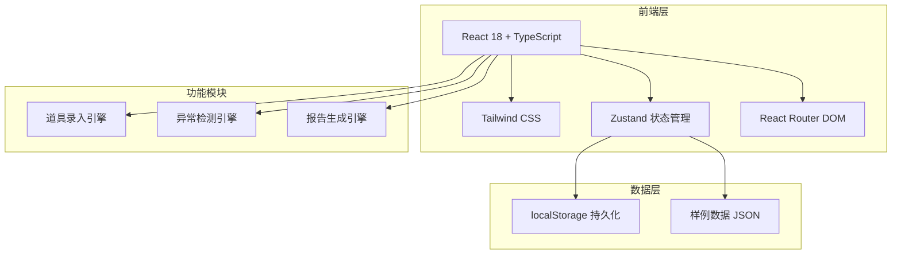
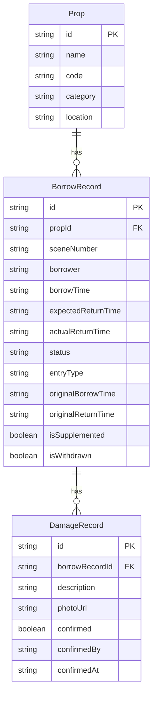

## 1. 架构设计

纯前端架构，数据持久化使用 localStorage，无需后端服务。

## 2. 技术说明

- **前端**：React@18 + Tailwind CSS@3 + Vite
- **初始化工具**：vite-init
- **后端**：无（纯前端，数据存 localStorage）
- **数据库**：无（使用 Zustand + localStorage 持久化）
- **状态管理**：Zustand
- **路由**：React Router DOM v6
- **图标**：lucide-react
- **报告导出**：纯前端生成 CSV/JSON

## 3. 路由定义

| 路由 | 用途 |
|------|------|
| `/` | 出入库看板（默认首页） |
| `/entry` | 道具录入页面 |
| `/anomalies` | 异常检测中心 |
| `/report` | 库存报告页面 |

## 4. API 定义

无后端 API，所有数据操作通过 Zustand store 在前端完成。

## 5. 服务端架构图

不适用（纯前端项目）

## 6. 数据模型

### 6.1 数据模型定义

### 6.2 数据定义

**Prop（道具）**

| 字段 | 类型 | 说明 |
|------|------|------|
| id | string | UUID |
| name | string | 道具名称 |
| code | string | 道具编号 |
| category | string | 分类（布景/服饰/小道具/音效设备） |
| location | string | 默认存放位置 |

**BorrowRecord（借还记录）**

| 字段 | 类型 | 说明 |
|------|------|------|
| id | string | UUID |
| propId | string | 关联道具 ID |
| sceneNumber | string | 场次编号 |
| borrower | string | 借用人 |
| borrowTime | string | 借出时间 ISO |
| expectedReturnTime | string | 预计返库时间 ISO |
| actualReturnTime | string | 实际返库时间 ISO（可为空） |
| status | enum | borrowed / returned / on_stage / pending_review |
| entryType | enum | normal / supplement / withdrawn |
| originalBorrowTime | string | 补录时保留的原始借出时间 |
| originalReturnTime | string | 补录时保留的原始返库时间 |
| isSupplemented | boolean | 是否为补录 |
| isWithdrawn | boolean | 是否已撤回 |

**DamageRecord（损伤记录）**

| 字段 | 类型 | 说明 |
|------|------|------|
| id | string | UUID |
| borrowRecordId | string | 关联借还记录 ID |
| description | string | 损伤描述 |
| photoUrl | string | 损伤照片 URL（base64 或外部链接） |
| confirmed | boolean | 是否已确认 |
| confirmedBy | string | 确认人 |
| confirmedAt | string | 确认时间 ISO |

### 6.3 异常检测规则

| 异常类型 | 检测逻辑 | 结果标记 |
|----------|----------|----------|
| 重复借出 | 同一 propId 存在 status=borrowed 或 on_stage 的记录 | 拦截+标记 |
| 损伤未确认 | DamageRecord.confirmed=false | 异常列表展示 |
| 返库超时 | actualReturnTime > expectedReturnTime 且 actualReturnTime 晚于场次演出时间 | 返库超时 |
| 待复核 | 无法自动判定（如补录时间冲突、数据不完整） | 待复核 |
