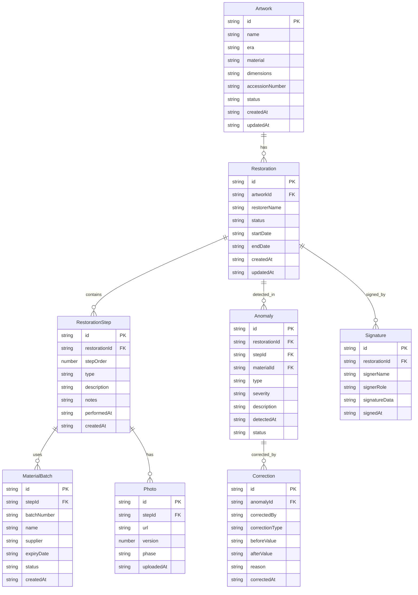

## 1. 架构设计

```mermaid
flowchart TB
    subgraph "前端层"
        "React + Vite + TailwindCSS"
        "Zustand 状态管理"
        "React Router 路由"
    end
    subgraph "后端层"
        "Express + TypeScript"
        "RESTful API"
        "业务规则引擎"
    end
    subgraph "数据层"
        "SQLite 持久化"
        "文件存储（照片）"
    end
    "前端层" -->|HTTP/JSON| "后端层"
    "后端层" -->|SQL| "数据层"
    "后端层" -->|文件I/O| "文件存储（照片）"
```

## 2. 技术说明

- 前端：React@18 + TailwindCSS@3 + Vite + Zustand
- 初始化工具：vite-init (react-express-ts 模板)
- 后端：Express@4 + TypeScript (ESM)
- 数据库：SQLite (better-sqlite3)，文件级持久化，无需额外数据库服务
- 照片存储：本地文件系统 uploads/ 目录

## 3. 路由定义

| 路由 | 用途 |
|------|------|
| / | 首页仪表盘，展示待处理异常与最近记录 |
| /artworks | 作品档案列表，支持筛选 |
| /artworks/:id | 单个作品详情，含修复记录 |
| /restorations/:id | 修复记录详情，含步骤、材料、照片 |
| /restorations/:id/steps | 修复步骤管理（时间线） |
| /restorations/:id/materials | 材料批次管理 |
| /restorations/:id/photos | 照片管理 |
| /restorations/:id/sign | 签名与确认 |
| /reports | 报告导出页面 |

## 4. API定义

### 4.1 作品档案

```typescript
interface Artwork {
  id: string;
  name: string;
  era: string;
  material: string;
  dimensions: string;
  accessionNumber: string;
  status: "pending" | "in_progress" | "completed" | "archived";
  createdAt: string;
  updatedAt: string;
}

// GET    /api/artworks          - 作品列表（支持 ?status=&keyword= 筛选）
// GET    /api/artworks/:id      - 作品详情
// POST   /api/artworks          - 创建作品
// PUT    /api/artworks/:id      - 更新作品
```

### 4.2 修复记录与步骤

```typescript
interface Restoration {
  id: string;
  artworkId: string;
  restorerName: string;
  status: "draft" | "in_progress" | "under_review" | "approved" | "rejected";
  startDate: string;
  endDate: string | null;
  createdAt: string;
  updatedAt: string;
}

interface RestorationStep {
  id: string;
  restorationId: string;
  stepOrder: number;
  type: "cleaning" | "color_correction" | "reinforcement" | "other";
  description: string;
  materials: string[];
  photos: string[];
  performedAt: string;
  notes: string;
  createdAt: string;
}

// GET    /api/restorations                    - 修复记录列表
// GET    /api/restorations/:id                - 修复记录详情
// POST   /api/restorations                    - 创建修复记录
// PUT    /api/restorations/:id                - 更新修复记录
// GET    /api/restorations/:id/steps          - 步骤列表
// POST   /api/restorations/:id/steps          - 添加步骤
// PUT    /api/restorations/:id/steps/:stepId  - 更新步骤
// PUT    /api/restorations/:id/steps/reorder   - 重排步骤顺序
```

### 4.3 材料批次

```typescript
interface MaterialBatch {
  id: string;
  batchNumber: string;
  name: string;
  supplier: string;
  expiryDate: string;
  stepId: string;
  status: "normal" | "expired" | "batch_error";
  createdAt: string;
}

// GET    /api/restorations/:id/materials          - 材料列表
// POST   /api/restorations/:id/materials          - 添加材料
// PUT    /api/materials/:id                       - 更新材料
// GET    /api/materials/:id/usage                 - 反查材料使用步骤
```

### 4.4 照片

```typescript
interface Photo {
  id: string;
  stepId: string;
  url: string;
  version: number;
  phase: "before" | "during" | "after";
  uploadedAt: string;
}

// POST   /api/restorations/:id/photos         - 上传照片
// GET    /api/restorations/:id/photos         - 照片列表
// PUT    /api/photos/:id                      - 更新照片信息
// DELETE /api/photos/:id                      - 删除照片
```

### 4.5 异常与修正

```typescript
type AnomalyType = "missing_photo" | "batch_number_error" | "step_order_inverted" | "material_expired";

interface Anomaly {
  id: string;
  restorationId: string;
  stepId?: string;
  materialId?: string;
  type: AnomalyType;
  severity: "warning" | "error";
  description: string;
  detectedAt: string;
  status: "open" | "corrected" | "confirmed";
}

interface Correction {
  id: string;
  anomalyId: string;
  correctedBy: string;
  correctionType: string;
  beforeValue: string;
  afterValue: string;
  reason: string;
  correctedAt: string;
}

// GET    /api/restorations/:id/anomalies          - 异常列表
// POST   /api/restorations/:id/anomalies/check    - 触发异常检测
// POST   /api/anomalies/:id/corrections           - 提交修正
// GET    /api/anomalies/:id/corrections           - 修正记录
```

### 4.6 签名与确认

```typescript
interface Signature {
  id: string;
  restorationId: string;
  signerName: string;
  signerRole: "restorer" | "reviewer";
  signatureData: string;
  signedAt: string;
}

// POST   /api/restorations/:id/signatures        - 提交签名
// GET    /api/restorations/:id/signatures        - 签名列表
// GET    /api/restorations/:id/trace-chain       - 获取三段追溯链
```

### 4.7 报告导出

```typescript
interface Report {
  id: string;
  restorationId: string;
  includeAnomalies: boolean;
  includeCorrections: boolean;
  includeSignatures: boolean;
  includeRules: boolean;
  generatedAt: string;
  fileUrl: string;
}

// POST   /api/restorations/:id/report            - 生成报告
// GET    /api/reports/:id                         - 下载报告
```

## 5. 服务端架构图

```mermaid
flowchart LR
    subgraph "Controller 层"
        "ArtworkController"
        "RestorationController"
        "MaterialController"
        "PhotoController"
        "AnomalyController"
        "SignatureController"
        "ReportController"
    end
    subgraph "Service 层"
        "ArtworkService"
        "RestorationService"
        "MaterialService"
        "AnomalyDetectionService"
        "SignatureService"
        "ReportService"
    end
    subgraph "Repository 层"
        "ArtworkRepo"
        "RestorationRepo"
        "MaterialRepo"
        "PhotoRepo"
        "AnomalyRepo"
        "SignatureRepo"
    end
    subgraph "数据库"
        "SQLite"
    end
    "Controller 层" --> "Service 层"
    "Service 层" --> "Repository 层"
    "Repository 层" --> "数据库"
```

## 6. 数据模型

### 6.1 数据模型定义



### 6.2 数据定义语言

```sql
CREATE TABLE artworks (
  id TEXT PRIMARY KEY,
  name TEXT NOT NULL,
  era TEXT NOT NULL,
  material TEXT NOT NULL,
  dimensions TEXT NOT NULL,
  accession_number TEXT NOT NULL UNIQUE,
  status TEXT NOT NULL DEFAULT 'pending' CHECK(status IN ('pending','in_progress','completed','archived')),
  created_at TEXT NOT NULL DEFAULT (datetime('now')),
  updated_at TEXT NOT NULL DEFAULT (datetime('now'))
);

CREATE TABLE restorations (
  id TEXT PRIMARY KEY,
  artwork_id TEXT NOT NULL REFERENCES artworks(id),
  restorer_name TEXT NOT NULL,
  status TEXT NOT NULL DEFAULT 'draft' CHECK(status IN ('draft','in_progress','under_review','approved','rejected')),
  start_date TEXT NOT NULL,
  end_date TEXT,
  created_at TEXT NOT NULL DEFAULT (datetime('now')),
  updated_at TEXT NOT NULL DEFAULT (datetime('now'))
);

CREATE TABLE restoration_steps (
  id TEXT PRIMARY KEY,
  restoration_id TEXT NOT NULL REFERENCES restorations(id),
  step_order INTEGER NOT NULL,
  type TEXT NOT NULL CHECK(type IN ('cleaning','color_correction','reinforcement','other')),
  description TEXT NOT NULL,
  notes TEXT DEFAULT '',
  performed_at TEXT NOT NULL,
  created_at TEXT NOT NULL DEFAULT (datetime('now'))
);

CREATE TABLE material_batches (
  id TEXT PRIMARY KEY,
  step_id TEXT NOT NULL REFERENCES restoration_steps(id),
  batch_number TEXT NOT NULL,
  name TEXT NOT NULL,
  supplier TEXT NOT NULL,
  expiry_date TEXT NOT NULL,
  status TEXT NOT NULL DEFAULT 'normal' CHECK(status IN ('normal','expired','batch_error')),
  created_at TEXT NOT NULL DEFAULT (datetime('now'))
);

CREATE TABLE photos (
  id TEXT PRIMARY KEY,
  step_id TEXT NOT NULL REFERENCES restoration_steps(id),
  url TEXT NOT NULL,
  version INTEGER NOT NULL DEFAULT 1,
  phase TEXT NOT NULL CHECK(phase IN ('before','during','after')),
  uploaded_at TEXT NOT NULL DEFAULT (datetime('now'))
);

CREATE TABLE anomalies (
  id TEXT PRIMARY KEY,
  restoration_id TEXT NOT NULL REFERENCES restorations(id),
  step_id TEXT REFERENCES restoration_steps(id),
  material_id TEXT REFERENCES material_batches(id),
  type TEXT NOT NULL CHECK(type IN ('missing_photo','batch_number_error','step_order_inverted','material_expired')),
  severity TEXT NOT NULL CHECK(severity IN ('warning','error')),
  description TEXT NOT NULL,
  detected_at TEXT NOT NULL DEFAULT (datetime('now')),
  status TEXT NOT NULL DEFAULT 'open' CHECK(status IN ('open','corrected','confirmed'))
);

CREATE TABLE corrections (
  id TEXT PRIMARY KEY,
  anomaly_id TEXT NOT NULL REFERENCES anomalies(id),
  corrected_by TEXT NOT NULL,
  correction_type TEXT NOT NULL,
  before_value TEXT NOT NULL,
  after_value TEXT NOT NULL,
  reason TEXT NOT NULL,
  corrected_at TEXT NOT NULL DEFAULT (datetime('now'))
);

CREATE TABLE signatures (
  id TEXT PRIMARY KEY,
  restoration_id TEXT NOT NULL REFERENCES restorations(id),
  signer_name TEXT NOT NULL,
  signer_role TEXT NOT NULL CHECK(signer_role IN ('restorer','reviewer')),
  signature_data TEXT NOT NULL,
  signed_at TEXT NOT NULL DEFAULT (datetime('now'))
);

CREATE INDEX idx_restorations_artwork ON restorations(artwork_id);
CREATE INDEX idx_steps_restoration ON restoration_steps(restoration_id);
CREATE INDEX idx_materials_step ON material_batches(step_id);
CREATE INDEX idx_photos_step ON photos(step_id);
CREATE INDEX idx_anomalies_restoration ON anomalies(restoration_id);
CREATE INDEX idx_corrections_anomaly ON corrections(anomaly_id);
CREATE INDEX idx_signatures_restoration ON signatures(restoration_id);
```

## 7. 业务规则说明（可调口径）

### 7.1 修复状态流转规则
- pending → in_progress → under_review → approved / rejected
- rejected 状态需填写退回原因，退回后修复师可重新修改再提交
- approved 后所有步骤与材料锁定，仅馆方审核员可解锁

### 7.2 材料追踪规则
- 批号格式：大写字母+8位数字（如 AB20240001）
- 有效期过期自动标记为 expired，触发异常
- 批号格式不合规自动标记为 batch_error，触发异常
- 同一批号可关联多个步骤，支持反查

### 7.3 照片版本规则
- 每个步骤至少应关联 1 张照片（before/during/after 任一阶段）
- 缺失照片触发 missing_photo 异常
- 重新上传同阶段照片自动递增版本号
- 旧版本不删除，保留历史记录

### 7.4 签名留痕规则
- 修复师签名 = 锁定步骤，不再允许修改
- 馆方审核员签名 = 确认闭环，完成三段追溯链
- 签名数据为 Canvas base64，附签名人、角色、时间戳
- 已签名记录不可删除签名

### 7.5 报告导出规则
- 报告必须包含：作品信息、修复步骤、材料清单、异常清单（含修正记录）、签名页
- 异常清单按类型分组，每组列出：异常描述、发现时间、修正操作、确认人
- 规则说明作为附录附入，方便馆方调整口径时对照
- 步骤顺序倒置的异常在报告中以时间线对比图展示
