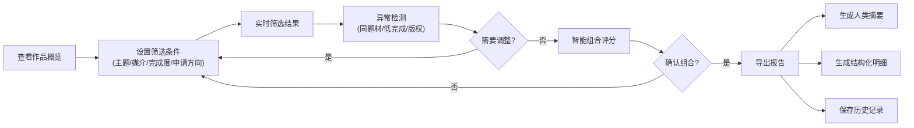

## 1. 产品概述

课程作品集筛选器是为设计老师打造的专业分析工具，帮助老师从学生作品中按主题、媒介、完成度挑出最适合院校申请的组合。系统将零散线索（学生作品、主题标签、媒介、完成度、申请方向、筛选报告）串联，提供可追溯的分析看板，确保每个异常点都能追到来源材料。

### 核心价值
- 解决设计老师手工筛选作品集效率低、遗漏问题的痛点
- 提供数据驱动的组合评分与异常检测
- 生成可交付的筛选报告，支持后续处理与存档
- 支持同事间无缝交接

---

## 2. 核心功能

### 2.1 用户角色
| 角色 | 注册方式 | 核心权限 |
|------|----------|----------|
| 设计老师 | 本地使用，无需注册 | 作品管理、筛选分析、报告导出、历史查看 |

### 2.2 功能模块
1. **分析看板主页**: 作品概览统计、筛选条件面板、作品列表展示、异常告警卡片
2. **组合评分面板**: 智能组合推荐、多维度评分、作品组合预览
3. **报告导出中心**: 人类可读摘要、结构化明细数据、异常清单
4. **历史记录管理**: 历史筛选会话、版本对比、快速恢复

### 2.3 页面详情
| 页面名称 | 模块名称 | 功能描述 |
|-----------|-------------|---------------------|
| 分析看板 | 数据概览卡片 | 显示作品总数、主题分布、媒介类型统计、完成度占比 |
| 分析看板 | 多维筛选面板 | 支持主题标签、媒介类型、完成度、申请方向的组合筛选 |
| 分析看板 | 作品列表 | 作品卡片展示，支持排序、批量选择，点击查看来源材料 |
| 分析看板 | 异常检测区 | 自动识别同题材过多、低完成度混入、图片缺版权等问题，点击可追溯 |
| 组合评分 | 组合推荐 | 基于申请方向智能推荐最优作品组合，显示匹配度评分 |
| 组合评分 | 维度评分 | 主题多样性、媒介丰富度、完成度均衡、版权合规等多维度评分 |
| 报告导出 | 摘要生成 | 生成人类可读的筛选结论摘要 |
| 报告导出 | 结构化导出 | 导出JSON/CSV格式明细，支持后续处理 |
| 历史记录 | 会话列表 | 保存每次筛选操作，支持命名备注、恢复、删除 |

---

## 3. 核心流程

设计老师打开系统后，首先查看所有作品的整体统计。根据学生申请方向设置筛选条件（主题、媒介、完成度），系统实时显示筛选结果并检测异常。老师可调整筛选条件，或使用智能组合推荐功能查看评分。确认最终组合后，导出生成包含摘要和结构化明细的完整报告，系统自动保存本次筛选历史以便后续追溯。

---

## 4. 用户界面设计

### 4.1 设计风格
- **主色调**: 深炭灰 `#1A1A1A` 作为背景基底，温暖米色 `#F5F0E8` 作为文本主色，赭石橙 `#D17A22` 作为强调色
- **辅助色**: 苔藓绿 `#5A7247` 表示正常/通过，砖红 `#B84A3E` 表示警告/异常，灰蓝 `#6B7C85` 表示次要信息
- **字体**: 标题使用 *Lora* 衬线字体，正文使用 *Inter* 无衬线字体，营造编辑室/艺术画册的专业质感
- **布局**: 不对称网格布局，左侧固定筛选面板，右侧主内容区采用卡片瀑布流
- **交互**: 卡片悬停时微妙上浮 + 边框高亮，异常项持续轻微脉动提示
- **背景**: 加入细腻纸纹噪点，深色调中透出温润的暖光渐变

### 4.2 页面设计概述
| 页面名称 | 模块名称 | UI 要素 |
|-----------|-------------|-------------|
| 分析看板 | 数据概览 | 大号数字 + 趋势箭头，卡片悬浮阴影，错落有致的不对称布局 |
| 分析看板 | 筛选面板 | 标签式筛选器，多列流式排列，选中状态使用强调色填充 |
| 分析看板 | 作品卡片 | 缩略图 + 标签组 + 完成度指示器，异常角标突出显示 |
| 分析看板 | 异常追踪 | 时间线式追溯面板，点击异常项展开关联作品链 |
| 组合评分 | 评分雷达 | 六维雷达图，实时更新，配色与主题统一 |
| 报告导出 | 导出预览 | 左右分栏，左为人读摘要（排版优雅），右为结构化数据（紧凑表格） |
| 历史记录 | 历史卡片 | 时间线布局，显示筛选条件快照，支持一键恢复 |

### 4.3 响应式
- 桌面端（1280px+）：三栏布局，筛选面板固定，主内容自适应
- 平板端（768-1279px）：筛选面板可折叠，两栏布局
- 移动端（<768px）：单列流式布局，筛选器转为顶部抽屉

---
