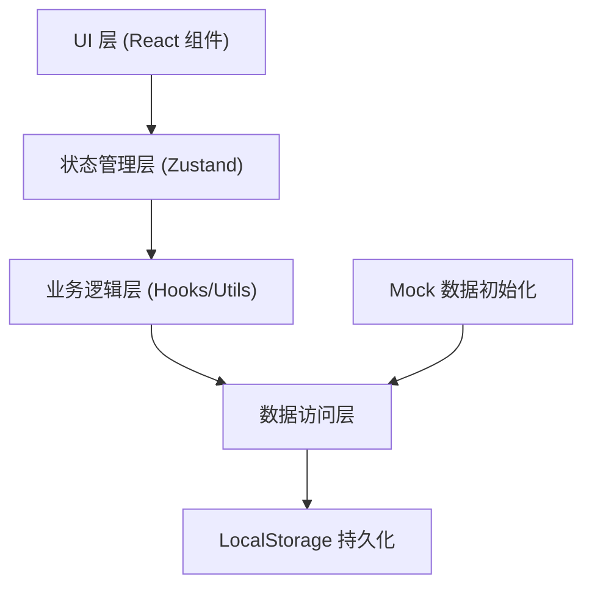
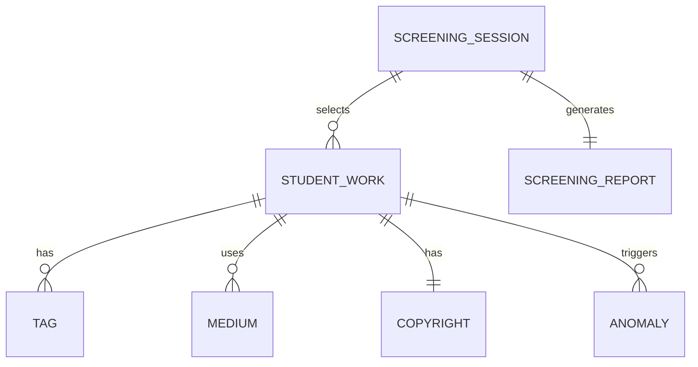

## 1. 架构设计

本系统为纯前端单页应用，使用 LocalStorage 进行数据持久化，无需后端服务。所有业务逻辑在前端完成，确保离线可用和数据隐私。



---

## 2. 技术描述

- **前端**: React@18 + TypeScript + Vite
- **样式**: TailwindCSS@3
- **状态管理**: Zustand
- **路由**: React Router DOM
- **图表**: Recharts（雷达图、分布图）
- **图标**: Lucide React
- **数据持久化**: LocalStorage
- **导出功能**: 原生 File API + JSON/CSV 生成

---

## 3. 路由定义

| 路由 | 页面 | 功能说明 |
|-------|------|---------|
| `/` | 分析看板主页 | 作品概览、多维筛选、作品列表、异常检测 |
| `/portfolio` | 组合评分 | 智能推荐、多维度评分、组合预览 |
| `/export` | 报告导出 | 摘要预览、结构化数据、导出操作 |
| `/history` | 历史记录 | 筛选会话列表、恢复、删除 |

---

## 4. 数据模型

### 4.1 核心数据结构



### 4.2 TypeScript 类型定义

```typescript
// 学生作品
interface StudentWork {
  id: string;
  title: string;
  studentName: string;
  thumbnail: string;
  description: string;
  tags: string[];
  mediums: string[];
  completion: 1 | 2 | 3 | 4 | 5;
  applicationDirection: string[];
  copyright: Copyright;
  createdAt: string;
  sourceMaterials: SourceMaterial[];
}

// 版权信息
interface Copyright {
  hasClearance: boolean;
  source: string;
  notes: string;
}

// 来源材料
interface SourceMaterial {
  id: string;
  type: 'image' | 'document' | 'reference';
  title: string;
  url: string;
  uploadedAt: string;
}

// 异常项
interface Anomaly {
  id: string;
  type: 'duplicate_theme' | 'low_completion' | 'missing_copyright';
  severity: 'warning' | 'critical';
  description: string;
  relatedWorkIds: string[];
  createdAt: string;
}

// 筛选条件
interface FilterCriteria {
  tags: string[];
  mediums: string[];
  minCompletion: number;
  applicationDirection: string | null;
}

// 组合评分
interface PortfolioScore {
  overall: number;
  dimensions: {
    themeDiversity: number;
    mediumRichness: number;
    completionBalance: number;
    copyrightCompliance: number;
    directionMatch: number;
    qualityLevel: number;
  };
}

// 筛选会话（历史记录）
interface ScreeningSession {
  id: string;
  name: string;
  criteria: FilterCriteria;
  selectedWorkIds: string[];
  score: PortfolioScore;
  anomalies: Anomaly[];
  createdAt: string;
  note: string;
}

// 导出报告
interface ScreeningReport {
  summary: {
    totalWorks: number;
    selectedWorks: number;
    overallScore: number;
    anomalyCount: number;
    recommendation: string;
  };
  details: StudentWork[];
  anomalies: Anomaly[];
  exportedAt: string;
}
```

---

## 5. 项目结构

```
src/
├── components/          # 可复用组件
│   ├── layout/         # 布局组件
│   ├── dashboard/      # 看板相关组件
│   ├── portfolio/      # 组合评分组件
│   ├── export/         # 导出相关组件
│   └── history/        # 历史记录组件
├── pages/              # 页面组件
│   ├── Dashboard.tsx
│   ├── Portfolio.tsx
│   ├── Export.tsx
│   └── History.tsx
├── store/              # Zustand 状态管理
│   └── usePortfolioStore.ts
├── hooks/              # 自定义 Hooks
│   ├── useFilter.ts
│   ├── useScoring.ts
│   └── useAnomaly.ts
├── utils/              # 工具函数
│   ├── export.ts
│   ├── scoring.ts
│   └── storage.ts
├── data/               # Mock 数据
│   └── mockWorks.ts
├── types/              # TypeScript 类型定义
│   └── index.ts
├── App.tsx
├── main.tsx
└── index.css
```

---
