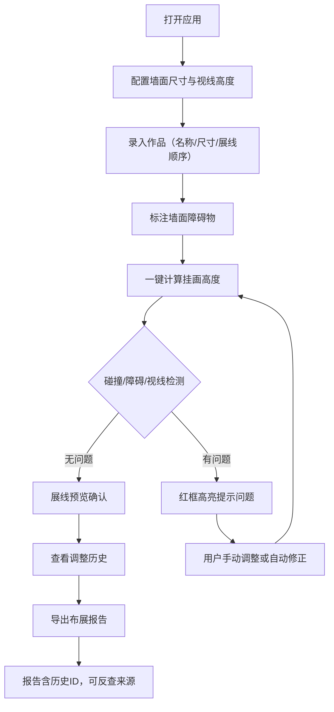

## 1. 产品概述

展墙挂画高度器——面向展览布展团队的挂画高度计算与布展规划工具。根据画框尺寸、观众视线高度和墙面障碍物，智能计算每幅作品的挂画高度，并自动检测画框碰撞、视线偏高、障碍漏算等常见布展问题。所有操作实时记入调整历史，导出报告可反查每条数据的来源与修改轨迹。

- 解决布展过程中高度计算依赖经验、碰撞和障碍遗漏频发的问题
- 目标用户：美术馆/画廊布展团队、策展人、展览设计师

## 2. 核心功能

### 2.1 用户角色

| 角色 | 使用方式 | 核心权限 |
|------|----------|----------|
| 布展师 | 打开即用，无需注册 | 创建展线、录入作品、计算高度、查看历史、导出报告 |
| 策展人 | 同上 | 审阅展线预览、查看报告、调整展线顺序 |

### 2.2 功能模块

1. **工作台页面**：墙面配置、作品录入、障碍物标注、视线高度设定、一键计算
2. **展线预览页面**：可视化墙面展线、拖拽调整位置、实时碰撞提示
3. **历史记录页面**：按时间线展示所有变更，支持按作品/操作类型筛选，可查看每条记录的来源步骤
4. **布展报告页面**：汇总报告、按作品/墙面维度导出、每项数据可追溯到历史记录

### 2.3 页面详情

| 页面名称 | 模块名称 | 功能描述 |
|----------|----------|----------|
| 工作台 | 墙面配置 | 录入墙面宽度/高度，设定地面起点高度 |
| 工作台 | 视线高度设定 | 设置标准视线高度（默认160cm），可自定义 |
| 工作台 | 作品录入 | 输入作品名称、画框宽高、展线顺序，自动或手动设定挂画高度 |
| 工作台 | 障碍物标注 | 在墙面上标注障碍物（开关、消防栓、管道等）的位置和尺寸 |
| 工作台 | 高度计算 | 一键计算：以视线高度为基准，画框中心对齐视线，自动避让障碍物和碰撞 |
| 工作台 | 碰撞检测 | 实时检测画框之间、画框与障碍物之间的重叠，红框高亮提示 |
| 展线预览 | 墙面可视化 | 按比例绘制墙面、障碍物、画框位置，支持缩放和平移 |
| 展线预览 | 拖拽调整 | 拖拽画框调整位置，实时重新计算碰撞和视线偏差 |
| 展线预览 | 视线标尺 | 显示视线水平线，直观判断作品中心是否对齐 |
| 历史记录 | 操作时间线 | 按时间倒序展示所有数据变更（新增/修改/删除） |
| 历史记录 | 变更溯源 | 每条记录显示：操作时间、操作类型、修改字段、修改前值→修改后值、触发来源（用户操作/自动计算/碰撞修正） |
| 历史记录 | 筛选回溯 | 按作品ID、操作类型、时间范围筛选 |
| 布展报告 | 汇总报告 | 按展线顺序列出所有作品挂画参数：名称、尺寸、挂画高度、中心高度、与视线偏差 |
| 布展报告 | 障碍物清单 | 列出所有障碍物及避让情况 |
| 布展报告 | 碰撞记录 | 列出所有碰撞检测结果及处理状态 |
| 布展报告 | 导出 | 导出为JSON（含完整历史ID引用）或打印友好的HTML报告 |

## 3. 核心流程

用户打开应用后，先配置墙面尺寸和视线高度，再录入作品和障碍物，系统自动计算挂画高度并检测碰撞。用户可在展线预览中拖拽微调，所有变更实时写入历史。确认无误后导出布展报告。

## 4. 用户界面设计

### 4.1 设计风格

- 主色调：暖灰（#D4CFC4）+ 深炭（#2C2C2C），辅助色：赭石橙（#C4623A）用于警告和高亮
- 按钮风格：圆角（8px）、扁平化、hover时微浮起阴影
- 字体：标题用 Playfair Display，正文用 Noto Sans SC
- 布局：左侧面板（输入区）+ 右侧画布（可视化区），顶部导航栏
- 图标：lucide-react 线性图标

### 4.2 页面设计概览

| 页面名称 | 模块名称 | UI元素 |
|----------|----------|--------|
| 工作台 | 墙面配置 | 输入框组（宽度/高度/地面起点），实时预览缩略图 |
| 工作台 | 作品列表 | 表格+内联编辑，每行显示名称/尺寸/高度/碰撞状态 |
| 工作台 | 障碍物标注 | 列表+墙面画布上的可拖拽标记 |
| 展线预览 | 墙面画布 | SVG画布，按比例渲染墙面/画框/障碍物/视线标尺 |
| 展线预览 | 拖拽交互 | 画框可拖拽，拖拽时显示辅助线和碰撞提示 |
| 历史记录 | 时间线 | 垂直时间线，每节点显示操作摘要，展开显示详情 |
| 布展报告 | 报告表格 | 分区表格（作品/障碍/碰撞），每行附带历史ID链接 |

### 4.3 响应式策略

- 桌面优先设计，左右分栏布局
- 平板端上下堆叠，画布全宽
- 移动端简化为单列流式布局，画布可横向滚动

### 4.4 设计基调

- 展览/美术馆气质：克制、精确、留白充足
- 数据可视化采用建筑蓝图风格：细线网格、标注式尺寸线
- 碰撞警告用赭石橙脉冲动画，不突兀但足够醒目
