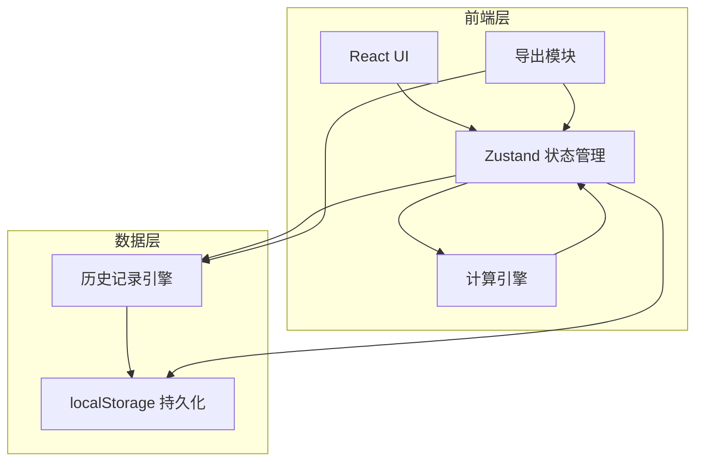
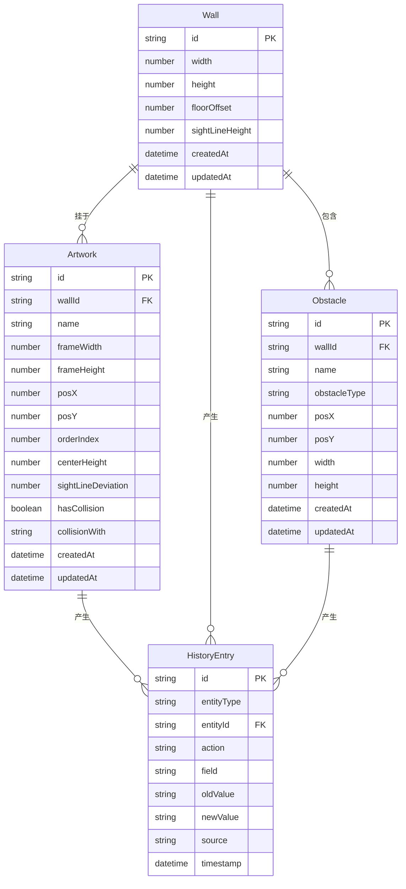

## 1. 架构设计



纯前端架构，无需后端服务。所有数据通过 localStorage 持久化，状态管理使用 Zustand。

## 2. 技术说明

- 前端：React@18 + TypeScript + Tailwind CSS + Vite
- 初始化工具：vite-init
- 状态管理：Zustand（含 persist 中间件自动持久化到 localStorage）
- 后端：无
- 数据库：无（localStorage 替代）
- 可视化：SVG（用于展线预览画布）
- 导出：JSON 导出 + window.print() 打印友好页面

## 3. 路由定义

| 路由 | 用途 |
|------|------|
| / | 工作台页面：墙面配置、作品录入、障碍物标注、高度计算 |
| /preview | 展线预览页面：可视化墙面展线、拖拽调整 |
| /history | 历史记录页面：操作时间线、变更溯源 |
| /report | 布展报告页面：汇总报告、导出 |

## 4. 数据模型

### 4.1 数据模型定义



### 4.2 核心类型定义

```typescript
interface Wall {
  id: string;
  width: number;          // 墙面宽度 cm
  height: number;         // 墙面高度 cm
  floorOffset: number;    // 地面起点高度 cm（如地台高度）
  sightLineHeight: number;// 标准视线高度 cm（默认160）
  createdAt: string;
  updatedAt: string;
}

interface Artwork {
  id: string;
  wallId: string;
  name: string;
  frameWidth: number;     // 画框宽度 cm
  frameHeight: number;    // 画框高度 cm
  posX: number;           // 画框左上角X cm
  posY: number;           // 画框左上角Y cm
  orderIndex: number;     // 展线顺序
  centerHeight: number;   // 画框中心高度 cm
  sightLineDeviation: number; // 与视线偏差 cm
  hasCollision: boolean;
  collisionWith: string[]; // 碰撞对象ID列表
  createdAt: string;
  updatedAt: string;
}

interface Obstacle {
  id: string;
  wallId: string;
  name: string;
  obstacleType: 'switch' | 'fire_extinguisher' | 'pipe' | 'outlet' | 'other';
  posX: number;           // 障碍物左上角X cm
  posY: number;           // 障碍物左上角Y cm
  width: number;
  height: number;
  createdAt: string;
  updatedAt: string;
}

interface HistoryEntry {
  id: string;
  entityType: 'wall' | 'artwork' | 'obstacle';
  entityId: string;
  action: 'create' | 'update' | 'delete' | 'auto_calc' | 'collision_fix';
  field: string;          // 修改的字段名
  oldValue: string;       // 修改前值
  newValue: string;       // 修改后值
  source: string;         // 触发来源：'user' | 'auto_calc' | 'collision_fix' | 'drag'
  timestamp: string;
}

interface ExhibitionReport {
  wall: Wall;
  artworks: Artwork[];
  obstacles: Obstacle[];
  historyEntries: HistoryEntry[];
  generatedAt: string;
}
```

### 4.3 核心计算逻辑

**挂画高度计算**：画框中心高度 = 视线高度 + 地面起点偏移
- posY = sightLineHeight + floorOffset - frameHeight / 2
- centerHeight = posY + frameHeight / 2
- sightLineDeviation = centerHeight - sightLineHeight - floorOffset

**碰撞检测**（AABB矩形重叠）：
- 两画框/画框与障碍物：不重叠条件 = A.right < B.left || A.left > B.right || A.bottom < B.top || A.top > B.bottom

**障碍物避让**：
- 若计算出的画框位置与障碍物重叠，向上/下偏移至无碰撞位置，记录偏差到 sightLineDeviation
