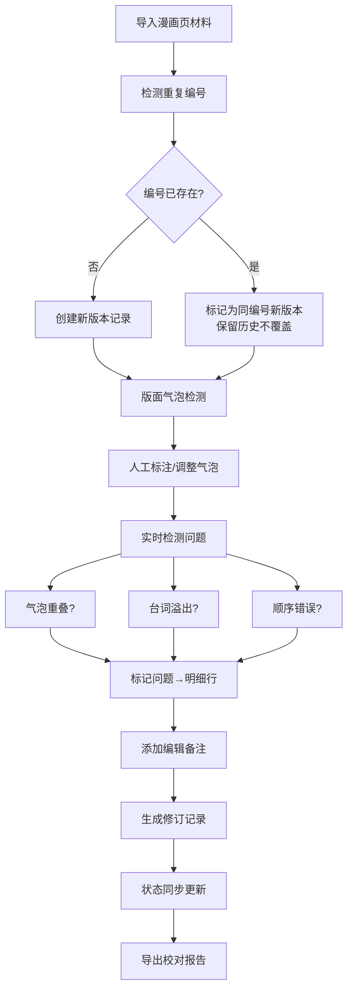

## 1. 产品概述

漫画对白气泡检查工具，专为漫画编辑校稿场景设计，解决气泡顺序错误、台词长度不适、气泡遮挡画面等反复返工问题。将视觉检查问题转化为可追溯的数据记录，实现"图上问题→明细行→修订历史→校对报告"的完整闭环。

### 核心价值
- **不覆盖原则**：重复编号或晚到材料保留历史版本，不静默覆盖
- **三大痛点**：气泡重叠、台词溢出、阅读顺序错误自然融入主检查流程
- **状态一致**：气泡状态与修订历史强一致，杜绝状态漂移

## 2. 核心功能

### 2.1 用户角色

| 角色 | 使用方式 | 核心权限 |
|------|----------|----------|
| 漫画编辑 | 独立工具使用 | 上传漫画页、标注气泡、调整顺序、添加备注、导出报告 |

### 2.2 功能模块

1. **漫画页管理**：页面列表、上传、版面预览、气泡检测
2. **气泡标注工作台**：气泡框绘制、台词录入、阅读顺序拖拽、长度提示
3. **问题检测引擎**：气泡重叠检测、台词溢出检测、阅读顺序校验
4. **修订历史**：版本追溯、变更对比、重复编号冲突处理
5. **校对报告**：问题汇总、导出CSV/JSON、明细行追溯

### 2.3 页面详情

| 页面名称 | 模块名称 | 功能描述 |
|----------|----------|----------|
| 项目列表 | 项目卡片 | 展示漫画项目、页数、问题数、最近修订时间 |
| 页面工作台 | 左侧预览区 | 漫画页显示、气泡框可视化标注、重叠区域高亮 |
| 页面工作台 | 中间明细区 | 气泡列表（序号、台词、长度、状态、问题标签）、可拖拽排序 |
| 页面工作台 | 右侧信息区 | 编辑备注、当前气泡详情、修订历史时间线 |
| 校对报告 | 问题汇总 | 按问题类型统计（重叠/溢出/顺序错）、可追溯到具体气泡 |
| 修订历史 | 版本对比 | 同一编号多版本并列展示、冲突标记、版本切换 |

## 3. 核心流程

## 4. 用户界面设计

### 4.1 设计风格

**美学方向：编辑室专业风格**
- 主色调：暖米色 `#F5F0E8` 作为基底，营造纸张质感
- 强调色：朱红色 `#C83C23` 用于问题标记，墨蓝 `#1E3A5F` 用于选中状态
- 中性色：深灰 `#2D2D2D` 文字，浅灰 `#E0D9CC` 边框
- 字体：正文用思源宋体（营造出版感），数据用等宽字体（保证对齐）
- 按钮：轻微圆角 `4px`，边框线 `1px`，按压有凹陷感
- 质感：纸张纹理背景，轻微投影，避免玻璃拟态

### 4.2 页面设计概览

| 页面名称 | 模块名称 | UI 元素 |
|----------|----------|---------|
| 页面工作台 | 预览区 | 画布式布局、气泡框可拖拽调整、重叠区域红色虚线描边、序号徽章 |
| 页面工作台 | 明细区 | 表格布局、行高适中、问题标签带圆角、拖拽手柄 |
| 页面工作台 | 信息区 | 时间线样式展示历史、每个版本带状态标记、冲突版本红色边框 |
| 校对报告 | 汇总区 | 卡片式统计、问题类型图标、可点击跳转对应气泡 |
| 修订历史 | 对比区 | 左右分栏、差异高亮、版本编号水印 |

### 4.3 交互细节
- 气泡选中：墨蓝描边 + 轻微放大动画
- 问题标记：朱红闪烁提示（首次出现时），后续静态显示
- 拖拽排序：半透明拖拽预览，放置位置指示线
- 冲突提示：编号重复时，气泡卡片右上角显示「冲突」角标，点击展开历史版本

### 4.4 响应式
- 桌面端（主）：三栏布局，左侧预览45%、中间明细35%、右侧信息20%
- 平板：两栏布局，预览+明细合并，信息区改为底部抽屉
- 移动端：单栏滚动，侧重数据浏览，标注功能降级

## 5. 核心业务规则（必看）

### 5.1 版本管理规则
1. 每条材料的唯一标识 = 漫画页编号 + 气泡序号
2. 同一标识的新入库材料：创建新版本，状态设为「待确认」，旧版本保留为「历史」
3. 绝不自动覆盖：用户需手动选择「设为当前版本」或「废弃此版本」
4. 版本号递增：v1 → v2 → v3，同时记录入库时间戳

### 5.2 状态流转规则
| 状态 | 触发条件 | 下一状态 |
|------|----------|----------|
| 待检测 | 新入库材料 | 正常 / 有问题 |
| 正常 | 检测通过 | 已确认 / 有问题 |
| 有问题 | 检测到重叠/溢出/顺序错 | 已修复 / 正常 |
| 已修复 | 修改后重新检测通过 | 已确认 |
| 已确认 | 人工确认无误 | （终止态） |
| 历史 | 有新版本入库 | （只读） |

### 5.3 问题检测规则
1. **气泡重叠**：两个气泡框的交叠面积 > 任一气泡面积的 10% 即判定
2. **台词溢出**：台词字符数 > 气泡框可容纳字符数（按字号估算）即判定
3. **阅读顺序错**：纵向阅读时，后一气泡的 y 坐标 < 前一气泡 y 坐标即判定（可手动调整）

## 6. 数据追溯要求
- 每个问题标记必须关联：具体气泡 ID、检测时间、检测规则版本、修复前/后截图
- 每条修订记录必须记录：操作人、操作时间、变更字段、变更前后值
- 报告导出的每一行明细必须包含：可追溯到原图位置的坐标信息
