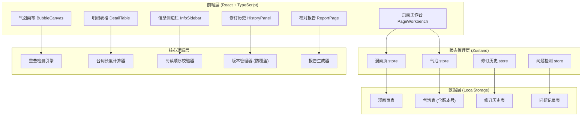
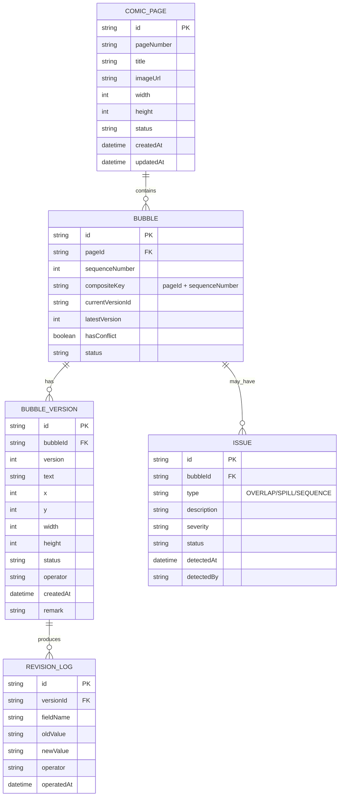

## 1. 架构设计



## 2. 技术描述

- **前端框架**：React@18 + TypeScript
- **构建工具**：Vite@5
- **样式方案**：Tailwind CSS@3
- **状态管理**：Zustand@4
- **路由**：React Router DOM@6
- **图标库**：Lucide React
- **拖拽**：@dnd-kit/core + @dnd-kit/sortable
- **数据持久化**：LocalStorage（无需后端）
- **导出**：原生 CSV/JSON 生成，无第三方依赖

## 3. 路由定义

| 路由 | 页面 | 用途 |
|------|------|------|
| `/` | 项目列表页 | 展示所有漫画项目，进入工作台 |
| `/workbench/:pageId` | 页面工作台 | 核心标注和检测界面 |
| `/report/:pageId` | 校对报告页 | 问题汇总和导出 |
| `/history/:bubbleId` | 修订历史页 | 单气泡的版本对比 |

## 4. 数据模型

### 4.1 ER 图



### 4.2 TypeScript 类型定义

```typescript
// 核心枚举
export type BubbleStatus = 'PENDING' | 'NORMAL' | 'HAS_ISSUE' | 'FIXED' | 'CONFIRMED' | 'HISTORY';
export type IssueType = 'OVERLAP' | 'SPILL' | 'SEQUENCE';
export type IssueSeverity = 'WARNING' | 'ERROR';

// 漫画页
export interface ComicPage {
  id: string;
  pageNumber: string;
  title: string;
  imageUrl: string;
  width: number;
  height: number;
  status: BubbleStatus;
  createdAt: string;
  updatedAt: string;
}

// 气泡（主记录，不存具体内容，存版本引用）
export interface Bubble {
  id: string;
  pageId: string;
  sequenceNumber: number;
  compositeKey: string; // pageId + ':' + sequenceNumber
  currentVersionId: string;
  latestVersion: number;
  hasConflict: boolean;
  status: BubbleStatus;
}

// 气泡版本（实际内容存储）
export interface BubbleVersion {
  id: string;
  bubbleId: string;
  version: number;
  text: string;
  x: number;
  y: number;
  width: number;
  height: number;
  status: BubbleStatus;
  operator: string;
  createdAt: string;
  remark: string;
}

// 问题记录
export interface Issue {
  id: string;
  bubbleId: string;
  relatedBubbleId?: string; // 重叠时关联另一个气泡
  type: IssueType;
  description: string;
  severity: IssueSeverity;
  status: 'OPEN' | 'RESOLVED';
  detectedAt: string;
  detectedBy: string;
}

// 修订日志
export interface RevisionLog {
  id: string;
  versionId: string;
  fieldName: string;
  oldValue: string;
  newValue: string;
  operator: string;
  operatedAt: string;
}

// 校对报告导出格式
export interface ReportRow {
  pageNumber: string;
  sequenceNumber: number;
  bubbleId: string;
  version: number;
  text: string;
  textLength: number;
  position: string;
  issues: string[];
  status: string;
  remark: string;
  lastModified: string;
}
```

## 5. 核心模块设计

### 5.1 版本管理器 (VersionManager)

```typescript
// 防覆盖核心逻辑
export class VersionManager {
  /**
   * 检测重复编号，返回冲突信息
   * 绝不覆盖，只创建新版本
   */
  checkAndCreateVersion(
    existingBubble: Bubble | undefined,
    newData: Omit<BubbleVersion, 'id' | 'version' | 'createdAt'>
  ): { bubble: Bubble; newVersion: BubbleVersion; isConflict: boolean } {
    if (!existingBubble) {
      // 全新气泡，创建 v1
      const bubbleId = generateId();
      const versionId = generateId();
      return {
        bubble: {
          id: bubbleId,
          pageId: newData.bubbleId.split(':')[0],
          sequenceNumber: parseInt(newData.bubbleId.split(':')[1]),
          compositeKey: newData.bubbleId,
          currentVersionId: versionId,
          latestVersion: 1,
          hasConflict: false,
          status: 'PENDING'
        },
        newVersion: {
          ...newData,
          id: versionId,
          version: 1,
          createdAt: new Date().toISOString()
        },
        isConflict: false
      };
    }

    // 已存在，创建新版本，不覆盖
    const newVersionNum = existingBubble.latestVersion + 1;
    const versionId = generateId();
    return {
      bubble: {
        ...existingBubble,
        latestVersion: newVersionNum,
        hasConflict: true, // 标记存在冲突
        status: 'PENDING' // 新版本需要重新确认
      },
      newVersion: {
        ...newData,
        id: versionId,
        version: newVersionNum,
        createdAt: new Date().toISOString()
      },
      isConflict: true
    };
  }

  /**
   * 用户手动选择当前版本
   */
  setCurrentVersion(bubble: Bubble, versionId: string, allVersions: BubbleVersion[]): Bubble {
    const targetVersion = allVersions.find(v => v.id === versionId);
    if (!targetVersion) return bubble;

    // 旧版本标记为 HISTORY
    const otherVersions = allVersions.filter(v => v.id !== versionId);
    // ... 更新状态

    return {
      ...bubble,
      currentVersionId: versionId,
      hasConflict: false,
      status: targetVersion.status
    };
  }
}
```

### 5.2 问题检测引擎

```typescript
// 重叠检测
export function detectOverlap(bubbles: BubbleVersion[]): Issue[] {
  const issues: Issue[] = [];
  for (let i = 0; i < bubbles.length; i++) {
    for (let j = i + 1; j < bubbles.length; j++) {
      const a = bubbles[i], b = bubbles[j];
      const overlap = calculateOverlapArea(a, b);
      const minArea = Math.min(a.width * a.height, b.width * b.height);
      if (overlap > minArea * 0.1) { // 交叠 > 10%
        issues.push({
          id: generateId(),
          bubbleId: a.bubbleId,
          relatedBubbleId: b.bubbleId,
          type: 'OVERLAP',
          description: `气泡 ${getSequenceNumber(a)} 与 ${getSequenceNumber(b)} 重叠，重叠面积占比 ${(overlap / minArea * 100).toFixed(1)}%`,
          severity: 'ERROR',
          status: 'OPEN',
          detectedAt: new Date().toISOString(),
          detectedBy: 'engine-v1.0'
        });
      }
    }
  }
  return issues;
}

// 台词溢出检测
export function detectSpill(version: BubbleVersion): Issue | null {
  const charCount = version.text.length;
  const capacity = estimateCapacity(version.width, version.height);
  if (charCount > capacity) {
    return {
      id: generateId(),
      bubbleId: version.bubbleId,
      type: 'SPILL',
      description: `台词过长，当前 ${charCount} 字，估计容量 ${capacity} 字，超出 ${charCount - capacity} 字`,
      severity: 'WARNING',
      status: 'OPEN',
      detectedAt: new Date().toISOString(),
      detectedBy: 'engine-v1.0'
    };
  }
  return null;
}

// 阅读顺序检测
export function detectSequenceError(sortedVersions: BubbleVersion[]): Issue[] {
  const issues: Issue[] = [];
  // 纵向阅读：从右到左，从上到下
  for (let i = 1; i < sortedVersions.length; i++) {
    const prev = sortedVersions[i - 1];
    const curr = sortedVersions[i];
    // 如果后一个的 y 坐标明显小于前一个，可能顺序错
    if (curr.y < prev.y - 20) {
      issues.push({
        id: generateId(),
        bubbleId: curr.bubbleId,
        type: 'SEQUENCE',
        description: `阅读顺序可能错误，气泡 ${i + 1} 位置在气泡 ${i} 上方`,
        severity: 'WARNING',
        status: 'OPEN',
        detectedAt: new Date().toISOString(),
        detectedBy: 'engine-v1.0'
      });
    }
  }
  return issues;
}
```

### 5.3 状态一致性保障

```typescript
// 状态变更必须通过这个函数，确保同时更新历史记录
export function updateBubbleStatus(
  bubble: Bubble,
  version: BubbleVersion,
  newStatus: BubbleStatus,
  operator: string,
  remark?: string
): { updatedVersion: BubbleVersion; revision: RevisionLog } {
  const oldStatus = version.status;
  const updatedVersion = {
    ...version,
    status: newStatus,
    remark: remark || version.remark
  };

  const revision: RevisionLog = {
    id: generateId(),
    versionId: version.id,
    fieldName: 'status',
    oldValue: oldStatus,
    newValue: newStatus,
    operator,
    operatedAt: new Date().toISOString()
  };

  return { updatedVersion, revision };
}
```

## 6. 项目结构

```
src/
├── types/              # 类型定义
│   └── index.ts
├── store/              # Zustand stores
│   ├── pageStore.ts
│   ├── bubbleStore.ts
│   ├── historyStore.ts
│   └── issueStore.ts
├── engine/             # 核心检测引擎
│   ├── overlapDetector.ts
│   ├── spillDetector.ts
│   ├── sequenceChecker.ts
│   └── versionManager.ts
├── components/         # UI 组件
│   ├── canvas/         # 气泡画布相关
│   ├── table/          # 明细表格相关
│   ├── sidebar/        # 侧边栏相关
│   ├── common/         # 通用组件
│   └── report/         # 报告相关
├── pages/              # 页面组件
│   ├── ProjectList.tsx
│   ├── Workbench.tsx
│   ├── Report.tsx
│   └── History.tsx
├── utils/              # 工具函数
│   ├── export.ts       # CSV/JSON 导出
│   ├── storage.ts      # LocalStorage 封装
│   └── helpers.ts
├── data/               # 测试数据
│   └── mockData.ts     # 含重复编号场景
├── App.tsx
├── main.tsx
└── index.css
```

## 7. 测试场景设计

### 7.1 重复编号测试用例

```typescript
// 场景：同一编号 (Page-001, 气泡3) 入库两次
export const mockConflictScenario = {
  page: { id: 'page-001', pageNumber: '001', title: '第1页' },
  firstImport: {
    sequenceNumber: 3,
    text: '你好，我是第一版台词',
    x: 100, y: 200, width: 150, height: 80
  },
  secondImport: {
    sequenceNumber: 3, // 同一编号！
    text: '你好，我是第二版台词，别把我覆盖了',
    x: 120, y: 220, width: 160, height: 90
  },
  expectedResult: {
    bubbleCount: 1, // 只有一条气泡主记录
    versionCount: 2, // 但有两个版本
    hasConflict: true, // 标记为冲突
    status: 'PENDING', // 等待用户确认
    noSilentOverride: true // 第一版数据完整保留
  }
};
```

### 7.2 三大痛点测试用例

```typescript
export const mockIssueScenario = {
  overlapBubbles: [
    { seq: 1, x: 50, y: 50, width: 100, height: 60 },
    { seq: 2, x: 80, y: 70, width: 100, height: 60 } // 与 seq1 重叠
  ],
  spillBubble: {
    seq: 3,
    text: '这是一段非常非常非常非常非常非常长的台词，一定会超出气泡框的容量限制',
    width: 100, height: 50
  },
  sequenceBubbles: [
    { seq: 1, y: 300 }, // 下面
    { seq: 2, y: 100 }  // 上面，但序号在后面
  ]
};
```
