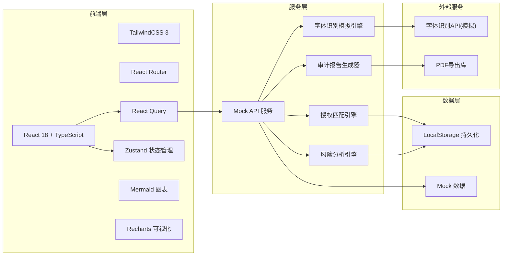
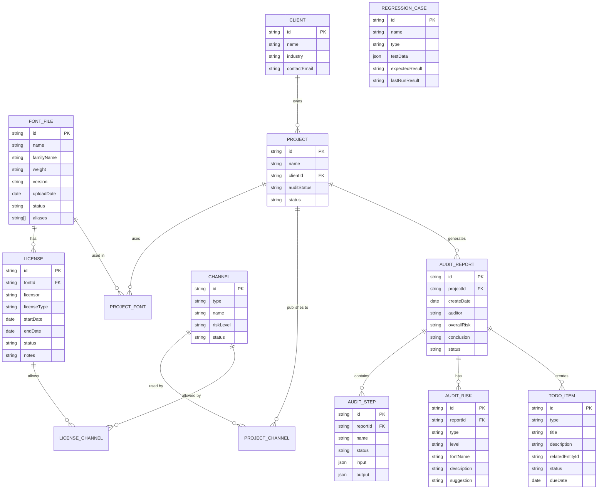

## 1. 架构设计



## 2. 技术描述
- **前端框架**: React@18.2.0 + TypeScript@5.0.0
- **构建工具**: Vite@5.0.0
- **样式方案**: TailwindCSS@3.4.0 + PostCSS
- **状态管理**: Zustand@4.4.0
- **数据请求**: React Query@5.0.0
- **路由管理**: React Router@6.20.0
- **图表可视化**: Recharts@2.10.0
- **流程图**: Mermaid@10.6.0
- **后端**: 纯前端Mock数据，LocalStorage持久化
- **数据库**: LocalStorage + 内存Mock数据
- **初始化命令**: `npm create vite@latest font-audit-system -- --template react-ts`

## 3. 路由定义
| 路由 | 页面名称 | 权限要求 | 功能说明 |
|------|----------|----------|----------|
| / | 审计工作台 | 所有登录用户 | 拖拽上传、字体识别、审计流程主入口 |
| /dashboard | 风险仪表盘 | 所有登录用户 | 风险概览、统计图表、待办事项 |
| /fonts | 字体库管理 | 法务/管理员 | 字体文件列表、状态管理 |
| /licenses | 授权证书管理 | 法务/管理员 | 授权证书上传、授权信息维护 |
| /projects | 项目管理 | 所有登录用户 | 项目列表、客户关联、渠道配置 |
| /channels | 发布渠道管理 | 法务/管理员 | 渠道类型配置、风险等级设置 |
| /reports | 审计报告 | 所有登录用户 | 报告列表、详情查看、导出 |
| /regression | 回归验证 | 法务/管理员 | 回归样例库、修改验证、风险重检 |
| /reports/:id | 报告详情 | 所有登录用户 | 单份报告详情、追溯链路 |

## 4. API 定义 (Mock)

### 4.1 TypeScript 类型定义
```typescript
// 状态枚举
type EntityStatus = 'confirmed' | 'temp_note';
type RiskLevel = 'high' | 'medium' | 'low' | 'pending';
type AuditStepStatus = 'pending' | 'running' | 'completed' | 'failed';
type ChannelType = 'web' | 'print' | 'social' | 'broadcast' | 'merchandise';

// 字体文件
interface FontFile {
  id: string;
  name: string;
  familyName: string;
  weight: string;
  version: string;
  uploadDate: string;
  status: EntityStatus;
  uploader: string;
  aliases: string[];
}

// 授权证书
interface License {
  id: string;
  fontId: string;
  fontName: string;
  licensor: string;
  licenseType: string;
  startDate: string;
  endDate: string;
  allowedChannels: ChannelType[];
  allowedClients: string[];
  certificateUrl?: string;
  status: EntityStatus;
  notes?: string;
}

// 客户
interface Client {
  id: string;
  name: string;
  industry: string;
  contactPerson: string;
  contactEmail: string;
  status: EntityStatus;
}

// 发布渠道
interface Channel {
  id: string;
  type: ChannelType;
  name: string;
  description: string;
  riskLevel: RiskLevel;
  status: EntityStatus;
}

// 项目
interface Project {
  id: string;
  name: string;
  clientId: string;
  clientName: string;
  channelIds: string[];
  channelNames: string[];
  fontIds: string[];
  fontNames: string[];
  createDate: string;
  auditStatus: 'pending' | 'audited' | 'risk_found';
  status: EntityStatus;
  notes?: string;
}

// 审计步骤
interface AuditStep {
  id: string;
  name: string;
  status: AuditStepStatus;
  startTime?: string;
  endTime?: string;
  input: any;
  output: any;
  error?: string;
}

// 审计风险项
interface AuditRisk {
  id: string;
  type: 'expired' | 'channel_out_of_scope' | 'font_renamed' | 'missing_license' | 'pending_info';
  level: RiskLevel;
  fontName: string;
  description: string;
  suggestion: string;
  relatedEntityId?: string;
  relatedEntityType?: string;
}

// 审计报告
interface AuditReport {
  id: string;
  projectId?: string;
  projectName?: string;
  clientName?: string;
  createDate: string;
  auditor: string;
  steps: AuditStep[];
  risks: AuditRisk[];
  overallRisk: RiskLevel;
  conclusion: string;
  status: EntityStatus;
  sampleFileName: string;
}

// 回归样例
interface RegressionCase {
  id: string;
  name: string;
  type: 'expired_license' | 'channel_out_of_scope' | 'font_renamed' | 'missing_info';
  description: string;
  testData: any;
  expectedResult: string;
  lastRunDate?: string;
  lastRunResult?: 'passed' | 'failed';
  status: EntityStatus;
}

// 待办事项
interface TodoItem {
  id: string;
  type: 'missing_license' | 'pending_confirmation' | 'expiring_license';
  title: string;
  description: string;
  relatedEntityId: string;
  relatedEntityType: string;
  relatedAuditReportId?: string;
  assignee: string;
  dueDate: string;
  status: 'pending' | 'completed';
  createDate: string;
}
```

### 4.2 Mock API 接口
```typescript
// 字体识别
POST /api/audit/recognize-fonts
Request: { file: File, projectId?: string }
Response: { fontCandidates: FontFile[], confidence: number }

// 授权匹配
POST /api/audit/match-license
Request: { fontId: string, projectId: string }
Response: { license?: License, matchStatus: 'matched' | 'not_found' | 'expired' }

// 渠道校验
POST /api/audit/validate-channels
Request: { licenseId: string, channelIds: string[] }
Response: { valid: boolean, invalidChannels: string[], reason: string }

// 风险分析
POST /api/audit/analyze-risks
Request: { font: FontFile, license?: License, channels: Channel[], project: Project }
Response: { risks: AuditRisk[], overallRisk: RiskLevel }

// 生成审计报告
POST /api/audit/generate-report
Request: { projectId?: string, steps: AuditStep[], risks: AuditRisk[], sampleFileName: string }
Response: AuditReport

// 导出报告
GET /api/reports/:id/export
Response: Blob (PDF/Excel)

// 回归测试
POST /api/regression/run/:caseId
Request: { modifications: any }
Response: { passed: boolean, result: AuditReport, diff: any }
```

## 5. 数据模型 (ER图)



## 6. 核心模块与数据结构

### 6.1 Store 结构 (Zustand)
```typescript
interface AppState {
  // 当前审计流程状态
  currentAudit: {
    step: 'upload' | 'recognize' | 'match' | 'validate' | 'analyze' | 'report';
    uploadedFile: File | null;
    recognizedFonts: FontFile[];
    matchedLicenses: Map<string, License>;
    validatedChannels: Map<string, boolean>;
    risks: AuditRisk[];
    steps: AuditStep[];
  };
  
  // 数据缓存
  fonts: FontFile[];
  licenses: License[];
  projects: Project[];
  clients: Client[];
  channels: Channel[];
  reports: AuditReport[];
  regressionCases: RegressionCase[];
  todos: TodoItem[];
  
  // UI状态
  sidebarCollapsed: boolean;
  currentRoute: string;
  
  // Actions
  setCurrentAuditStep: (step: string) => void;
  setUploadedFile: (file: File | null) => void;
  setRecognizedFonts: (fonts: FontFile[]) => void;
  addAuditStep: (step: AuditStep) => void;
  addRisk: (risk: AuditRisk) => void;
  completeAudit: (report: AuditReport) => void;
  resetAudit: () => void;
  
  // CRUD操作
  loadFonts: () => Promise<void>;
  addFont: (font: FontFile) => void;
  updateFontStatus: (id: string, status: EntityStatus) => void;
  
  loadLicenses: () => Promise<void>;
  addLicense: (license: License) => void;
  updateLicense: (license: License) => void;
  
  loadProjects: () => Promise<void>;
  addProject: (project: Project) => void;
  
  loadReports: () => Promise<void>;
  addReport: (report: AuditReport) => void;
  
  loadTodos: () => Promise<void>;
  completeTodo: (id: string) => void;
  
  loadRegressionCases: () => Promise<void>;
  runRegressionCase: (id: string, modifications: any) => Promise<boolean>;
}
```

### 6.2 Mock 数据说明
- 预置3个回归样例：授权过期、渠道超范围、字体改名
- 预置1个需要补资料的样例（未匹配授权证书）
- 预置5个字体文件、3个授权证书、3个客户、5个渠道、2个项目
- 预置2份历史审计报告，1份包含待办事项

### 6.3 审计链路追溯实现
每个 AuditStep 包含完整的 input 和 output 字段，报告页面以时间轴形式展示，点击每个步骤可展开查看该步骤的输入数据和输出结果，实现端到端可追溯。

### 6.4 状态区分实现
- 已确认 (confirmed): 绿色实心标签，背景色 `rgba(67, 160, 71, 0.15)`，边框色 `#43A047`
- 临时备注 (temp_note): 灰色虚线标签，背景色 `rgba(158, 158, 158, 0.1)`，边框 `1px dashed #9E9E9E`
