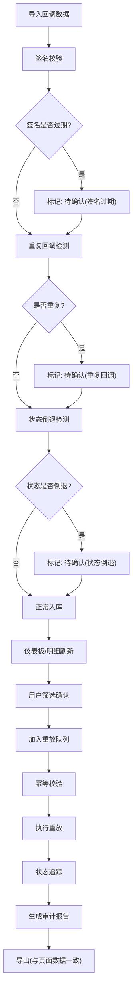

## 1. 产品概述

Webhook重放审计系统，面向支付研发团队，用于排查回调问题时按签名、重试和业务状态重放Webhook。系统确保图表、明细和导出围绕同一批数据刷新，杜绝导入导出各算各的。

- 核心问题：回调排查时签名过期、重复回调、状态倒退等异常容易被静默通过，导致审计盲区
- 目标用户：支付研发工程师、运维审计人员
- 核心价值：可疑情况宁可标"待确认"也不安静通过，让每一条回调都有迹可循

## 2. 核心功能

### 2.1 用户角色

| 角色 | 注册方式 | 核心权限 |
|------|----------|----------|
| 研发工程师 | 内部账号 | 导入日志、查看明细、触发重放、导出报告 |
| 审计人员 | 内部账号（只读） | 查看仪表板、查看明细、导出报告 |

### 2.2 功能模块

1. **总览仪表板**：签名校验统计、重试分布、状态分布、待确认告警
2. **回调明细**：全量回调表、多维筛选、签名/状态/重试详情、批量操作
3. **重放队列**：重放任务管理、幂等校验、执行进度、结果追踪
4. **审计报告**：自动汇总、人工标注、一键导出

### 2.3 页面详情

| 页面名称 | 模块名称 | 功能描述 |
|----------|----------|----------|
| 总览仪表板 | 签名校验统计卡片 | 签名通过/过期/待确认/失败数量与占比 |
| 总览仪表板 | 重试分布图 | 按重试次数分布的柱状图 |
| 总览仪表板 | 状态分布图 | 按订单状态分布的饼图 |
| 总览仪表板 | 待确认告警列表 | 签名过期、重复回调、状态倒退的待确认条目 |
| 总览仪表板 | 时间趋势图 | 按时间维度的回调量与异常率趋势 |
| 回调明细 | 筛选栏 | 按签名状态、重试次数、订单状态、处理结果、时间范围筛选 |
| 回调明细 | 明细表格 | 全量回调记录，支持排序、分页、行展开查看详情 |
| 回调明细 | 批量操作 | 批量标记待确认、批量加入重放队列 |
| 回调明细 | 导入功能 | 导入回调日志、签名头、重试次数、订单状态、处理结果、审计报告 |
| 重放队列 | 任务列表 | 重放任务队列，显示状态（待执行/执行中/已完成/失败） |
| 重放队列 | 幂等校验结果 | 每条重放任务的幂等检查结果 |
| 重放队列 | 状态追踪 | 重放执行后订单状态变化追踪 |
| 审计报告 | 自动汇总 | 基于当前筛选数据自动生成审计摘要 |
| 审计报告 | 人工标注 | 对可疑条目添加备注和确认状态 |
| 审计报告 | 一键导出 | 导出CSV/JSON，数据与页面图表/明细一致 |

## 3. 核心流程

用户导入回调数据 → 系统自动进行签名校验（过期标记"待确认"） → 检测重复回调（标记"待确认"） → 检测状态倒退（标记"待确认"） → 数据进入回调明细和仪表板 → 用户筛选确认 → 选择条目加入重放队列 → 系统幂等校验 → 执行重放 → 追踪状态变化 → 生成审计报告 → 导出

## 4. 用户界面设计

### 4.1 设计风格

- **主色调**：深蓝灰（#1e293b）为底，琥珀色（#f59e0b）为告警强调，翠绿（#10b981）为通过状态
- **次色调**：石板灰（#64748b）用于边框和次要文字，红色（#ef4444）用于失败状态
- **按钮风格**：圆角8px，紧凑型，主操作用实色填充，次操作用描边
- **字体**：JetBrains Mono 用于数据/代码展示，Source Han Sans（思源黑体）用于界面文字
- **布局风格**：左侧导航 + 右侧内容区，表格为主、卡片为辅
- **图标风格**：线性图标（lucide-react），16px/20px

### 4.2 页面设计概览

| 页面名称 | 模块名称 | UI元素 |
|----------|----------|--------|
| 总览仪表板 | 统计卡片 | 4个KPI卡片，数字+图标+环比变化，hover微动效 |
| 总览仪表板 | 图表区 | 2×2网格布局：重试分布柱状图、状态分布饼图、时间趋势折线图、待确认列表 |
| 回调明细 | 筛选栏 | 横向排列的下拉筛选+日期范围选择器，一键重置 |
| 回调明细 | 表格 | 虚拟滚动表格，行展开详情面板，状态标签用颜色区分 |
| 重放队列 | 任务卡片 | 卡片列表，每卡显示任务概要+进度条+操作按钮 |
| 审计报告 | 汇总面板 | 顶部统计摘要+条目列表+导出按钮组 |

### 4.3 响应式

- 桌面优先设计，最小宽度1280px
- 图表区域在窄屏下自动从2列切为1列
- 表格在窄屏下固定首列+横向滚动

### 4.4 3D场景

不适用
