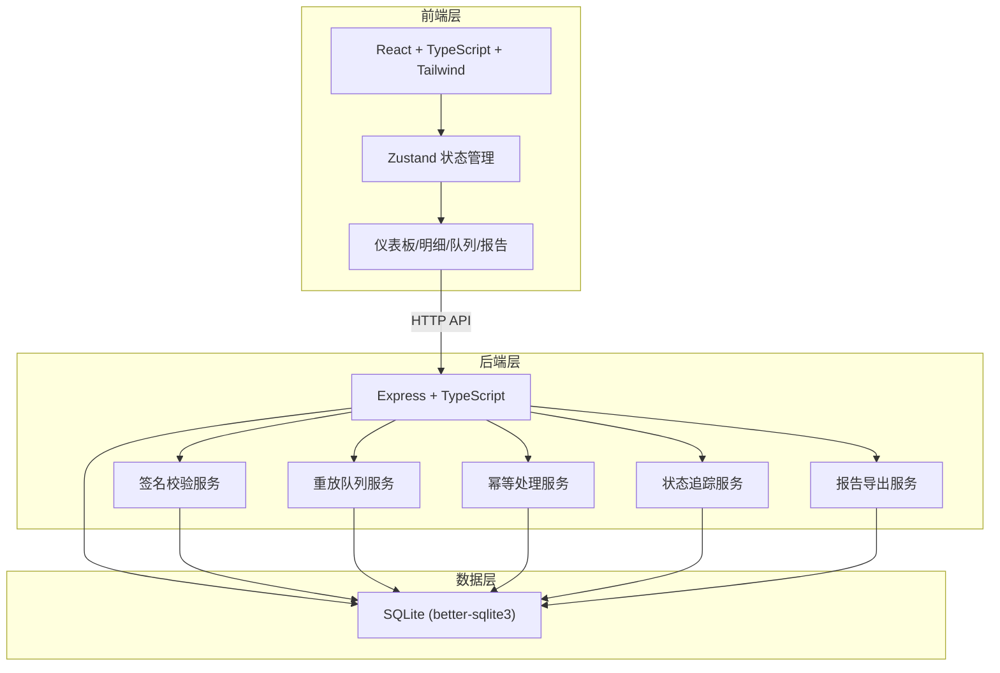
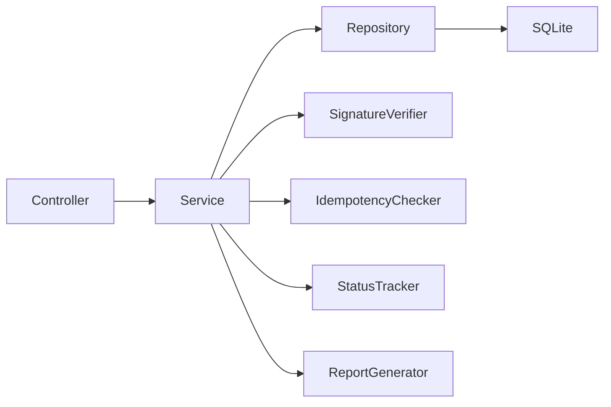
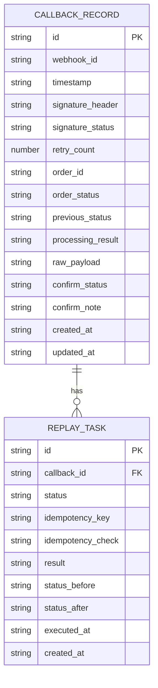

## 1. 架构设计



## 2. 技术说明

- **前端**：React@18 + tailwindcss@3 + vite + zustand + recharts（图表）
- **初始化工具**：vite-init
- **后端**：Express@4 + TypeScript + better-sqlite3
- **数据库**：SQLite（单文件，无需额外部署）
- **加密**：Node.js crypto 模块（HMAC-SHA256 签名校验）
- **导出**：后端生成 CSV/JSON，前端触发下载
- **测试**：Vitest + Supertest

## 3. 路由定义

| 路由 | 用途 |
|------|------|
| `/` | 总览仪表板，KPI卡片+图表+告警 |
| `/callbacks` | 回调明细，筛选+表格+导入+批量操作 |
| `/replay` | 重放队列，任务管理+幂等校验+状态追踪 |
| `/report` | 审计报告，汇总+标注+导出 |

## 4. API定义

```typescript
interface CallbackRecord {
  id: string
  webhook_id: string
  timestamp: string
  signature_header: string
  signature_status: "valid" | "expired" | "invalid" | "pending"
  retry_count: number
  order_id: string
  order_status: "pending" | "paid" | "failed" | "refunded" | "cancelled"
  previous_status: string | null
  processing_result: "success" | "failed" | "duplicate" | "pending"
  raw_payload: string
  confirm_status: "confirmed" | "pending" | "rejected"
  confirm_note: string | null
  created_at: string
  updated_at: string
}

interface ReplayTask {
  id: string
  callback_id: string
  status: "queued" | "running" | "completed" | "failed"
  idempotency_key: string
  idempotency_check: "pass" | "fail" | "skip"
  result: string | null
  status_before: string | null
  status_after: string | null
  executed_at: string | null
  created_at: string
}

interface AuditReport {
  total_callbacks: number
  signature_valid: number
  signature_expired: number
  signature_invalid: number
  duplicates: number
  status_regressions: number
  pending_confirmations: number
  replay_success: number
  replay_failed: number
  generated_at: string
}

// API Endpoints

// 回调数据
GET    /api/callbacks              // 列表（支持筛选、分页、排序）
POST   /api/callbacks/import       // 批量导入
GET    /api/callbacks/:id          // 详情
PATCH  /api/callbacks/:id/confirm  // 更新确认状态

// 统计
GET    /api/stats/overview         // 仪表板统计
GET    /api/stats/retry-distribution   // 重试分布
GET    /api/stats/status-distribution  // 状态分布
GET    /api/stats/trend             // 时间趋势

// 重放
GET    /api/replay-tasks           // 重放任务列表
POST   /api/replay-tasks           // 创建重放任务（支持批量）
POST   /api/replay-tasks/:id/execute  // 执行重放
GET    /api/replay-tasks/:id       // 重放任务详情

// 审计报告
GET    /api/reports/audit          // 生成审计摘要
PATCH  /api/reports/annotations/:id  // 更新标注
GET    /api/reports/export         // 导出（csv/json）

// 签名校验
POST   /api/verify/signature       // 手动验证签名
```

## 5. 服务端架构图



## 6. 数据模型

### 6.1 数据模型定义



### 6.2 数据定义语言

```sql
CREATE TABLE callback_records (
  id TEXT PRIMARY KEY,
  webhook_id TEXT NOT NULL,
  timestamp TEXT NOT NULL,
  signature_header TEXT,
  signature_status TEXT NOT NULL DEFAULT 'pending',
  retry_count INTEGER NOT NULL DEFAULT 0,
  order_id TEXT NOT NULL,
  order_status TEXT NOT NULL,
  previous_status TEXT,
  processing_result TEXT NOT NULL DEFAULT 'pending',
  raw_payload TEXT,
  confirm_status TEXT NOT NULL DEFAULT 'pending',
  confirm_note TEXT,
  created_at TEXT NOT NULL DEFAULT (datetime('now')),
  updated_at TEXT NOT NULL DEFAULT (datetime('now'))
);

CREATE INDEX idx_callbacks_signature_status ON callback_records(signature_status);
CREATE INDEX idx_callbacks_order_status ON callback_records(order_status);
CREATE INDEX idx_callbacks_confirm_status ON callback_records(confirm_status);
CREATE INDEX idx_callbacks_order_id ON callback_records(order_id);
CREATE INDEX idx_callbacks_timestamp ON callback_records(timestamp);

CREATE TABLE replay_tasks (
  id TEXT PRIMARY KEY,
  callback_id TEXT NOT NULL REFERENCES callback_records(id),
  status TEXT NOT NULL DEFAULT 'queued',
  idempotency_key TEXT NOT NULL,
  idempotency_check TEXT NOT NULL DEFAULT 'skip',
  result TEXT,
  status_before TEXT,
  status_after TEXT,
  executed_at TEXT,
  created_at TEXT NOT NULL DEFAULT (datetime('now'))
);

CREATE INDEX idx_replay_callback_id ON replay_tasks(callback_id);
CREATE INDEX idx_replay_status ON replay_tasks(status);
CREATE INDEX idx_replay_idempotency ON replay_tasks(idempotency_key);

-- 初始种子数据：模拟回调记录
INSERT INTO callback_records (id, webhook_id, timestamp, signature_header, signature_status, retry_count, order_id, order_status, previous_status, processing_result, confirm_status, raw_payload) VALUES
  ('cb_001', 'wh_pay_001', '2026-05-29T10:00:00Z', 'sha256=abc123', 'valid', 0, 'ORD-20260529-001', 'paid', NULL, 'success', 'confirmed', '{"event":"payment.success","amount":100.00}'),
  ('cb_002', 'wh_pay_002', '2026-05-29T10:05:00Z', 'sha256=expired_sig', 'expired', 2, 'ORD-20260529-002', 'paid', NULL, 'pending', 'pending', '{"event":"payment.success","amount":200.00}'),
  ('cb_003', 'wh_pay_001', '2026-05-29T10:00:01Z', 'sha256=abc123', 'valid', 1, 'ORD-20260529-001', 'paid', 'paid', 'duplicate', 'pending', '{"event":"payment.success","amount":100.00}'),
  ('cb_004', 'wh_pay_003', '2026-05-29T10:10:00Z', 'sha256=def456', 'valid', 0, 'ORD-20260529-003', 'pending', 'paid', 'pending', 'pending', '{"event":"payment.refund","amount":50.00}'),
  ('cb_005', 'wh_pay_004', '2026-05-29T10:15:00Z', 'sha256=bad_sig', 'invalid', 3, 'ORD-20260529-004', 'failed', NULL, 'failed', 'pending', '{"event":"payment.failed","amount":300.00}'),
  ('cb_006', 'wh_pay_005', '2026-05-29T10:20:00Z', 'sha256=ghi789', 'valid', 1, 'ORD-20260529-005', 'paid', NULL, 'success', 'confirmed', '{"event":"payment.success","amount":150.00}'),
  ('cb_007', 'wh_pay_006', '2026-05-29T10:25:00Z', 'sha256=jkl012', 'expired', 1, 'ORD-20260529-006', 'paid', NULL, 'pending', 'pending', '{"event":"payment.success","amount":250.00}'),
  ('cb_008', 'wh_pay_007', '2026-05-29T10:30:00Z', 'sha256=mno345', 'valid', 0, 'ORD-20260529-007', 'refunded', 'paid', 'success', 'confirmed', '{"event":"payment.refund","amount":100.00}'),
  ('cb_009', 'wh_pay_008', '2026-05-29T10:35:00Z', NULL, 'invalid', 0, 'ORD-20260529-008', 'pending', NULL, 'failed', 'pending', '{"event":"payment.pending","amount":500.00}'),
  ('cb_010', 'wh_pay_009', '2026-05-29T10:40:00Z', 'sha256=pqr678', 'valid', 4, 'ORD-20260529-009', 'failed', NULL, 'failed', 'pending', '{"event":"payment.failed","amount":75.00}');

INSERT INTO replay_tasks (id, callback_id, status, idempotency_key, idempotency_check, result, status_before, status_after, executed_at) VALUES
  ('rp_001', 'cb_002', 'completed', 'idem_ORD-20260529-002_1', 'pass', 'success', 'paid', 'paid', '2026-05-29T11:00:00Z'),
  ('rp_002', 'cb_004', 'failed', 'idem_ORD-20260529-003_1', 'fail', 'status_regression_blocked', 'pending', 'pending', '2026-05-29T11:05:00Z');
```
