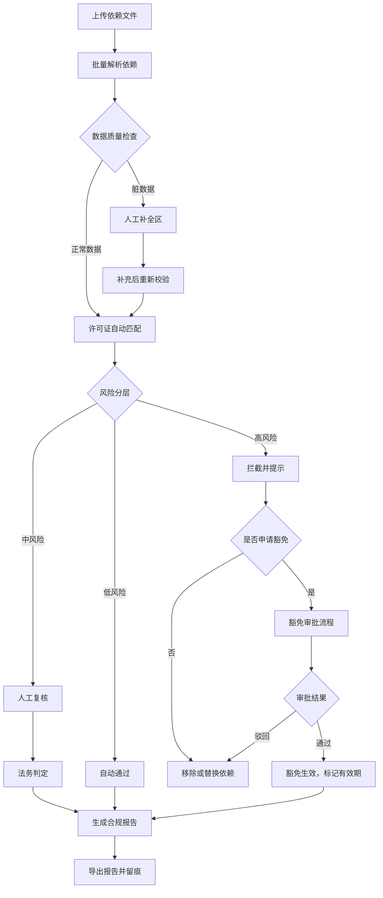

## 1. 产品概述

开源依赖许可证合规审查系统，面向法务和研发团队，在软件发版前对项目依赖的开源组件进行许可证合规性审查。解决传递依赖难追溯、双许可证难判断、豁免过期难追踪等核心痛点，实现批量导入、分层审查、留痕可溯、报告导出的全流程闭环。

- 核心用户：法务合规人员、研发负责人、项目QA
- 核心价值：降低开源许可证合规风险，提高审查效率，确保审查过程可追溯

## 2. 核心特性

### 2.1 用户角色

| 角色 | 登录方式 | 核心权限 |
|------|----------|----------|
| 研发工程师 | 本地登录 | 上传依赖清单、查看审查结果、补充材料、申请豁免 |
| 法务专员 | 本地登录 | 许可证归类、风险判定、豁免审批、导出合规报告 |
| 管理员 | 本地登录 | 系统配置、许可证规则维护、用户管理 |

### 2.2 功能模块

1. **依赖管理页**：批量上传、文件解析、正常/脏数据分离、依赖清单展示
2. **许可证审查页**：许可证归类、传递依赖追溯、双许可证处理、风险分层标记
3. **豁免管理页**：豁免申请、审批记录、有效期管理、过期预警
4. **合规报告页**：报告生成、多格式导出、历史版本对比、数字签名
5. **系统配置页**：许可证规则库、风险等级配置、模板管理

### 2.3 页面详情

| 页面名称 | 模块名称 | 功能描述 |
|----------|----------|----------|
| 依赖管理 | 批量上传区 | 支持拖拽上传package.json、pom.xml、requirements.txt等文件，多文件同时处理 |
| 依赖管理 | 解析结果区 | 自动解析依赖树，区分直接依赖/传递依赖，展示包名、版本、许可证、仓库地址 |
| 依赖管理 | 脏数据区 | 许可证缺失、格式错误、版本冲突的依赖单独展示，支持人工补全 |
| 许可证审查 | 许可证卡片 | 每个依赖展示许可证全称、SPDX标识、风险等级、合规判定理由 |
| 许可证审查 | 传递依赖树 | 可展开查看完整依赖链，高亮高风险传递依赖 |
| 许可证审查 | 双许可证处理 | 支持OR/AND双许可证场景，可选择适用许可证并记录选择理由 |
| 豁免管理 | 豁免申请 | 为高风险依赖申请豁免，填写豁免理由、有效期、审批人 |
| 豁免管理 | 豁免列表 | 展示所有豁免记录，按过期时间排序，红黄绿灯预警 |
| 合规报告 | 报告生成 | 一键生成合规报告，包含风险统计、豁免清单、问题依赖明细 |
| 合规报告 | 历史记录 | 报告版本管理，导出数字对不齐自动校验 |

## 3. 核心流程

### 3.1 主流程描述

研发工程师上传项目依赖清单 → 系统自动解析并分离正常/脏数据 → 法务人员进行许可证归类和风险判定 → 高风险依赖可申请豁免 → 审批通过后生成合规报告 → 报告导出并留痕。所有状态变化全程记录，重启后可恢复处理进度。



## 4. 用户界面设计

### 4.1 设计风格

- 主色调：深青色 `#0F4C5C` 专业稳重，代表合规与信任
- 辅助色：风险红 `#E63946`、警示黄 `#F4A261`、通过绿 `#2A9D8F`、豁免蓝 `#264653`
- 字体选择：标题用 `Noto Serif SC` 衬线体体现正式感，正文用 `Noto Sans SC` 保证可读性，等宽字体 `JetBrains Mono` 展示代码和依赖名
- 布局风格：左右分栏，左侧导航+右侧内容，卡片式信息承载，清晰的表格线框
- 设计基调：极简专业、数据导向、状态清晰、不留模糊地带

### 4.2 页面设计概述

| 页面名称 | 模块名称 | UI 元素 |
|----------|----------|---------|
| 依赖管理 | 上传区 | 大尺寸拖拽区域，文件列表卡片带进度条，解析状态图标动画 |
| 依赖管理 | 依赖清单 | 斑马纹表格，可展开行显示传递依赖，状态徽章醒目 |
| 许可证审查 | 风险仪表盘 | 红黄绿三色饼图，风险分布数字跳动动画 |
| 许可证审查 | 依赖卡片 | 悬停上浮效果，点击展开详情，风险等级用边框色区分 |
| 豁免管理 | 时间线 | 审批记录垂直时间线，过期日期倒计时显示 |
| 合规报告 | 报告预览 | 可折叠章节，导出按钮带加载动画，数字签名区域 |

### 4.3 响应式

- 桌面端（1440px+）：三栏布局，完整功能展示
- 平板端（1024px）：两栏布局，侧边导航可折叠
- 移动端（768px）：单栏布局，底部tab导航，表格横向滚动

## 5. 关键数据状态

### 5.1 依赖状态流转

```
待解析 → 解析中 → 已解析(正常/脏数据) → 待审查 → 审查中 → 
已通过/已拦截/豁免申请中 → 豁免已通过/豁免已驳回 → 已纳入报告
```

### 5.2 风险等级定义

| 等级 | 颜色 | 判定标准 | 处理方式 |
|------|------|----------|----------|
| 高危 | 红色 | GPL/AGPL强传染许可证，未获授权 | 强制拦截，必须申请豁免或移除 |
| 中危 | 黄色 | MPL/LGPL弱传染，双许可证不确定 | 人工复核，记录判定理由 |
| 低危 | 绿色 | MIT/Apache/BSD宽松许可证 | 自动通过 |
| 未知 | 灰色 | 许可证缺失或无法识别 | 人工补全后重新判定 |
