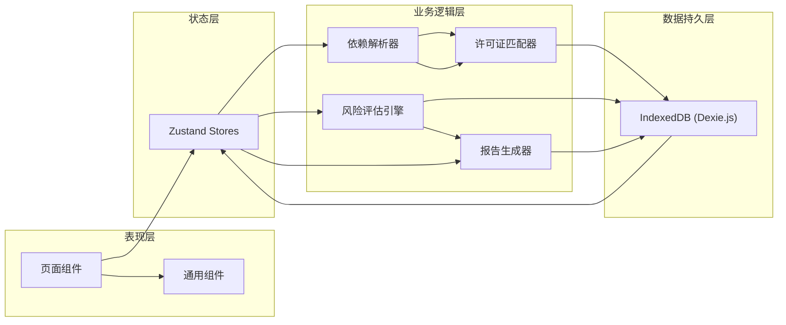
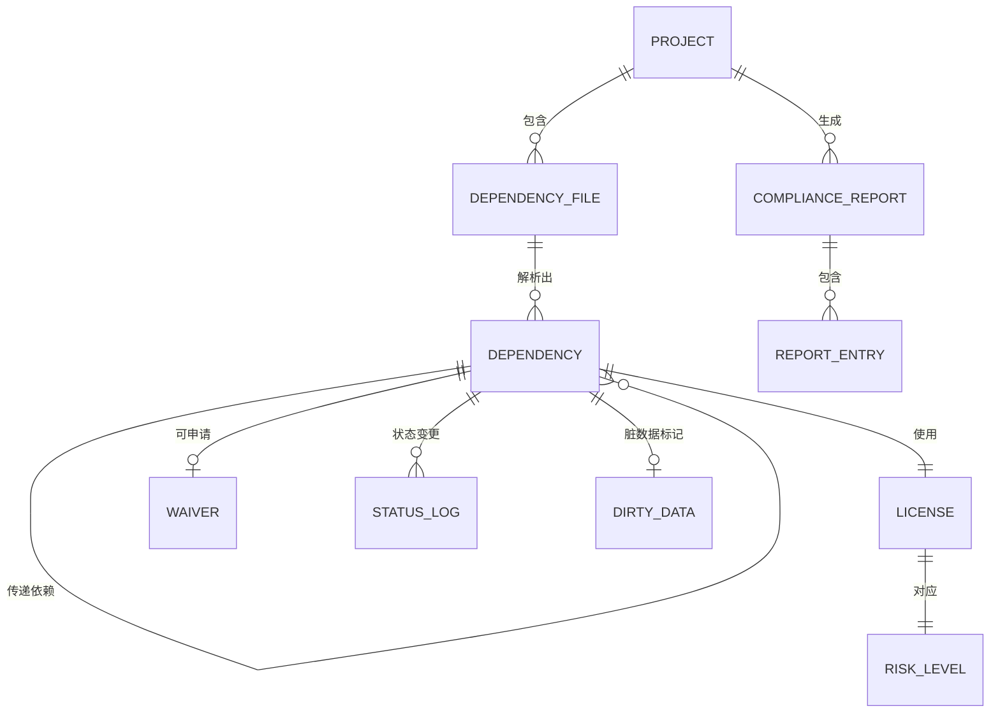

## 1. 架构设计

本系统为纯前端本地应用，数据全部存储在浏览器 IndexedDB 中，确保重启后历史记录完整保留。采用分层架构，严格分离状态管理、业务逻辑和UI渲染。



## 2. 技术描述

- **前端框架**: React 18 + TypeScript 5
- **构建工具**: Vite 5
- **样式方案**: TailwindCSS 3.4
- **状态管理**: Zustand 4.5
- **本地数据库**: Dexie.js 4.0 (IndexedDB 封装)
- **图表库**: Recharts 2.12
- **图标库**: Lucide React
- **日期处理**: dayjs
- **文件解析**: 内置解析器支持 package.json / pom.xml / requirements.txt / go.mod
- **数据导出**: 支持 JSON / CSV / PDF / Markdown

### 关键技术决策

1. **IndexedDB 而非 localStorage**: 存储量大（支持GB级）、支持索引查询、事务处理，适合依赖清单和历史记录
2. **Dexie.js 封装**: 简化 IndexedDB 操作，提供类型安全的查询 API
3. **Zustand 状态切片**: 按业务领域拆分 store，避免状态臃肿
4. **数据版本校验**: 每条记录带 hash 校验，导出时自动比对，确保数字对得上

## 3. 路由定义

| 路由 | 页面 | 功能 |
|------|------|------|
| `/` | 依赖管理页 | 批量上传、文件解析、依赖清单展示、脏数据处理 |
| `/review` | 许可证审查页 | 许可证归类、风险分层、传递依赖追溯 |
| `/waiver` | 豁免管理页 | 豁免申请审批、有效期管理、过期预警 |
| `/report` | 合规报告页 | 报告生成、多格式导出、历史版本对比 |
| `/config` | 系统配置页 | 许可证规则库、风险等级配置 |

## 4. 数据模型

### 4.1 ER 图



### 4.2 核心数据结构 TypeScript 定义

```typescript
// 依赖状态枚举
type DependencyStatus = 
  | 'pending_parse'      // 待解析
  | 'parsing'           // 解析中
  | 'parsed_normal'     // 已解析-正常
  | 'parsed_dirty'      // 已解析-脏数据
  | 'pending_review'    // 待审查
  | 'reviewing'         // 审查中
  | 'approved'          // 已通过
  | 'blocked'           // 已拦截
  | 'waiver_pending'    // 豁免申请中
  | 'waiver_approved'   // 豁免已通过
  | 'waiver_rejected'   // 豁免已驳回
  | 'in_report'         // 已纳入报告

// 风险等级
type RiskLevel = 'critical' | 'warning' | 'safe' | 'unknown'

// 数据质量问题类型
type DirtyType = 
  | 'license_missing'      // 许可证缺失
  | 'version_conflict'     // 版本冲突
  | 'format_error'         // 格式错误
  | 'transitive_missing'   // 传递依赖漏算
  | 'repo_url_missing'     // 仓库地址缺失

// 项目
interface Project {
  id: string
  name: string
  description: string
  createdAt: number
  updatedAt: number
  lastExportHash?: string  // 最后一次导出的哈希，用于校验数字对不齐
}

// 上传的依赖文件
interface DependencyFile {
  id: string
  projectId: string
  fileName: string
  fileType: 'npm' | 'maven' | 'pip' | 'gomod' | 'other'
  fileContent: string
  uploadTime: number
  parseStatus: 'pending' | 'success' | 'failed'
  parseError?: string
  parsedAt?: number
}

// 依赖项（核心数据结构）
interface Dependency {
  id: string
  projectId: string
  fileId: string
  parentId?: string              // 父依赖ID，用于构建传递依赖树
  packageName: string            // 包名
  packageVersion: string         // 包版本
  license: string | string[]     // 许可证（支持双许可证数组）
  licenseSelected?: string       // 双许可证时选择的许可证
  repoUrl?: string               // 仓库地址
  homepage?: string              // 主页
  isDirect: boolean              // 是否直接依赖
  depth: number                  // 依赖深度
  transitiveDependencies: string[]  // 传递依赖ID列表
  status: DependencyStatus
  riskLevel: RiskLevel
  blockReason?: string           // 拦截原因
  reviewNotes?: string           // 审查备注
  dirtyData?: DirtyDataRecord    // 脏数据标记
  waiverId?: string              // 关联的豁免ID
  createdAt: number
  updatedAt: number
  statusLogs: StatusLog[]        // 状态变更历史（内嵌，方便查询）
}

// 脏数据记录
interface DirtyDataRecord {
  dirtyType: DirtyType
  description: string
  fixed: boolean
  fixedAt?: number
  fixedBy?: string
  fixNotes?: string
}

// 状态变更日志
interface StatusLog {
  id: string
  dependencyId: string
  fromStatus: DependencyStatus
  toStatus: DependencyStatus
  operator: string
  reason: string
  timestamp: number
}

// 许可证定义
interface LicenseDefinition {
  id: string
  spdxId: string              // SPDX 标准标识
  fullName: string            // 许可证全称
  shortName: string           // 简称
  riskLevel: RiskLevel
  description: string
  obligations: string[]       // 义务条款
  permissions: string[]       // 允许的使用方式
  restrictions: string[]      // 限制条款
  isCopyleft: boolean         // 是否传染型
  copyleftStrength?: 'strong' | 'weak' | 'network'
}

// 豁免记录
interface Waiver {
  id: string
  dependencyId: string
  projectId: string
  applicant: string
  approver?: string
  reason: string
  justification: string       // 豁免理由
  effectiveDate: number       // 生效日期
  expiryDate: number          // 过期日期
  status: 'pending' | 'approved' | 'rejected' | 'expired'
  approvalNotes?: string
  createdAt: number
  approvedAt?: number
  rejectionReason?: string
  history: WaiverHistory[]    // 豁免历史（续期记录）
}

// 豁免历史（续期记录）
interface WaiverHistory {
  id: string
  waiverId: string
  previousExpiryDate: number
  newExpiryDate: number
  extendedBy: string
  extendedAt: number
  reason: string
}

// 合规报告
interface ComplianceReport {
  id: string
  projectId: string
  reportVersion: string
  generatedAt: number
  generatedBy: string
  status: 'draft' | 'final'
  totalDependencies: number
  safeCount: number
  warningCount: number
  criticalCount: number
  unknownCount: number
  waiverCount: number
  dirtyCount: number
  exportHash: string          // 报告内容哈希，用于校验
  entries: ReportEntry[]
}

// 报告条目
interface ReportEntry {
  id: string
  reportId: string
  dependencyId: string
  packageName: string
  packageVersion: string
  license: string
  riskLevel: RiskLevel
  status: DependencyStatus
  waiverId?: string
  notes?: string
}

// 导出记录
interface ExportRecord {
  id: string
  reportId: string
  format: 'json' | 'csv' | 'pdf' | 'markdown'
  exportedAt: number
  exportedBy: string
  exportHash: string          // 导出文件哈希
  filePath?: string
  recordCount: number         // 导出记录数，用于核对
}
```

### 4.3 状态流转设计

```typescript
// 状态转移矩阵，定义合法的状态转换
const STATUS_TRANSITIONS: Record<DependencyStatus, DependencyStatus[]> = {
  pending_parse: ['parsing'],
  parsing: ['parsed_normal', 'parsed_dirty'],
  parsed_normal: ['pending_review'],
  parsed_dirty: ['pending_review'],  // 脏数据修复后也到待审查
  pending_review: ['reviewing', 'approved'],  // 低风险可直接自动通过
  reviewing: ['approved', 'blocked', 'waiver_pending'],
  approved: ['in_report', 'blocked'],  // 已通过的也可重新拦截
  blocked: ['waiver_pending', 'approved'],  // 拦截后可申请豁免或重新判定
  waiver_pending: ['waiver_approved', 'waiver_rejected'],
  waiver_approved: ['in_report', 'blocked'],  // 豁免通过后也可因过期重新拦截
  waiver_rejected: ['blocked', 'waiver_pending'],  // 驳回后可重新申请
  in_report: ['approved', 'blocked']  // 已入报告的也可重新判定
}

// 状态变更时的钩子函数
interface StatusTransitionHook {
  (dependency: Dependency, from: DependencyStatus, to: DependencyStatus): void
}

// 例如：拦截时自动记录原因
const onBlocked: StatusTransitionHook = (dep, from, to) => {
  if (to === 'blocked' && !dep.blockReason) {
    dep.blockReason = generateBlockReason(dep)
  }
  addStatusLog(dep.id, from, to, dep.blockReason || '风险过高')
}
```

### 4.4 IndexedDB 表设计

使用 Dexie.js 定义数据库表结构：

```typescript
import Dexie, { Table } from 'dexie'

export class LicenseWallDB extends Dexie {
  projects!: Table<Project, string>
  dependencyFiles!: Table<DependencyFile, string>
  dependencies!: Table<Dependency, string>
  licenses!: Table<LicenseDefinition, string>
  waivers!: Table<Waiver, string>
  reports!: Table<ComplianceReport, string>
  reportEntries!: Table<ReportEntry, string>
  exports!: Table<ExportRecord, string>
  statusLogs!: Table<StatusLog, string>

  constructor() {
    super('LicenseWallDB')
    
    this.version(1).stores({
      projects: '&id, name, createdAt, updatedAt',
      dependencyFiles: '&id, projectId, fileName, uploadTime, parseStatus',
      dependencies: '&id, projectId, fileId, parentId, packageName, status, riskLevel, isDirect, depth, updatedAt',
      licenses: '&id, &spdxId, shortName, riskLevel, isCopyleft',
      waivers: '&id, dependencyId, projectId, status, expiryDate, createdAt',
      reports: '&id, projectId, reportVersion, generatedAt, status, exportHash',
      reportEntries: '&id, reportId, dependencyId, riskLevel',
      exports: '&id, reportId, exportedAt, exportHash, format',
      statusLogs: '&id, dependencyId, timestamp'
    })
  }
}

export const db = new LicenseWallDB()
```

### 4.5 数据一致性保证

1. **哈希校验机制**:
   - 每次报告生成时计算内容哈希 `exportHash = SHA256(reportContent)`
   - 导出时再次计算并比对，确保导出内容与报告一致
   - 重启后读取历史报告，重新计算哈希与存储的 `exportHash` 比对，检测数据是否被篡改

2. **操作留痕**:
   - 所有状态变更写入 `statusLogs` 表
   - 豁免审批、续期操作记录完整历史
   - 脏数据修复过程全程记录

3. **版本号递增**:
   - 报告版本号语义化 `v1.0.0`
   - 每次修改依赖状态后，相关报告版本递增
   - 历史版本可追溯对比

## 5. 核心业务模块设计

### 5.1 依赖解析器

支持多种包管理器文件格式解析：

```typescript
interface ParserResult {
  dependencies: Omit<Dependency, 'id' | 'projectId' | 'fileId' | 'status' | 'riskLevel' | 'createdAt' | 'updatedAt'>[]
  errors: ParseError[]
}

interface ParseError {
  type: DirtyType
  line?: number
  packageName?: string
  message: string
}

// 解析器接口
interface IParser {
  supports(fileName: string): boolean
  parse(content: string): ParserResult
}

// 内置解析器
class PackageJsonParser implements IParser { /* ... */ }
class PomXmlParser implements IParser { /* ... */ }
class RequirementsTxtParser implements IParser { /* ... */ }
class GoModParser implements IParser { /* ... */ }
```

### 5.2 许可证匹配器

```typescript
interface LicenseMatchResult {
  license: LicenseDefinition | null
  confidence: number  // 匹配度 0-100
  isDual: boolean     // 是否双许可证
  alternatives?: LicenseDefinition[]
}

class LicenseMatcher {
  // 模糊匹配许可证名称
  match(licenseString: string): LicenseMatchResult { /* ... */ }
  
  // 处理双许可证 (MIT OR Apache-2.0)
  parseDualLicense(licenseString: string): LicenseDefinition[] { /* ... */ }
  
  // SPDX 标识符规范化
  normalizeSpdx(spdx: string): string { /* ... */ }
}
```

### 5.3 风险评估引擎

```typescript
interface RiskAssessment {
  level: RiskLevel
  reasons: string[]
  suggestions: string[]
}

class RiskEngine {
  assess(dep: Dependency): RiskAssessment {
    const reasons: string[] = []
    
    // 1. 许可证风险
    if (dep.license) {
      const license = this.getLicenseDefinition(dep.license)
      if (license?.riskLevel === 'critical') {
        reasons.push(`使用强传染许可证 ${license.fullName}，可能导致源代码泄露`)
      }
    } else {
      reasons.push('许可证信息缺失，无法判定合规性')
    }
    
    // 2. 传递依赖风险
    const transitiveRisks = this.checkTransitiveDependencies(dep)
    reasons.push(...transitiveRisks)
    
    // 3. 豁免过期检查
    if (dep.waiverId) {
      const waiver = this.getWaiver(dep.waiverId)
      if (waiver && this.isExpired(waiver)) {
        reasons.push(`豁免已于 ${formatDate(waiver.expiryDate)} 过期`)
      }
    }
    
    // 4. 脏数据检查
    if (dep.dirtyData && !dep.dirtyData.fixed) {
      reasons.push(`数据质量问题: ${this.getDirtyTypeLabel(dep.dirtyData.dirtyType)}`)
    }
    
    return {
      level: this.determineLevel(reasons),
      reasons,
      suggestions: this.generateSuggestions(reasons)
    }
  }
}
```

### 5.4 报告生成器

```typescript
class ReportGenerator {
  async generate(projectId: string): Promise<ComplianceReport> {
    // 1. 统计数据校验
    const stats = await this.calculateStats(projectId)
    const hash = this.calculateHash(stats)
    
    // 2. 与上一次导出比对
    const lastReport = await this.getLastReport(projectId)
    if (lastReport) {
      const diff = this.compareStats(stats, lastReport)
      if (diff.changed) {
        // 记录差异
        this.logReportDiff(lastReport, stats, diff)
      }
    }
    
    // 3. 生成报告条目
    const entries = await this.generateEntries(projectId)
    
    // 4. 创建报告
    return {
      id: generateId(),
      projectId,
      reportVersion: this.incrementVersion(lastReport?.reportVersion),
      generatedAt: Date.now(),
      generatedBy: currentUser,
      status: 'draft',
      ...stats,
      exportHash: hash,
      entries
    }
  }
  
  // 数字校验：确保统计数字与实际数据一致
  private async verifyNumbers(report: ComplianceReport): Promise<boolean> {
    const actual = await this.calculateStats(report.projectId)
    return (
      report.totalDependencies === actual.totalDependencies &&
      report.safeCount === actual.safeCount &&
      report.warningCount === actual.warningCount &&
      report.criticalCount === actual.criticalCount &&
      report.unknownCount === actual.unknownCount &&
      report.waiverCount === actual.waiverCount &&
      report.dirtyCount === actual.dirtyCount
    )
  }
}
```

## 6. Zustand Store 设计

按业务领域拆分状态切片：

```typescript
// 项目状态
interface ProjectState {
  currentProject: Project | null
  projects: Project[]
  setCurrentProject: (id: string) => void
  createProject: (name: string, desc: string) => Promise<Project>
}

// 依赖状态
interface DependencyState {
  dependencies: Dependency[]
  dirtyDependencies: Dependency[]
  loading: boolean
  parseFiles: (fileIds: string[]) => Promise<void>
  updateStatus: (id: string, status: DependencyStatus, reason: string) => Promise<void>
  fixDirtyData: (id: string, fixData: Partial<Dependency>) => Promise<void>
}

// 豁免状态
interface WaiverState {
  waivers: Waiver[]
  createWaiver: (depId: string, data: Partial<Waiver>) => Promise<Waiver>
  approveWaiver: (id: string, notes: string) => Promise<void>
  rejectWaiver: (id: string, reason: string) => Promise<void>
  checkExpiry: () => Waiver[]  // 返回即将过期的豁免
}

// 报告状态
interface ReportState {
  reports: ComplianceReport[]
  currentReport: ComplianceReport | null
  generateReport: (projectId: string) => Promise<ComplianceReport>
  exportReport: (reportId: string, format: string) => Promise<ExportRecord>
  verifyReport: (reportId: string) => Promise<boolean>
}
```
