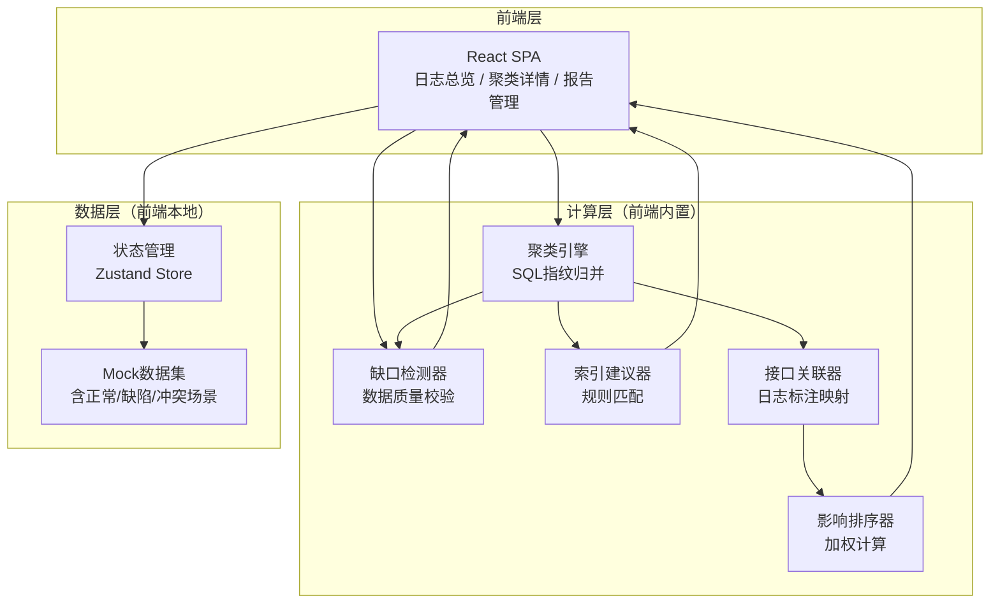
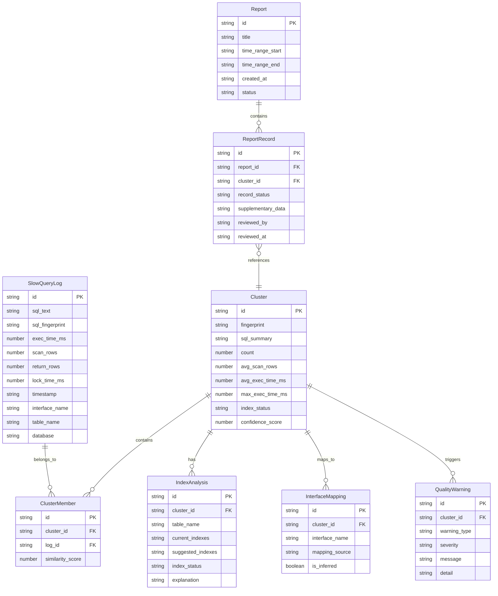

## 1. 架构设计

## 2. 技术说明

- **前端**：React@18 + TypeScript + TailwindCSS@3 + Vite
- **初始化工具**：Vite (react-ts template)
- **后端**：无（纯前端，数据使用Mock）
- **数据库**：无（前端本地状态 + Mock数据）
- **图表**：Recharts（趋势图、影响排序柱状图）
- **SQL解析/格式化**：sql-formatter（SQL语法高亮展示）
- **状态管理**：Zustand
- **动画**：framer-motion
- **代码高亮**：prism-react-renderer

## 3. 路由定义

| 路由 | 用途 |
|------|------|
| `/` | 重定向到 `/overview` |
| `/overview` | 日志总览页：时间窗口、趋势图、聚类卡片、数据质量警告 |
| `/cluster/:id` | 聚类详情页：归并列表、索引分析、接口关联、原始记录 |
| `/reports` | 报告管理页：三栏分类列表、补录、撤回、导出 |

## 4. 数据模型

### 4.1 数据模型定义

### 4.2 数据定义

#### SlowQueryLog（慢查询原始日志）

| 字段 | 类型 | 必填 | 说明 |
|------|------|------|------|
| id | string | 是 | UUID |
| sql_text | string | 是 | 完整SQL文本 |
| sql_fingerprint | string | 否 | SQL指纹（可能缺失→触发归并冲突警告） |
| exec_time_ms | number | 是 | 执行时间（毫秒） |
| scan_rows | number | 否 | 扫描行数（可能缺失→触发缺口警告） |
| return_rows | number | 否 | 返回行数 |
| lock_time_ms | number | 否 | 锁等待时间 |
| timestamp | string | 是 | 执行时间戳 |
| interface_name | string | 否 | 接口名（可能缺失→触发"需补充"标记） |
| table_name | string | 否 | 表名 |
| database | string | 否 | 数据库名 |

#### Cluster（聚类）

| 字段 | 类型 | 说明 |
|------|------|------|
| id | string | UUID |
| fingerprint | string | SQL指纹 |
| sql_summary | string | SQL摘要（参数化后截断） |
| count | number | 归并数量 |
| avg_scan_rows | number | 平均扫描行 |
| avg_exec_time_ms | number | 平均执行时间 |
| max_exec_time_ms | number | 最大执行时间 |
| index_status | enum | covered / partial / missing |
| confidence_score | number | 归并置信度 0-1 |

#### IndexAnalysis（索引分析）

| 字段 | 类型 | 说明 |
|------|------|------|
| id | string | UUID |
| cluster_id | string | 关联聚类 |
| table_name | string | 表名 |
| current_indexes | string[] | 当前索引列表 |
| suggested_indexes | string[] | 建议索引列表 |
| index_status | enum | hit / partial / missing / redundant |
| explanation | string | 索引建议说明 |

#### InterfaceMapping（接口关联）

| 字段 | 类型 | 说明 |
|------|------|------|
| id | string | UUID |
| cluster_id | string | 关联聚类 |
| interface_name | string | 接口名称 |
| mapping_source | enum | log_annotation / trace_mapping / manual / none |
| is_inferred | boolean | 是否推断（推断的标记为待确认） |

#### QualityWarning（数据质量警告）

| 字段 | 类型 | 说明 |
|------|------|------|
| id | string | UUID |
| cluster_id | string | 关联聚类 |
| warning_type | enum | merge_conflict / missing_index / missing_interface / time_window_mismatch / missing_scan_rows |
| severity | enum | critical / warning / info |
| message | string | 警告摘要 |
| detail | string | 详细说明 |

#### Report（报告）

| 字段 | 类型 | 说明 |
|------|------|------|
| id | string | UUID |
| title | string | 报告标题 |
| time_range_start | string | 分析起始时间 |
| time_range_end | string | 分析结束时间 |
| created_at | string | 创建时间 |
| status | enum | draft / submitted / archived |

#### ReportRecord（报告记录）

| 字段 | 类型 | 说明 |
|------|------|------|
| id | string | UUID |
| report_id | string | 关联报告 |
| cluster_id | string | 关联聚类 |
| record_status | enum | processed / pending / returned |
| supplementary_data | object | 补录数据（索引/接口/表结构） |
| reviewed_by | string | 审核人 |
| reviewed_at | string | 审核时间 |

### 4.3 Mock数据场景覆盖

Mock数据集必须覆盖以下场景：

| 场景 | 具体表现 | 预期系统行为 |
|------|----------|-------------|
| 正常完整数据 | SQL有指纹、有索引、有接口名、扫描行完整 | 正常聚类→绿色状态→自动归为"已处理" |
| 同SQL归并错 | 两条相同SQL被分配不同指纹 | 触发merge_conflict警告，置信度低，黄色标记 |
| 索引缺失 | 表无索引信息 | index_status=missing，触发missing_index警告，建议索引 |
| 时间窗口错 | 日志时间戳超出选择窗口 | 触发time_window_mismatch警告，窗口滑块变红 |
| 接口名缺失 | 日志无interface_name字段 | 接口关联显示虚线框"需补充"，记录归为"待确认" |
| 扫描行为空 | scan_rows为null | 触发missing_scan_rows警告，影响排序标注"估算值" |
| 重复提交 | 同一聚类+时间窗口重复提交报告 | toast提示重复，显示匹配详情 |
| 补录后重新提交 | 退回记录补录接口名后重新提交 | 状态从returned→pending→processed |
| 撤回已提交报告 | 对已提交报告执行撤回 | 报告状态回退至draft，记录回到"待确认" |
