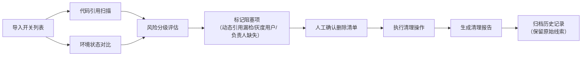

## 1. 产品概述

FeatureFlag清理器是一款面向研发团队的功能开关生命周期管理工具，解决产品迭代过程中功能开关积压、清理困难的痛点。通过自动化扫描、多维度风险评估和可追溯的清理流程，帮助团队安全、高效地识别和移除过期功能开关，降低代码维护成本。

- 核心价值：将人工排查改为批处理，避免手工改表和截图的低效操作
- 目标用户：后端研发、前端研发、技术负责人、QA工程师

---

## 2. 核心功能

### 2.1 用户角色

| 角色 | 注册方式 | 核心权限 |
|------|----------|----------|
| 研发工程师 | 工号登录 | 导入开关、执行扫描、查看报告、执行清理 |
| 技术负责人 | 工号登录 | 审批删除、调整规则、查看全局统计 |
| QA工程师 | 工号登录 | 验证清理结果、标注灰度状态 |

### 2.2 功能模块

1. **开关总览页**：开关列表、筛选搜索、批量导入导出、状态概览
2. **代码引用扫描**：静态代码扫描、动态引用检测、漏检提示
3. **环境状态对比**：多环境配置对比、灰度用户检测、启用状态分析
4. **风险评估中心**：风险分级、删除建议、阻塞项提示
5. **清理执行台**：删除清单生成、批量处理、操作日志
6. **报告中心**：清理报告导出、历史记录、规则配置

### 2.3 页面详情

| 页面名称 | 模块名称 | 功能描述 |
|----------|----------|----------|
| 开关总览页 | 开关列表 | 展示开关名称、代码位置、负责人、上线日期、环境状态、风险等级 |
| 开关总览页 | 批量导入 | 支持Excel/JSON导入，冲突时提示跳过/覆盖/追加 |
| 开关总览页 | 高级筛选 | 按风险等级、环境状态、负责人、上线时间筛选 |
| 代码引用扫描 | 扫描配置 | 配置代码仓库路径、排除目录、扫描规则 |
| 代码引用扫描 | 扫描结果 | 展示引用位置、引用类型（静态/动态）、漏检风险提示 |
| 环境状态对比 | 环境列表 | 对比各环境开关值、灰度用户、启用比例 |
| 环境状态对比 | 异常检测 | 自动标记灰度用户仍在使用、环境不一致等问题 |
| 风险评估中心 | 风险分级 | 高/中/低风险自动判定，展示判定规则和理由 |
| 风险评估中心 | 阻塞项提示 | 动态引用漏检、灰度用户仍在、负责人缺失等高优先级提示 |
| 清理执行台 | 删除清单 | 生成可删除开关列表，支持人工确认和调整 |
| 清理执行台 | 清理操作 | 模拟清理、执行清理、回滚操作 |
| 清理执行台 | 操作日志 | 完整记录每次清理的原始数据、操作人、时间、结果 |
| 报告中心 | 报告导出 | 支持PDF/Excel导出，包含原始线索、分析过程、清理结果 |
| 报告中心 | 规则配置 | 可调整引用扫描、环境对比、风险分级等规则 |
| 报告中心 | 历史追溯 | 查看所有历史清理记录，不覆盖原始线索 |

---

## 3. 核心流程

### 3.1 开关清理主流程

研发工程师导入开关列表 → 系统执行代码扫描和环境对比 → 自动进行风险分级并标记阻塞项 → 人工确认删除清单 → 执行清理并生成报告 → 归档历史记录

### 3.2 批量导入冲突处理流程

用户选择导入文件 → 系统检测重复开关 → 弹窗询问处理方式（跳过/覆盖/追加）→ 执行导入并记录操作日志

---

## 4. 用户界面设计

### 4.1 设计风格

- **主色调**：深科技蓝 #1E3A8A，代表专业和可信赖
- **辅助色**：警告橙 #F59E0B（中风险）、危险红 #EF4444（高风险/阻塞）、成功绿 #10B981（低风险/可删除）、信息灰 #6B7280（待确认）
- **按钮风格**：圆角8px，微阴影，悬停时有轻微上浮效果
- **字体**：标题使用 Inter，正文使用系统字体，代码片段使用 JetBrains Mono
- **布局风格**：卡片式布局，左侧导航+右侧内容区，数据表格支持固定列和横向滚动
- **图标风格**：线性图标，统一24px尺寸，颜色与语义匹配

### 4.2 页面设计要点

| 页面名称 | 模块名称 | UI元素 |
|----------|----------|--------|
| 开关总览页 | 顶部统计 | 四个彩色统计卡片：总开关数、可清理数、高风险数、待确认数 |
| 开关总览页 | 数据表格 | 支持多选、排序、列配置，风险等级用彩色标签展示 |
| 代码引用扫描 | 扫描进度 | 进度条+实时日志，扫描完成后展示环形统计图 |
| 风险评估中心 | 阻塞项卡片 | 红色警告卡片，用通俗语言说明风险和建议操作 |
| 清理执行台 | 删除清单 | 可拖拽排序，每条显示风险理由，支持一键排除 |
| 报告中心 | 规则配置 | 规则卡片展开式设计，每条规则带"解释"按钮说明设计意图 |

### 4.3 关键提示文案（人能读懂）

- **动态引用漏检**：「⚠️ 该开关可能通过变量名动态拼接引用，静态扫描无法覆盖。建议全局搜索开关名的关键词片段进行人工确认。」
- **灰度用户仍在**：「⚠️ 生产环境仍有 128 位灰度用户在使用此开关控制的功能，直接删除可能影响这部分用户体验。建议先全量或灰度下线后再清理。」
- **负责人缺失**：「⚠️ 该开关未登记负责人，无法确认清理影响范围。建议联系该模块最近的代码提交者补充信息。」

### 4.4 响应式

- 桌面端为主（1440px及以上），支持1280px适配
- 平板端折叠左侧导航为图标模式
- 移动端重点优化数据展示，复杂操作引导至桌面端

---

## 5. 数据可追溯性设计

### 5.1 原始线索保留机制

- 每次导入、扫描、清理操作都保留原始数据快照
- 修改记录采用追加模式，不覆盖历史数据
- 报告中同时展示：原始数据 → 分析过程 → 最终结论 的完整链路

### 5.2 操作审计

- 所有关键操作记录：操作人、时间、IP、变更前后值
- 清理操作支持一键回滚（恢复开关配置）
