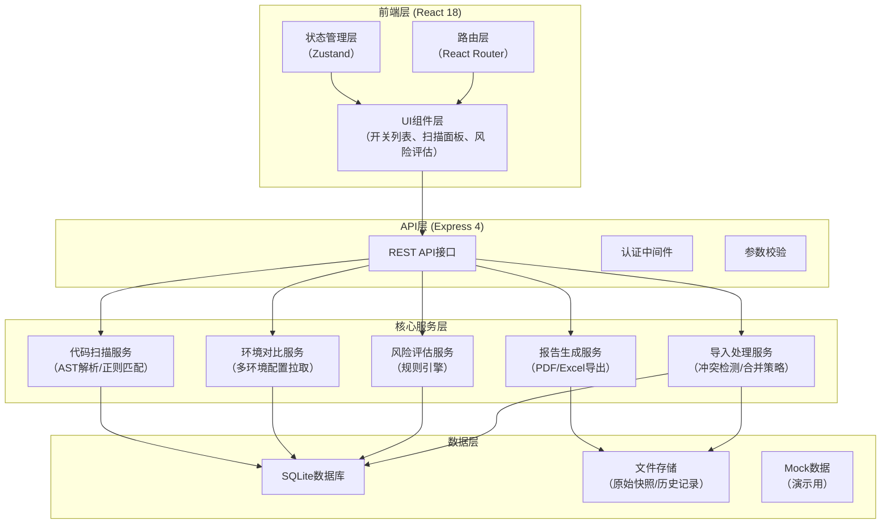
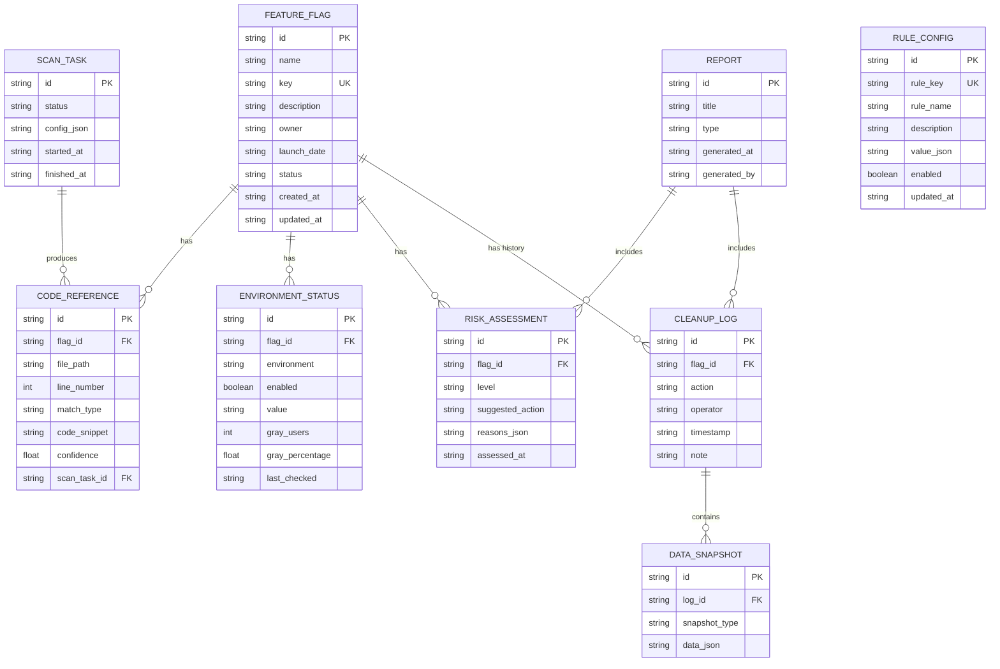

## 1. 架构设计



---

## 2. 技术描述

### 2.1 技术栈选型

| 层级 | 技术选型 | 版本 | 说明 |
|------|----------|------|------|
| 前端框架 | React | 18.x | 函数式组件 + Hooks |
| 前端构建 | Vite | 5.x | 快速冷启动和热更新 |
| 状态管理 | Zustand | 4.x | 轻量级状态管理，替代Redux |
| 路由 | React Router | 6.x | 声明式路由 |
| UI样式 | TailwindCSS | 3.x | 原子化CSS，快速构建UI |
| UI组件 | Headless UI | 1.x | 无样式组件，配合Tailwind |
| 图表 | Recharts | 2.x | 风险分布、扫描统计图表 |
| 后端框架 | Express | 4.x | 轻量级Node.js服务 |
| 数据库 | SQLite | 3.x | 本地文件数据库，无需额外服务 |
| ORM | Prisma | 5.x | 类型安全的数据库访问 |
| 代码扫描 | TypeScript ESTree / grep | - | AST解析 + 正则兜底 |
| Excel处理 | SheetJS (xlsx) | 0.18.x | 导入导出Excel |
| PDF导出 | jsPDF | 2.5.x | 生成PDF报告 |
| 类型系统 | TypeScript | 5.x | 全链路类型安全 |

### 2.2 初始化方式

- 前端：`npm create vite@latest feature-flag-cleaner -- --template react-ts`
- 后端：Express 4 手动初始化，与前端共用 package.json（monorepo 结构）

---

## 3. 路由定义

| 路由 | 页面名称 | 说明 |
|------|----------|------|
| `/` | 开关总览页 | 开关列表、统计概览、筛选搜索 |
| `/scan` | 代码扫描页 | 扫描配置、执行扫描、查看结果 |
| `/environment` | 环境对比页 | 多环境配置对比、灰度状态 |
| `/risk` | 风险评估页 | 风险分级、阻塞项提示、删除建议 |
| `/cleanup` | 清理执行台 | 删除清单、执行清理、操作日志 |
| `/reports` | 报告中心 | 历史报告、规则配置、导出 |
| `/reports/:id` | 报告详情 | 单份报告详情页 |
| `/settings` | 系统设置 | 规则配置、扫描参数 |

---

## 4. API 定义

### 4.1 TypeScript 类型定义

```typescript
// 功能开关基础信息
interface FeatureFlag {
  id: string;
  name: string;
  key: string;
  description: string;
  owner: string | null;
  launchDate: string | null;
  createdAt: string;
  updatedAt: string;
  status: 'active' | 'inactive' | 'deprecated' | 'pending_cleanup';
}

// 代码引用信息
interface CodeReference {
  id: string;
  flagId: string;
  filePath: string;
  lineNumber: number;
  matchType: 'static' | 'dynamic' | 'suspected';
  codeSnippet: string;
  confidence: number;
}

// 环境状态
interface EnvironmentStatus {
  id: string;
  flagId: string;
  environment: 'dev' | 'staging' | 'production';
  enabled: boolean;
  value: string;
  grayUsers: number;
  grayPercentage: number;
  lastChecked: string;
}

// 风险评估结果
interface RiskAssessment {
  id: string;
  flagId: string;
  level: 'low' | 'medium' | 'high' | 'blocker';
  reasons: RiskReason[];
  suggestedAction: 'safe_delete' | 'verify_first' | 'do_not_delete';
  assessedAt: string;
}

interface RiskReason {
  code: string;
  message: string;
  severity: 'warning' | 'error';
  suggestion: string;
}

// 清理操作记录
interface CleanupLog {
  id: string;
  flagId: string;
  action: 'import' | 'scan' | 'assess' | 'delete' | 'rollback';
  operator: string;
  timestamp: string;
  beforeSnapshot: any;
  afterSnapshot: any;
  note: string;
}

// 导入冲突处理
type ImportConflictStrategy = 'skip' | 'overwrite' | 'append';

interface ImportResult {
  total: number;
  success: number;
  skipped: number;
  overwritten: number;
  appended: number;
  conflicts: ImportConflict[];
}

interface ImportConflict {
  flagKey: string;
  existing: FeatureFlag;
  incoming: Partial<FeatureFlag>;
  resolution: ImportConflictStrategy;
}
```

### 4.2 API 接口列表

| 方法 | 路径 | 说明 |
|------|------|------|
| GET | `/api/flags` | 获取开关列表（支持筛选、分页） |
| POST | `/api/flags` | 新增单个开关 |
| GET | `/api/flags/:id` | 获取开关详情 |
| PUT | `/api/flags/:id` | 更新开关信息 |
| DELETE | `/api/flags/:id` | 删除开关（记录日志） |
| POST | `/api/flags/import` | 批量导入开关 |
| POST | `/api/flags/export` | 批量导出开关 |
| POST | `/api/scan` | 触发代码扫描 |
| GET | `/api/scan/:taskId` | 获取扫描状态和结果 |
| GET | `/api/environment/compare` | 多环境对比 |
| POST | `/api/environment/sync` | 同步环境状态 |
| GET | `/api/risk/assess` | 触发风险评估 |
| GET | `/api/risk/flags/:flagId` | 获取单个开关风险详情 |
| GET | `/api/cleanup/list` | 获取待清理清单 |
| POST | `/api/cleanup/execute` | 执行批量清理 |
| POST | `/api/cleanup/rollback/:logId` | 回滚清理操作 |
| GET | `/api/cleanup/logs` | 获取操作日志 |
| GET | `/api/reports` | 获取报告列表 |
| POST | `/api/reports/generate` | 生成清理报告 |
| GET | `/api/reports/:id/export` | 导出报告（pdf/excel） |
| GET | `/api/settings/rules` | 获取规则配置 |
| PUT | `/api/settings/rules` | 更新规则配置 |

---

## 5. 数据模型

### 5.1 ER 图



### 5.2 关键规则配置表

系统预置的规则支持用户调整，每条规则包含解释说明：

| 规则键 | 规则名称 | 默认值 | 解释 |
|--------|----------|--------|------|
| `scan.dynamic_patterns` | 动态引用检测模式 | `["getFlag\\(['\"]{key}['\"]\\)", "flags\\[['\"]{key}['\"]\\]"]` | 用于检测通过变量拼接等方式动态获取开关的代码模式，{key}会被替换为开关名 |
| `scan.exclude_dirs` | 扫描排除目录 | `["node_modules", ".git", "dist", "build"]` | 代码扫描时跳过的目录，提升扫描速度 |
| `risk.stale_days` | 过期开关阈值 | `180` | 上线超过多少天且全量开启的开关标记为可清理 |
| `risk.gray_user_threshold` | 灰度用户告警阈值 | `10` | 灰度用户数超过多少时标记为阻塞项 |
| `risk.ownership_required` | 是否要求负责人 | `true` | 未登记负责人的开关是否提升风险等级 |
| `cleanup.require_approval` | 清理是否需要审批 | `true` | 高风险开关清理是否需要负责人审批 |
| `import.default_strategy` | 导入默认策略 | `ask` | 重复开关导入时的默认处理方式：ask/skip/overwrite/append |

### 5.3 风险分级规则（可配置）

| 风险等级 | 判定条件 | 建议操作 |
|----------|----------|----------|
| **低风险** | 1. 代码中无引用<br/>2. 所有环境全量开启超过180天<br/>3. 无灰度用户<br/>4. 负责人明确 | 可安全删除 |
| **中风险** | 1. 存在静态引用但逻辑已注释<br/>2. 灰度用户 < 阈值<br/>3. 负责人缺失但影响范围小 | 建议人工确认后删除 |
| **高风险** | 1. 存在动态引用可能<br/>2. 灰度用户 ≥ 阈值<br/>3. 环境状态不一致 | 必须人工核查，确认无误后再处理 |
| **阻塞** | 1. 明确检测到动态引用<br/>2. 生产环境灰度用户 > 100<br/>3. 核心链路开关且无负责人 | 禁止清理，必须先解决阻塞项 |

---

## 6. 前端组件架构

### 6.1 目录结构

```
src/
├── components/          # 通用组件
│   ├── DataTable/       # 数据表格（支持列配置、筛选）
│   ├── RiskBadge/       # 风险等级标签
│   ├── StatusBadge/     # 状态标签
│   ├── ConfirmModal/    # 确认弹窗
│   ├── ProgressBar/     # 进度条
│   └── RuleCard/        # 规则配置卡片（带解释）
├── pages/               # 页面组件
│   ├── Dashboard/       # 开关总览
│   ├── CodeScan/        # 代码扫描
│   ├── Environment/     # 环境对比
│   ├── RiskAssessment/  # 风险评估
│   ├── Cleanup/         # 清理执行
│   ├── Reports/         # 报告中心
│   └── Settings/        # 系统设置
├── store/               # Zustand 状态管理
│   ├── flagStore.ts
│   ├── scanStore.ts
│   └── uiStore.ts
├── services/            # API 服务层
│   ├── flagApi.ts
│   ├── scanApi.ts
│   ├── riskApi.ts
│   └── reportApi.ts
├── types/               # TypeScript 类型定义
│   └── index.ts
├── utils/               # 工具函数
│   ├── riskCalculator.ts
│   ├── dateUtils.ts
│   └── exportUtils.ts
├── hooks/               # 自定义 Hooks
│   ├── useScan.ts
│   └── useRiskAssessment.ts
└── mock/                # Mock 数据
    └── data.ts
```

### 6.2 Mock 数据说明

为便于演示，预置 50 条模拟开关数据，覆盖以下场景：
- 20 条低风险可清理（无引用、全量开启、超180天）
- 15 条中风险需确认（有注释引用、少量灰度用户）
- 10 条高风险需核查（动态引用嫌疑、较多灰度用户）
- 5 条阻塞禁止清理（动态引用明确、大量灰度用户、无负责人）
