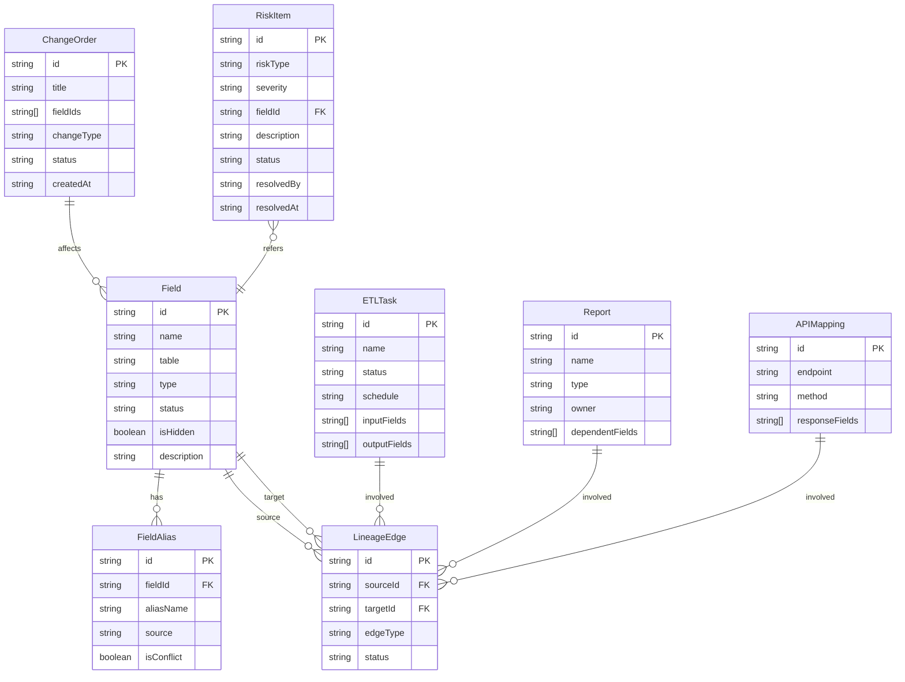

## 1. 架构设计

```mermaid
graph TB
    subgraph "前端层"
        "React SPA" --> "状态管理(Zustand)"
        "React SPA" --> "路由(React Router)"
        "React SPA" --> "图谱引擎(自研Canvas)"
    end
    subgraph "数据层"
        "Mock数据引擎" --> "字段字典"
        "Mock数据引擎" --> "ETL任务表"
        "Mock数据引擎" --> "报表注册表"
        "Mock数据引擎" --> "API映射表"
        "Mock数据引擎" --> "变更单"
        "Mock数据引擎" --> "血缘关系表"
        "Mock数据引擎" --> "别名映射表"
        "Mock数据引擎" --> "风险清单表"
    end
    subgraph "核心引擎"
        "血缘追踪引擎" --> "影响扫描器"
        "血缘追踪引擎" --> "断点检测器"
        "别名归并引擎" --> "冲突检测器"
        "别名归并引擎" --> "自动匹配器"
        "巡检引擎" --> "报告生成器"
        "巡检引擎" --> "导出器"
    end
    "React SPA" --> "核心引擎"
    "核心引擎" --> "Mock数据引擎"
```

## 2. 技术说明

- **前端**：React@18 + TypeScript + Tailwind CSS@3 + Vite
- **初始化工具**：vite-init (react-ts template)
- **后端**：无（纯前端项目，数据存储在localStorage + 内存状态）
- **图谱渲染**：基于Canvas自研力导向图（不引入重型图形库，保持轻量）
- **状态管理**：Zustand
- **导出**：jsPDF（PDF导出）+ SheetJS/xlsx（Excel导出）
- **字体**：JetBrains Mono + Noto Sans SC

## 3. 路由定义

| 路由 | 用途 |
|------|------|
| `/` | 重定向到 `/lineage` |
| `/lineage` | 血缘图谱页 - 主页，可视化血缘关系 |
| `/scan` | 影响扫描页 - 输入变更字段，扫描下游影响 |
| `/alias` | 别名归并页 - 管理字段别名映射 |
| `/risk` | 风险清单页 - 汇总未解决的血缘风险 |
| `/report` | 巡检报告页 - 生成和导出巡检报告 |

## 4. 数据模型

### 4.1 数据模型定义



### 4.2 核心TypeScript类型

```typescript
type NodeType = 'field' | 'etl' | 'report' | 'api'
type RiskSeverity = 'high' | 'medium' | 'low'
type RiskType = 'unregistered_field' | 'lineage_break' | 'unregistered_downstream' | 'alias_conflict' | 'status_contradiction'
type EdgeStatus = 'active' | 'broken' | 'unregistered'

interface LineageNode {
  id: string
  type: NodeType
  label: string
  aliases: string[]
  isHidden: boolean
  status: string
  metadata: Record<string, unknown>
}

interface LineageEdge {
  id: string
  source: string
  target: string
  edgeType: string
  status: EdgeStatus
}
```

## 5. 项目目录结构

```
src/
├── components/
│   ├── layout/          # 布局组件（侧边栏、顶栏）
│   ├── lineage/         # 血缘图谱相关组件
│   │   ├── LineageGraph.tsx      # Canvas图谱主组件
│   │   ├── NodeRenderer.tsx      # 节点渲染器
│   │   ├── EdgeRenderer.tsx      # 边渲染器
│   │   └── NodeDetailDrawer.tsx  # 节点详情抽屉
│   ├── scan/            # 影响扫描相关组件
│   │   ├── ScanInput.tsx         # 变更输入面板
│   │   ├── ImpactTree.tsx        # 影响树组件
│   │   └── SeverityBadge.tsx     # 严重程度标识
│   ├── alias/           # 别名归并相关组件
│   │   ├── AliasTable.tsx        # 别名映射表
│   │   ├── ConflictAlert.tsx     # 冲突检测提示
│   │   └── AliasMergeModal.tsx   # 合并操作弹窗
│   ├── risk/            # 风险清单相关组件
│   │   ├── RiskCard.tsx          # 风险卡片
│   │   └── RiskFilter.tsx        # 筛选排序
│   └── report/          # 巡检报告相关组件
│       ├── ReportPreview.tsx     # 报告预览
│       └── ExportButtons.tsx     # 导出按钮
├── pages/
│   ├── LineagePage.tsx
│   ├── ScanPage.tsx
│   ├── AliasPage.tsx
│   ├── RiskPage.tsx
│   └── ReportPage.tsx
├── store/
│   ├── useLineageStore.ts       # 血缘数据状态
│   ├── useScanStore.ts          # 扫描状态
│   ├── useAliasStore.ts         # 别名状态
│   ├── useRiskStore.ts          # 风险状态
│   └── useReportStore.ts        # 报告状态
├── data/
│   └── demoData.ts              # 演示数据
├── engine/
│   ├── lineageTracker.ts        # 血缘追踪引擎
│   ├── impactScanner.ts         # 影响扫描器
│   ├── aliasMerger.ts           # 别名归并引擎
│   ├── riskAnalyzer.ts          # 风险分析器
│   └── reportGenerator.ts       # 报告生成器
├── utils/
│   └── graphLayout.ts           # 力导向图布局算法
├── App.tsx
└── main.tsx
```
