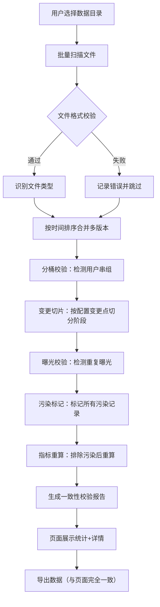
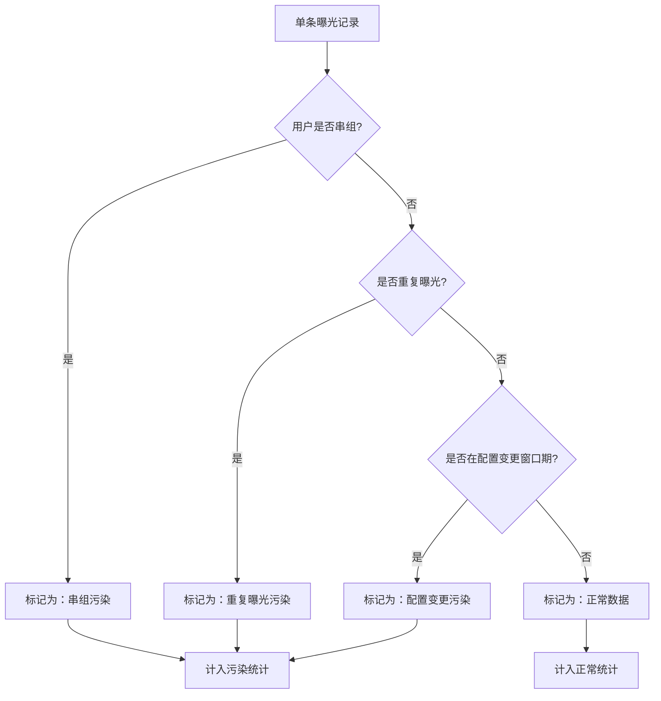

## 1. 产品概述

灰度实验污染检查系统是一款面向数据分析师和运营人员的实验数据质量校验工具，用于检测增长实验过程中因配置变更、用户串组、重复曝光等原因导致的实验组和对照组数据污染问题。

- 解决问题：实验中途配置变更导致的数据污染、用户跨组泄漏、重复曝光等数据质量问题
- 目标用户：数据分析师、运营人员、实验平台管理员
- 核心价值：在实验分析前自动识别污染数据，提供可复核的校验报告，确保实验结论的可信度

## 2. 核心功能

### 2.1 用户角色

| 角色 | 登录方式 | 核心权限 |
|------|----------|----------|
| 数据分析师 | 本地应用 | 上传数据、执行污染检查、查看报告、导出结果 |
| 运营人员 | 本地应用 | 上传运营变更记录、查看污染概览 |

### 2.2 功能模块

1. **文件管理页**：目录批量导入、文件类型识别、错误文件跳过、处理进度展示
2. **污染检查页**：分桶校验、变更切片、污染标记、指标重算、实时处理日志
3. **报告总览页**：污染统计概览、趋势图表、关键指标对比、污染类型分布
4. **详情查询页**：单条记录详情、污染证据链、数据溯源、版本对比
5. **导出中心**：CSV/Excel导出、报告PDF生成、导出记录一致性校验

### 2.3 页面详情

| 页面名称 | 模块名称 | 功能描述 |
|----------|----------|----------|
| 文件管理页 | 目录导入模块 | 支持选择整个目录批量导入，自动识别文件类型（配置/分桶/曝光/变更/转化/报告），显示文件列表和状态 |
| 文件管理页 | 错误处理模块 | 遇到格式错误或损坏文件时记录错误并继续处理，显示错误详情和跳过的文件列表 |
| 文件管理页 | 版本管理模块 | 处理多版本数据，支持按时间戳合并和去重，标记数据先后顺序 |
| 污染检查页 | 分桶校验模块 | 检查用户是否同时出现在多个实验组，检测串组用户，计算串组率 |
| 污染检查页 | 变更切片模块 | 根据运营变更时间点将实验周期切分为多个阶段，分别计算各阶段指标 |
| 污染检查页 | 污染标记模块 | 标记串组用户、重复曝光记录、配置变更前后的污染数据，支持自定义污染规则 |
| 污染检查页 | 指标重算模块 | 排除污染数据后重新计算核心指标，展示修正前后对比 |
| 报告总览页 | 统计概览模块 | 展示总曝光量、污染率、串组率、重复曝光率等关键指标 |
| 报告总览页 | 图表展示模块 | 污染趋势图、各阶段指标对比图、污染类型分布图 |
| 详情查询页 | 单条查询模块 | 支持按用户ID、曝光ID查询单条记录的完整信息和污染状态 |
| 详情查询页 | 证据链展示模块 | 展示污染判断的完整证据链，包括分桶记录、曝光时间、配置版本等 |
| 导出中心 | 数据导出模块 | 导出CSV/Excel格式的完整数据表，确保导出数据与页面统计完全一致 |
| 导出中心 | 报告导出模块 | 生成包含统计图表和详细分析的PDF报告，支持自定义报告内容 |

## 3. 核心流程

### 3.1 污染检查主流程

用户上传包含实验数据的整个目录，系统自动识别文件类型并进行格式校验，跳过损坏文件，然后依次执行分桶校验、变更切片、污染标记和指标重算，最后生成可复核的检查报告，支持数据导出和详情查询。

### 3.2 污染判定流程

## 4. 用户界面设计

### 4.1 设计风格

- **主色调**：深靛蓝 (#1e3a5f) 作为主色，代表专业和可信；警示红 (#dc2626) 用于污染标记；成功绿 (#059669) 用于正常数据；中性灰 (#64748b) 用于辅助信息
- **按钮风格**：直角矩形按钮，带有细微边框和hover时的背景色变化，强调专业工具感
- **字体**：使用 JetBrains Mono 作为等宽字体展示数据，使用 Inter 作为界面字体，确保数据展示的清晰度和可读性
- **布局风格**：模块化卡片布局，左侧导航栏，右侧内容区，顶部全局状态栏
- **数据可视化**：使用简洁的条形图、折线图和饼图，强调数据的准确性而非视觉花哨

### 4.2 页面设计概述

| 页面名称 | 模块名称 | UI元素 |
|----------|----------|--------|
| 文件管理页 | 目录导入区 | 拖拽上传区域、目录选择按钮、文件列表表格（文件名、类型、大小、状态、错误信息） |
| 文件管理页 | 处理进度条 | 分阶段进度展示、当前处理文件、已处理/总数、错误计数 |
| 污染检查页 | 控制面板 | 检查规则配置、污染阈值设置、开始/暂停按钮 |
| 污染检查页 | 实时日志 | 滚动显示处理日志，不同类型日志用不同颜色区分 |
| 报告总览页 | 指标卡片 | 4-6个关键指标卡片，带有数值、环比变化、状态指示灯 |
| 报告总览页 | 图表区域 | 污染趋势折线图、污染类型分布饼图、各阶段指标对比柱状图 |
| 详情查询页 | 搜索栏 | 用户ID/曝光ID搜索框、筛选条件（污染类型、时间范围、实验组） |
| 详情查询页 | 证据链面板 | 时间线式展示该记录的完整生命周期，高亮污染点 |
| 导出中心 | 导出选项 | 格式选择（CSV/Excel/PDF）、内容选择（全部/仅污染/仅正常）、数据范围选择 |
| 导出中心 | 一致性校验 | 导出前自动校验导出数据与页面统计是否一致，显示校验结果 |

### 4.3 响应式设计

- 采用桌面端优先设计，主内容区最小宽度1200px
- 支持1280px、1440px、1920px等常见分辨率自适应
- 表格支持水平滚动，确保数据列完整展示
- 移动端简化为核心功能：概览统计、详情查询

### 4.4 交互细节

- 污染记录行使用浅红色背景，鼠标悬停显示污染原因浮层
- 指标卡片支持点击下钻查看详细构成
- 时间线支持缩放和拖拽，定位到具体配置变更点
- 导出过程显示进度条，完成后提供下载链接和校验码
