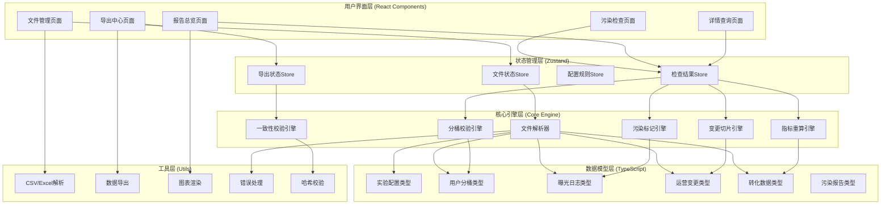

## 1. 架构设计

本系统采用纯前端架构，所有数据处理均在浏览器端完成，确保数据安全和隐私。使用React + TypeScript构建，核心数据处理引擎独立封装，确保计算逻辑的可测试性和可复用性。



## 2. 技术描述

- **前端框架**: React@18 + TypeScript@5 + Vite@5
- **状态管理**: Zustand@4（轻量级，适合复杂数据流）
- **样式方案**: TailwindCSS@3 + CSS Variables
- **图表库**: Recharts@2（React生态，类型安全）
- **文件处理**: PapaParse@5（CSV解析）+ SheetJS/xlsx@0.18（Excel处理）
- **图标库**: Lucide React@0.294（简洁专业的图标）
- **日期处理**: date-fns@3（轻量级日期库）
- **PDF导出**: html2canvas@1 + jspdf@2
- **数据校验**: zod@3（TypeScript优先的校验库）
- **初始化工具**: vite-init (npm create vite@latest)

## 3. 路由定义

| 路由 | 页面组件 | 主要功能 |
|------|----------|----------|
| / | DashboardPage | 污染检查总览，快速开始入口 |
| /files | FileManagerPage | 文件目录管理、批量导入、错误处理 |
| /check | ContaminationCheckPage | 执行污染检查、实时日志、进度展示 |
| /report | ReportOverviewPage | 统计概览、图表展示、指标对比 |
| /detail | DetailQueryPage | 单条记录查询、证据链展示 |
| /export | ExportCenterPage | 数据导出、报告生成、一致性校验 |

## 4. 核心数据模型

### 4.1 TypeScript 类型定义

```typescript
// 基础枚举
export enum FileType {
  EXPERIMENT_CONFIG = 'experiment_config',
  USER_BUCKET = 'user_bucket',
  EXPOSURE_LOG = 'exposure_log',
  OPERATION_CHANGE = 'operation_change',
  CONVERSION_DATA = 'conversion_data',
  CONTAMINATION_REPORT = 'contamination_report',
  UNKNOWN = 'unknown'
}

export enum ContaminationType {
  CROSS_GROUP = 'cross_group',      // 用户串组
  DUPLICATE_EXPOSURE = 'duplicate', // 重复曝光
  CONFIG_CHANGE = 'config_change',  // 配置变更污染
  NONE = 'none'                     // 正常
}

export enum ProcessStatus {
  PENDING = 'pending',
  PROCESSING = 'processing',
  COMPLETED = 'completed',
  ERROR = 'error',
  SKIPPED = 'skipped'
}

// 实验配置
export interface ExperimentConfig {
  experimentId: string;
  experimentName: string;
  version: string;
  configData: Record<string, any>;
  startTime: number;
  endTime?: number;
  createdAt: number;
}

// 用户分桶
export interface UserBucket {
  userId: string;
  experimentId: string;
  groupId: string;
  groupName: string;
  bucketTime: number;
  bucketVersion: string;
}

// 曝光日志
export interface ExposureLog {
  exposureId: string;
  userId: string;
  experimentId: string;
  groupId: string;
  exposureTime: number;
  configVersion: string;
  deviceId?: string;
  pageUrl?: string;
  isContaminated: boolean;
  contaminationType: ContaminationType;
  contaminationReason?: string;
}

// 运营变更
export interface OperationChange {
  changeId: string;
  experimentId: string;
  changeType: 'config' | 'traffic' | 'group';
  changeTime: number;
  operator: string;
  changeDescription: string;
  oldValue?: string;
  newValue?: string;
}

// 转化数据
export interface ConversionData {
  conversionId: string;
  userId: string;
  exposureId: string;
  conversionEvent: string;
  conversionValue: number;
  conversionTime: number;
}

// 污染检查结果
export interface CheckResult {
  totalExposures: number;
  contaminatedCount: number;
  crossGroupCount: number;
  duplicateExposureCount: number;
  configChangeCount: number;
  contaminationRate: number;
  crossGroupRate: number;
  duplicateRate: number;
  configChangeRate: number;
  affectedUsers: string[];
  contaminatedExposures: string[];
  phaseResults: PhaseResult[];
  recalculatedMetrics: Metrics;
  originalMetrics: Metrics;
  consistencyChecksum: string;
}

// 阶段结果（变更切片）
export interface PhaseResult {
  phaseId: string;
  phaseName: string;
  startTime: number;
  endTime: number;
  configVersion: string;
  exposureCount: number;
  contaminationCount: number;
  metrics: Metrics;
}

// 核心指标
export interface Metrics {
  conversionRate: number;
  averageValue: number;
  totalConversions: number;
  totalValue: number;
  uniqueUsers: number;
}

// 文件处理记录
export interface FileRecord {
  id: string;
  name: string;
  path: string;
  size: number;
  type: FileType;
  status: ProcessStatus;
  rowCount: number;
  errorMessage?: string;
  createdAt: number;
  processedAt?: number;
}

// 证据链
export interface EvidenceChain {
  exposureId: string;
  userId: string;
  bucketRecords: UserBucket[];
  exposureRecords: ExposureLog[];
  configChanges: OperationChange[];
  conversionRecords: ConversionData[];
  contaminationVerdict: ContaminationType;
  verdictReason: string;
}
```

### 4.2 数据校验 Schema (Zod)

```typescript
import { z } from 'zod';

export const UserBucketSchema = z.object({
  userId: z.string().min(1),
  experimentId: z.string().min(1),
  groupId: z.string().min(1),
  bucketTime: z.number().int().positive(),
  bucketVersion: z.string().min(1)
});

export const ExposureLogSchema = z.object({
  exposureId: z.string().min(1),
  userId: z.string().min(1),
  experimentId: z.string().min(1),
  exposureTime: z.number().int().positive(),
  configVersion: z.string().min(1)
});

export const OperationChangeSchema = z.object({
  changeId: z.string().min(1),
  experimentId: z.string().min(1),
  changeTime: z.number().int().positive(),
  changeType: z.enum(['config', 'traffic', 'group'])
});
```

## 5. 核心引擎设计

### 5.1 分桶校验引擎 (BucketValidationEngine)

**职责**：检测用户是否同时出现在多个实验组

**算法**：
1. 按用户ID分组，收集所有分桶记录
2. 检查同一用户在同一实验中是否有不同的groupId
3. 考虑分桶版本和时间，识别中途改桶的情况
4. 输出串组用户列表和串组率

**时间复杂度**：O(n log n)，n为分桶记录数

### 5.2 变更切片引擎 (ChangeSlicingEngine)

**职责**：根据运营变更时间点切割实验周期

**算法**：
1. 收集所有运营变更记录，按时间排序
2. 将实验周期切分为 N+1 个阶段（N为变更次数）
3. 每个阶段对应一个稳定的配置版本
4. 按阶段分组统计曝光和转化数据

### 5.3 污染标记引擎 (ContaminationMarkingEngine)

**职责**：标记每条曝光记录的污染状态

**判定规则**（按优先级）：
1. 用户串组 → 标记为 CROSS_GROUP
2. 同一用户对同一实验曝光多次 → 标记为 DUPLICATE（保留首次，标记其余）
3. 曝光时间落在配置变更窗口期（前后30分钟）→ 标记为 CONFIG_CHANGE
4. 以上都不满足 → 标记为 NONE

### 5.4 指标重算引擎 (MetricRecalculationEngine)

**职责**：排除污染数据后重新计算核心指标

**计算逻辑**：
- 转化率 = 去污染后的转化数 / 去污染后的曝光数
- 平均转化值 = 去污染后的总转化值 / 去污染后的转化数
- 同时输出原始指标用于对比

### 5.5 一致性校验引擎 (ConsistencyCheckEngine)

**职责**：确保页面统计、详情查询、导出数据三者完全一致

**实现方式**：
1. 所有统计计算使用同一数据源（检查结果Store）
2. 导出前计算数据哈希值，与页面展示的校验码比对
3. 详情查询直接从原始数据中检索，不经过二次计算
4. 提供三重一致性校验报告

## 6. 状态管理设计

### 6.1 文件状态 Store

```typescript
interface FileState {
  files: FileRecord[];
  selectedDirectory: string | null;
  isScanning: boolean;
  scanProgress: number;
  addFile: (file: FileRecord) => void;
  updateFile: (id: string, updates: Partial<FileRecord>) => void;
  removeFile: (id: string) => void;
  scanDirectory: (path: string) => Promise<void>;
  clearAll: () => void;
}
```

### 6.2 检查结果 Store

```typescript
interface CheckState {
  isRunning: boolean;
  currentPhase: string;
  progress: number;
  logs: LogEntry[];
  result: CheckResult | null;
  exposureLogs: Map<string, ExposureLog>;
  userBuckets: Map<string, UserBucket[]>;
  operationChanges: OperationChange[];
  conversionData: ConversionData[];
  startCheck: () => Promise<void>;
  pauseCheck: () => void;
  resetCheck: () => void;
  getEvidenceChain: (exposureId: string) => EvidenceChain | null;
}
```

## 7. 错误处理策略

### 7.1 文件处理错误

- 解析错误：记录文件名、错误类型、所在行号，跳过该文件继续处理
- 格式错误：提供修复建议（如分隔符、编码格式）
- 数据缺失：标记为警告，不中断处理流程

### 7.2 数据一致性错误

- 导出前自动校验，不一致则禁止导出并提示
- 提供强制导出选项，但会在导出文件中标记警告

### 7.3 性能优化

- 使用 Web Worker 处理大文件解析和计算
- 数据分页加载，避免一次性渲染大量记录
- 使用 requestIdleCallback 处理非紧急计算
- 结果缓存，重复查询不重复计算
