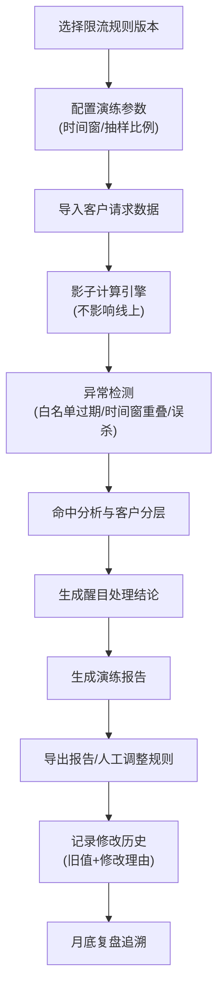

## 1. 产品概述
接口限流影子演练平台，在不影响线上用户的前提下，对限流策略进行预演评估，提前发现潜在问题。解决传统表格管理中白名单过期、时间窗重叠、突发流量误杀等隐蔽问题。
- 核心目标：确保限流策略上线前可验证、可追溯、可解释
- 目标用户：运维工程师、架构师、技术负责人
- 产品价值：降低限流策略上线风险，保护高价值客户，提升故障排查效率

## 2. 核心 Features

### 2.1 用户角色
| 角色 | 注册方式 | 核心权限 |
|------|----------|----------|
| 运维工程师 | 内部账号登录 | 规则管理、演练执行、报告查看 |
| 架构师 | 内部账号登录 | 规则审批、策略配置、客户分层 |
| 技术负责人 | 内部账号登录 | 全量权限、报告审批、复盘分析 |

### 2.2 功能模块
1. **仪表板**：演练概览、异常告警、趋势图表
2. **规则管理**：限流规则CRUD、版本管理、历史追溯
3. **影子演练**：模拟计算、命中分析、结果预览
4. **客户分层**：客户信息管理、分层配置、白名单管理
5. **演练报告**：报告列表、详情查看、导出下载
6. **系统设置**：修改记录、操作日志、配置管理

### 2.3 页面详情
| 页面名称 | 模块名称 | 功能描述 |
|----------|----------|----------|
| 仪表板 | 概览卡片 | 展示今日演练次数、命中数、异常数、影响客户数 |
| 仪表板 | 异常告警区 | 醒目展示白名单过期、时间窗重叠、误杀预警，带处理结论 |
| 仪表板 | 趋势图表 | 近7天演练命中趋势、客户分层命中分布 |
| 规则管理 | 规则列表 | 限流规则表格，支持筛选、搜索、版本切换 |
| 规则管理 | 规则编辑 | 新增/编辑规则，配置接口路径、时间窗、阈值、白名单 |
| 规则管理 | 版本对比 | 规则版本历史、变更对比、回滚功能 |
| 影子演练 | 演练配置 | 选择规则版本、时间范围、抽样比例 |
| 影子演练 | 命中分析 | 逐条展示命中请求、命中原因、客户信息 |
| 影子演练 | 结果预览 | 模拟限流后客户被挡情况，按重要性排序 |
| 客户分层 | 客户列表 | 客户信息、分层等级、白名单状态、历史命中 |
| 客户分层 | 白名单管理 | 白名单配置、有效期提醒、批量操作 |
| 演练报告 | 报告列表 | 历史演练报告、状态筛选、导出操作 |
| 演练报告 | 报告详情 | 完整演练数据、命中明细、异常分析、处理建议 |
| 系统设置 | 修改记录 | 人工修改历史，含旧值、新值、修改理由 |

## 3. 核心流程

## 4. 界面设计

### 4.1 设计风格
- **主色调**：深靛蓝 (#1E3A8A) - 代表专业、可靠
- **辅助色**：
  - 告警红 (#DC2626) - 误杀、严重异常
  - 警告橙 (#F59E0B) - 白名单过期、时间窗重叠
  - 成功绿 (#059669) - 正常、通过
  - 信息蓝 (#2563EB) - 提示、信息
- **中性色**：深灰背景 (#0F172A)、中灰 (#334155)、浅灰 (#94A3B8)
- **按钮风格**：直角按钮，2px边框，hover时背景加深
- **字体**：JetBrains Mono（等宽，技术感）+ Noto Sans SC（中文易读）
- **布局风格**：左侧导航 + 主内容区，卡片式布局，高密度信息展示
- **图标风格**：线条硬朗的线性图标，无圆角，强调技术感

### 4.2 页面设计概览
| 页面名称 | 模块名称 | UI 元素 |
|----------|----------|---------|
| 仪表板 | 概览卡片 | 深色卡片，大数字指标，微动画，状态色边框 |
| 仪表板 | 异常告警区 | 顶部醒目标红卡片，带闪烁动画，处理结论按钮突出 |
| 仪表板 | 趋势图表 | Recharts面积图，分层着色，交互tooltip |
| 规则管理 | 规则列表 | 斑马纹表格，版本标签，状态徽标，行悬停高亮 |
| 规则管理 | 版本对比 | 左右分栏，差异高亮（红删绿增），时间轴 |
| 影子演练 | 命中分析 | 瀑布流式布局，命中卡片，原因标签，客户分层色标 |
| 客户分层 | 白名单管理 | 表格带倒计时，过期日期高亮，批量操作栏 |
| 演练报告 | 报告详情 | 分章节折叠面板，导出按钮固定右下角 |

### 4.3 响应式
- Desktop-first 设计，最小支持宽度 1280px
- 主内容区固定宽度 1200px，居中布局
- 表格支持水平滚动，窄屏时导航栏可折叠

### 4.4 动效设计
- 页面加载：卡片 staggered 淡入（100ms 间隔）
- 告警卡片：轻微脉冲动画，吸引注意力
- 状态切换：颜色过渡动画（300ms ease）
- 悬停效果：卡片上移 2px，阴影加深
