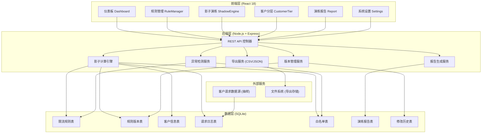
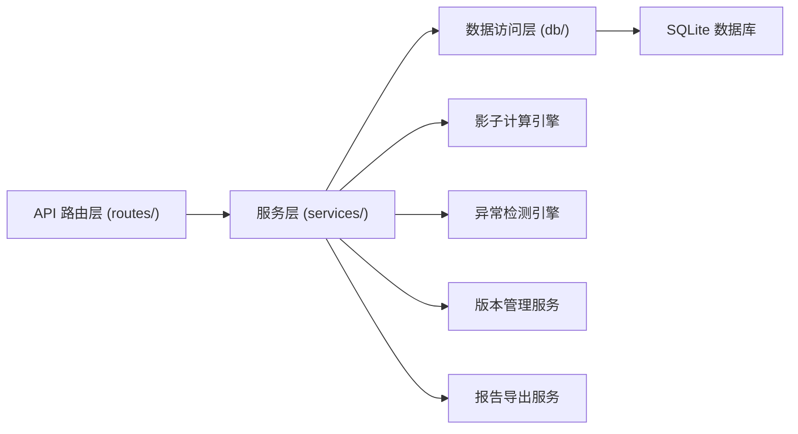
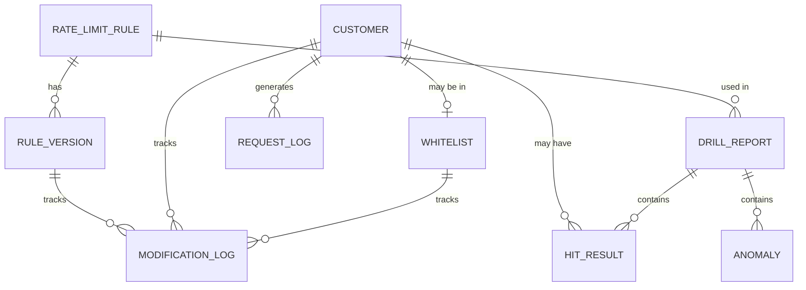

## 1. 架构设计


## 2. 技术描述
- **前端**：React@18 + TypeScript + tailwindcss@3 + vite@5
- **状态管理**：React Context + useReducer（轻量级，无需Redux）
- **路由**：react-router-dom@6
- **图表**：recharts@2
- **UI组件**：radix-ui（基础组件）+ lucide-react（图标）
- **后端**：Express@4 + TypeScript
- **数据库**：SQLite3 + better-sqlite3（同步API，性能好）
- **ORM**：无，直接使用参数化SQL（简单可靠）
- **初始化工具**：npm create vite@latest
- **代码风格**：ESLint + Prettier

## 3. 路由定义
| 路由路径 | 页面名称 | 功能 |
|----------|----------|------|
| / | 仪表板 | 演练概览、异常告警、趋势图表 |
| /rules | 规则管理 | 限流规则列表、版本管理 |
| /rules/new | 新建规则 | 创建新的限流规则 |
| /rules/:id | 规则详情 | 规则详情、版本对比、历史追溯 |
| /shadow | 影子演练 | 演练配置、影子计算、命中分析 |
| /customers | 客户分层 | 客户列表、分层配置、白名单管理 |
| /reports | 演练报告 | 报告列表、详情查看、导出 |
| /reports/:id | 报告详情 | 单份报告完整内容 |
| /settings | 系统设置 | 修改记录、操作日志 |

## 4. API 定义

### 类型定义
```typescript
// 限流规则
interface RateLimitRule {
  id: string;
  name: string;
  path: string;
  method: 'GET' | 'POST' | 'PUT' | 'DELETE' | '*';
  windowSize: number; // 时间窗大小(秒)
  limit: number; // 阈值
  tier: 'S' | 'A' | 'B' | 'C'; // 适用客户层级
  status: 'active' | 'draft' | 'deprecated';
  currentVersion: number;
  createdAt: string;
  updatedAt: string;
}

// 规则版本
interface RuleVersion {
  id: string;
  ruleId: string;
  version: number;
  snapshot: RateLimitRule;
  changeReason: string;
  modifiedBy: string;
  createdAt: string;
}

// 客户信息
interface Customer {
  id: string;
  name: string;
  tier: 'S' | 'A' | 'B' | 'C';
  priority: number;
  isWhitelisted: boolean;
  whitelistExpiresAt?: string;
  totalRequests: number;
  blockedCount: number;
  createdAt: string;
}

// 请求日志（抽样）
interface RequestLog {
  id: string;
  customerId: string;
  path: string;
  method: string;
  timestamp: string;
  statusCode: number;
  latency: number;
  userAgent: string;
  ip: string;
}

// 命中结果
interface HitResult {
  requestId: string;
  ruleId: string;
  ruleVersion: number;
  customerId: string;
  customerTier: string;
  hitReason: 'threshold_exceeded' | 'whitelist_expired' | 'window_overlap' | 'false_positive';
  explanation: string;
  wouldBlock: boolean;
  confidence: number;
}

// 演练报告
interface DrillReport {
  id: string;
  name: string;
  ruleId: string;
  ruleVersion: number;
  startTime: string;
  endTime: string;
  sampleRate: number;
  totalRequests: number;
  hitCount: number;
  blockedCustomers: string[];
  anomalies: Anomaly[];
  hitResults: HitResult[];
  conclusion: string;
  status: 'pending' | 'running' | 'completed' | 'failed';
  createdAt: string;
}

// 异常检测
interface Anomaly {
  id: string;
  type: 'whitelist_expired' | 'window_overlap' | 'false_positive';
  severity: 'critical' | 'warning' | 'info';
  message: string;
  affectedEntities: string[];
  recommendation: string;
  resolved: boolean;
  resolution?: string;
}

// 修改历史
interface ModificationLog {
  id: string;
  entityType: 'rule' | 'customer' | 'whitelist';
  entityId: string;
  field: string;
  oldValue: string;
  newValue: string;
  reason: string;
  modifiedBy: string;
  createdAt: string;
}
```

### API 端点
```typescript
// 规则管理
GET    /api/rules                     // 获取规则列表
GET    /api/rules/:id                 // 获取规则详情
POST   /api/rules                     // 创建规则
PUT    /api/rules/:id                 // 更新规则（创建新版本）
GET    /api/rules/:id/versions        // 获取版本历史
GET    /api/rules/:id/versions/:v     // 获取指定版本
POST   /api/rules/:id/rollback/:v     // 回滚到指定版本

// 影子演练
POST   /api/shadow/drill              // 发起影子演练
GET    /api/shadow/drill/:id          // 获取演练结果
GET    /api/shadow/hit-analysis       // 命中分析

// 客户管理
GET    /api/customers                 // 获取客户列表
PUT    /api/customers/:id/tier        // 更新客户层级
GET    /api/whitelist                 // 获取白名单
POST   /api/whitelist                 // 添加白名单
DELETE /api/whitelist/:id             // 移除白名单

// 异常检测
GET    /api/anomalies                 // 获取异常列表
PUT    /api/anomalies/:id/resolve     // 标记异常已解决

// 报告
GET    /api/reports                   // 获取报告列表
GET    /api/reports/:id               // 获取报告详情
GET    /api/reports/:id/export        // 导出报告 (CSV/JSON)

// 修改历史
GET    /api/modifications             // 获取修改历史
```

## 5. 服务器架构


## 6. 数据模型

### 6.1 ER 图


### 6.2 DDL 语句
```sql
-- 限流规则表
CREATE TABLE rate_limit_rules (
  id TEXT PRIMARY KEY,
  name TEXT NOT NULL,
  path TEXT NOT NULL,
  method TEXT NOT NULL DEFAULT '*',
  window_size INTEGER NOT NULL,
  limit INTEGER NOT NULL,
  tier TEXT NOT NULL,
  status TEXT NOT NULL DEFAULT 'draft',
  current_version INTEGER NOT NULL DEFAULT 1,
  created_at TEXT NOT NULL DEFAULT CURRENT_TIMESTAMP,
  updated_at TEXT NOT NULL DEFAULT CURRENT_TIMESTAMP
);

-- 规则版本表
CREATE TABLE rule_versions (
  id TEXT PRIMARY KEY,
  rule_id TEXT NOT NULL REFERENCES rate_limit_rules(id),
  version INTEGER NOT NULL,
  snapshot TEXT NOT NULL,
  change_reason TEXT NOT NULL,
  modified_by TEXT NOT NULL,
  created_at TEXT NOT NULL DEFAULT CURRENT_TIMESTAMP,
  UNIQUE(rule_id, version)
);

-- 客户信息表
CREATE TABLE customers (
  id TEXT PRIMARY KEY,
  name TEXT NOT NULL,
  tier TEXT NOT NULL,
  priority INTEGER NOT NULL DEFAULT 100,
  total_requests INTEGER NOT NULL DEFAULT 0,
  blocked_count INTEGER NOT NULL DEFAULT 0,
  created_at TEXT NOT NULL DEFAULT CURRENT_TIMESTAMP,
  updated_at TEXT NOT NULL DEFAULT CURRENT_TIMESTAMP
);

-- 白名单表
CREATE TABLE whitelist (
  id TEXT PRIMARY KEY,
  customer_id TEXT NOT NULL REFERENCES customers(id),
  reason TEXT NOT NULL,
  expires_at TEXT,
  created_by TEXT NOT NULL,
  created_at TEXT NOT NULL DEFAULT CURRENT_TIMESTAMP,
  UNIQUE(customer_id)
);

-- 请求日志表（抽样数据）
CREATE TABLE request_logs (
  id TEXT PRIMARY KEY,
  customer_id TEXT NOT NULL REFERENCES customers(id),
  path TEXT NOT NULL,
  method TEXT NOT NULL,
  timestamp TEXT NOT NULL,
  status_code INTEGER NOT NULL,
  latency INTEGER NOT NULL,
  user_agent TEXT,
  ip TEXT,
  created_at TEXT NOT NULL DEFAULT CURRENT_TIMESTAMP
);

-- 演练报告表
CREATE TABLE drill_reports (
  id TEXT PRIMARY KEY,
  name TEXT NOT NULL,
  rule_id TEXT NOT NULL REFERENCES rate_limit_rules(id),
  rule_version INTEGER NOT NULL,
  start_time TEXT NOT NULL,
  end_time TEXT NOT NULL,
  sample_rate REAL NOT NULL DEFAULT 1.0,
  total_requests INTEGER NOT NULL DEFAULT 0,
  hit_count INTEGER NOT NULL DEFAULT 0,
  blocked_customers TEXT,
  anomalies TEXT,
  hit_results TEXT,
  conclusion TEXT,
  status TEXT NOT NULL DEFAULT 'pending',
  created_at TEXT NOT NULL DEFAULT CURRENT_TIMESTAMP
);

-- 修改历史表
CREATE TABLE modification_logs (
  id TEXT PRIMARY KEY,
  entity_type TEXT NOT NULL,
  entity_id TEXT NOT NULL,
  field TEXT NOT NULL,
  old_value TEXT,
  new_value TEXT,
  reason TEXT NOT NULL,
  modified_by TEXT NOT NULL,
  created_at TEXT NOT NULL DEFAULT CURRENT_TIMESTAMP
);

-- 索引
CREATE INDEX idx_request_logs_customer_time ON request_logs(customer_id, timestamp);
CREATE INDEX idx_request_logs_path ON request_logs(path);
CREATE INDEX idx_drill_reports_rule ON drill_reports(rule_id, rule_version);
CREATE INDEX idx_modifications_entity ON modification_logs(entity_type, entity_id);
```

### 6.3 种子数据
```sql
-- 插入示例客户
INSERT INTO customers (id, name, tier, priority, total_requests, blocked_count) VALUES
('cust_001', '阿里云计算', 'S', 1, 150000, 0),
('cust_002', '腾讯游戏', 'S', 2, 120000, 3),
('cust_003', '字节跳动', 'A', 10, 80000, 5),
('cust_004', '京东零售', 'A', 15, 60000, 8),
('cust_005', '美团外卖', 'B', 20, 40000, 12),
('cust_006', '拼多多', 'B', 25, 35000, 18),
('cust_007', '小米商城', 'C', 30, 20000, 25),
('cust_008', '华为云', 'S', 3, 95000, 1);

-- 插入白名单
INSERT INTO whitelist (id, customer_id, reason, expires_at, created_by) VALUES
('wl_001', 'cust_001', '战略客户，无限流', '2026-12-31T23:59:59Z', 'admin'),
('wl_002', 'cust_002', '春节活动保障，临时白名单', '2026-03-01T23:59:59Z', 'admin'),
('wl_003', 'cust_008', '重要客户保障', NULL, 'admin');

-- 插入示例规则
INSERT INTO rate_limit_rules (id, name, path, method, window_size, limit, tier, status, current_version) VALUES
('rule_001', '登录接口限流', '/api/auth/login', 'POST', 60, 100, 'C', 'active', 2),
('rule_002', '查询接口限流', '/api/v1/query', 'GET', 60, 500, 'B', 'active', 1),
('rule_003', '下单接口限流', '/api/v1/order', 'POST', 60, 200, 'A', 'draft', 1),
('rule_004', '支付回调限流', '/api/callback/pay', 'POST', 10, 50, '*', 'active', 3);

-- 插入规则版本
INSERT INTO rule_versions (id, rule_id, version, snapshot, change_reason, modified_by) VALUES
('ver_001', 'rule_001', 1, '{"limit":50,"windowSize":60}', '初始版本', 'admin'),
('ver_002', 'rule_001', 2, '{"limit":100,"windowSize":60}', '阈值从50调整到100，业务方反馈有误杀', 'zhangsan'),
('ver_003', 'rule_004', 1, '{"limit":30,"windowSize":10}', '初始版本', 'admin'),
('ver_004', 'rule_004', 2, '{"limit":40,"windowSize":10}', '提升阈值应对双11', 'lisi'),
('ver_005', 'rule_004', 3, '{"limit":50,"windowSize":10}', '回调流量超出预期', 'lisi');
```
