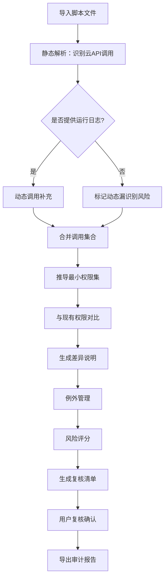

## 1. 产品概述

脚本权限最小化平台——帮助运维团队从脚本源码与运行日志中推导真实云API调用，自动生成最小权限集，管理例外与通配风险，输出可复核审计报告的本地化工具。

- 解决问题：大量脚本申请了过大的云权限，审计无法快速定位最小权限集
- 目标用户：云平台运维工程师、安全审计人员、权限管理员

## 2. 核心功能

### 2.1 用户角色

| 角色 | 注册方式 | 核心权限 |
|------|----------|----------|
| 运维工程师 | 本地登录 | 导入脚本、查看分析、管理例外 |
| 审计人员 | 本地登录 | 查看报告、复核权限、导出报告 |

### 2.2 功能模块

1. **导入页**：上传脚本文件（.sh/.py/.ps1/.yaml）、粘贴代码、选择云平台类型（AWS/阿里云/腾讯云/GCP）
2. **分析总览页**：全局仪表盘，展示脚本数量、权限统计、风险分布、例外状态
3. **脚本详情页**：脚本文件内容、识别的云API调用列表、静态解析结果、动态调用补充
4. **权限推导页**：现有权限 vs 推导最小权限对比、权限差异说明、操作建议
5. **例外管理页**：例外申请、审批、到期提醒、长期有效例外风险标注
6. **风险评分页**：动态调用漏识别风险、通配权限过大风险、例外长期有效风险，含原因/影响/下一步
7. **审计报告页**：复核清单、权限变更方案、报告导出（JSON/CSV/Markdown）

### 2.3 页面详情

| 页面名称 | 模块名称 | 功能描述 |
|----------|----------|----------|
| 导入页 | 文件上传区 | 拖拽或点击上传脚本文件，支持批量上传 |
| 导入页 | 代码粘贴区 | 直接粘贴脚本代码进行快速分析 |
| 导入页 | 云平台选择 | 选择目标云平台，影响权限模板和API识别规则 |
| 导入页 | 导入历史 | 展示最近导入记录，点击可跳转详情 |
| 分析总览页 | 统计卡片 | 脚本总数、API调用总数、权限总数、高风险项数 |
| 分析总览页 | 权限分布图 | 按云服务分类的权限使用分布 |
| 分析总览页 | 风险雷达 | 动态漏识别、通配过大、例外长期有效三大风险维度 |
| 分析总览页 | 最近活动 | 最近分析、例外变更、报告生成等操作日志 |
| 脚本详情页 | 脚本源码 | 语法高亮显示脚本内容，标注API调用位置 |
| 脚本详情页 | API调用列表 | 识别出的所有云API调用，标注静态/动态来源 |
| 脚本详情页 | 运行日志 | 脚本执行时的实际API调用日志记录 |
| 脚本详情页 | 现有权限 | 脚本当前绑定的权限策略列表 |
| 权限推导页 | 权限对比表 | 现有权限与推导最小权限并列对比，高亮差异 |
| 权限推导页 | 差异说明 | 每项差异的原因说明（冗余/缺失/通配替换） |
| 权限推导页 | 操作建议 | 一键应用最小权限、逐项确认、标记为例外 |
| 例外管理页 | 例外列表 | 所有例外条目，含状态（待审批/已批准/已过期） |
| 例外管理页 | 例外详情 | 例外原因、影响范围、到期时间、关联脚本 |
| 例外管理页 | 风险标注 | 长期有效例外标红，显示风险原因和影响 |
| 例外管理页 | 审批操作 | 批准/拒绝/修改有效期 |
| 风险评分页 | 动态调用漏识别 | 列出可能的动态调用，原因分析，影响范围，建议操作 |
| 风险评分页 | 例外长期有效 | 列出长期有效的例外，原因分析，影响范围，建议操作 |
| 风险评分页 | 通配权限过大 | 列出通配符权限，原因分析，影响范围，建议操作 |
| 风险评分页 | 综合评分 | 脚本整体风险评分（0-100），分维度展示 |
| 审计报告页 | 复核清单 | 所有权限变更项的待复核列表，支持逐项确认 |
| 审计报告页 | 变更方案 | 最小权限方案的完整描述，含变更前后对比 |
| 审计报告页 | 报告导出 | 导出为JSON/CSV/Markdown格式 |
| 审计报告页 | 历史报告 | 之前生成的报告列表，支持重新下载 |

## 3. 核心流程

用户上传脚本 → 系统静态解析识别云API调用 → 用户补充运行日志（可选）→ 系统合并静态+动态调用 → 推导最小权限集 → 与现有权限对比 → 标记例外与风险 → 生成复核清单 → 用户复核确认 → 导出审计报告

## 4. 用户界面设计

### 4.1 设计风格

- 主色调：深灰蓝（#1a1f2e）背景 + 翡翠绿（#10b981）强调色，传递安全与专业的视觉印象
- 辅助色：琥珀橙（#f59e0b）用于风险警告，玫红（#ef4444）用于高风险标注
- 按钮风格：圆角8px，主按钮实心绿，次按钮描边，危险按钮实心红
- 字体：JetBrains Mono用于代码区域，Noto Sans SC用于中文界面
- 布局风格：左侧固定导航栏 + 右侧内容区，卡片式内容分区
- 图标风格：线性图标（Lucide），统一2px描边

### 4.2 页面设计概览

| 页面名称 | 模块名称 | UI元素 |
|----------|----------|--------|
| 导入页 | 文件上传区 | 虚线边框拖拽区，上传图标，支持格式提示 |
| 导入页 | 代码粘贴区 | 等宽字体代码编辑器，行号显示 |
| 导入页 | 云平台选择 | 卡片式单选，含平台Logo和名称 |
| 分析总览页 | 统计卡片 | 四宫格大数字卡片，带图标和趋势箭头 |
| 分析总览页 | 权限分布图 | 横向柱状图，按服务分类 |
| 分析总览页 | 风险雷达 | 三维雷达图，三个风险维度 |
| 脚本详情页 | 脚本源码 | 语法高亮代码区，行号，API调用位置标点 |
| 脚本详情页 | API调用列表 | 表格，含来源标签（静态/动态） |
| 权限推导页 | 权限对比表 | 双列表格，差异行高亮，含操作按钮 |
| 例外管理页 | 例外列表 | 表格，状态标签彩色，风险项标红 |
| 风险评分页 | 风险卡片 | 三张风险卡片，含评分环、原因、影响、建议 |
| 审计报告页 | 复核清单 | 勾选列表，支持批量操作 |

### 4.3 响应式设计

桌面优先设计，最小宽度1280px，关键数据区域在1024px以上保持可用

### 4.4 3D场景指引

不适用
