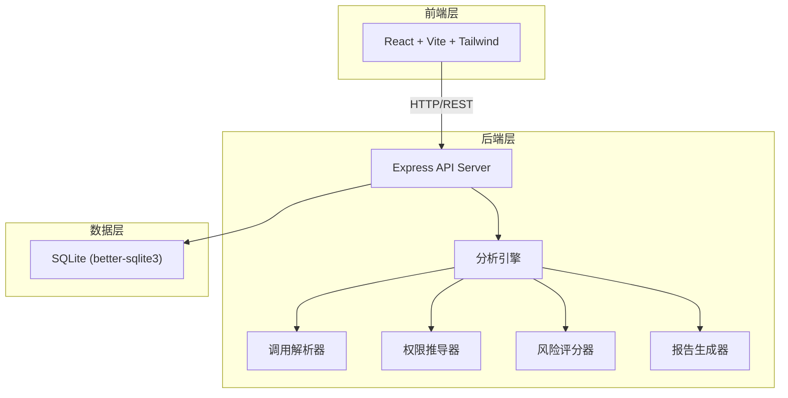
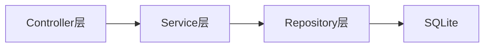
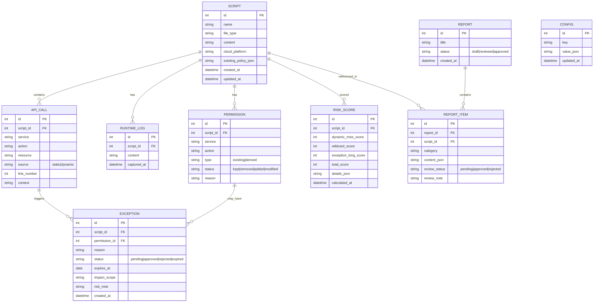

## 1. 架构设计



## 2. 技术说明

- 前端：React@18 + TailwindCSS@3 + Vite + Zustand
- 初始化工具：vite-init（react-express-ts 模板）
- 后端：Express@4 + TypeScript（ESM格式）
- 数据库：SQLite（better-sqlite3），数据持久化，重启不丢失
- 图表：Recharts（权限分布、风险雷达、评分环）

## 3. 路由定义

| 路由 | 用途 |
|------|------|
| / | 分析总览仪表盘 |
| /import | 导入脚本页面 |
| /scripts/:id | 脚本详情页 |
| /permissions/:id | 权限推导页 |
| /exceptions | 例外管理页 |
| /risks | 风险评分页 |
| /reports | 审计报告页 |

## 4. API定义

### 4.1 脚本导入

```
POST   /api/scripts/import          上传脚本文件/代码
GET    /api/scripts                  获取脚本列表
GET    /api/scripts/:id              获取脚本详情（含源码、API调用、现有权限）
DELETE /api/scripts/:id              删除脚本
```

### 4.2 API调用解析

```
POST   /api/scripts/:id/parse       触发静态解析
POST   /api/scripts/:id/runtime-log 上传运行日志
GET    /api/scripts/:id/calls       获取识别的API调用列表
```

### 4.3 权限推导

```
POST   /api/scripts/:id/derive      触发权限推导
GET    /api/scripts/:id/permissions  获取权限对比（现有 vs 最小）
PUT    /api/scripts/:id/permissions  应用最小权限方案
```

### 4.4 例外管理

```
GET    /api/exceptions               获取例外列表
POST   /api/exceptions               创建例外
PUT    /api/exceptions/:id           更新例外（审批/修改有效期）
DELETE /api/exceptions/:id           删除例外
```

### 4.5 风险评分

```
GET    /api/risks/overview           风险总览
GET    /api/risks/dynamic-miss       动态调用漏识别详情
GET    /api/risks/exception-long     例外长期有效详情
GET    /api/risks/wildcard-over      通配权限过大详情
GET    /api/scripts/:id/risk-score   单脚本风险评分
```

### 4.6 审计报告

```
GET    /api/reports                  获取报告列表
POST   /api/reports/generate         生成报告
GET    /api/reports/:id              获取报告详情
GET    /api/reports/:id/export?format=json|csv|md  导出报告
PUT    /api/reports/:id/review       复核确认
```

### 4.7 仪表盘

```
GET    /api/dashboard/stats          统计数据
GET    /api/dashboard/activities     最近活动
```

### 4.8 配置持久化

```
GET    /api/config                   获取配置
PUT    /api/config                   保存配置
```

## 5. 服务端架构图



- Controller：路由处理、参数校验
- Service：业务逻辑（解析、推导、评分、报告）
- Repository：数据访问（better-sqlite3 封装）

## 6. 数据模型

### 6.1 数据模型定义



### 6.2 数据定义语言

```sql
CREATE TABLE script (
    id INTEGER PRIMARY KEY AUTOINCREMENT,
    name TEXT NOT NULL,
    file_type TEXT NOT NULL DEFAULT 'sh',
    content TEXT NOT NULL,
    cloud_platform TEXT NOT NULL DEFAULT 'aws',
    existing_policy_json TEXT DEFAULT '[]',
    created_at TEXT DEFAULT (datetime('now')),
    updated_at TEXT DEFAULT (datetime('now'))
);

CREATE TABLE api_call (
    id INTEGER PRIMARY KEY AUTOINCREMENT,
    script_id INTEGER NOT NULL REFERENCES script(id) ON DELETE CASCADE,
    service TEXT NOT NULL,
    action TEXT NOT NULL,
    resource TEXT DEFAULT '*',
    source TEXT NOT NULL DEFAULT 'static',
    line_number INTEGER,
    context TEXT
);

CREATE TABLE runtime_log (
    id INTEGER PRIMARY KEY AUTOINCREMENT,
    script_id INTEGER NOT NULL REFERENCES script(id) ON DELETE CASCADE,
    content TEXT NOT NULL,
    captured_at TEXT DEFAULT (datetime('now'))
);

CREATE TABLE permission (
    id INTEGER PRIMARY KEY AUTOINCREMENT,
    script_id INTEGER NOT NULL REFERENCES script(id) ON DELETE CASCADE,
    service TEXT NOT NULL,
    action TEXT NOT NULL,
    type TEXT NOT NULL DEFAULT 'existing',
    status TEXT NOT NULL DEFAULT 'kept',
    reason TEXT
);

CREATE TABLE exception (
    id INTEGER PRIMARY KEY AUTOINCREMENT,
    script_id INTEGER NOT NULL REFERENCES script(id) ON DELETE CASCADE,
    permission_id INTEGER REFERENCES permission(id),
    reason TEXT NOT NULL,
    status TEXT NOT NULL DEFAULT 'pending',
    expires_at TEXT,
    impact_scope TEXT,
    risk_note TEXT,
    created_at TEXT DEFAULT (datetime('now'))
);

CREATE TABLE risk_score (
    id INTEGER PRIMARY KEY AUTOINCREMENT,
    script_id INTEGER NOT NULL REFERENCES script(id) ON DELETE CASCADE,
    dynamic_miss_score INTEGER DEFAULT 0,
    wildcard_score INTEGER DEFAULT 0,
    exception_long_score INTEGER DEFAULT 0,
    total_score INTEGER DEFAULT 0,
    details_json TEXT DEFAULT '{}',
    calculated_at TEXT DEFAULT (datetime('now'))
);

CREATE TABLE report (
    id INTEGER PRIMARY KEY AUTOINCREMENT,
    title TEXT NOT NULL,
    status TEXT NOT NULL DEFAULT 'draft',
    created_at TEXT DEFAULT (datetime('now'))
);

CREATE TABLE report_item (
    id INTEGER PRIMARY KEY AUTOINCREMENT,
    report_id INTEGER NOT NULL REFERENCES report(id) ON DELETE CASCADE,
    script_id INTEGER NOT NULL REFERENCES script(id),
    category TEXT NOT NULL,
    content_json TEXT NOT NULL DEFAULT '{}',
    review_status TEXT NOT NULL DEFAULT 'pending',
    review_note TEXT
);

CREATE TABLE config (
    id INTEGER PRIMARY KEY AUTOINCREMENT,
    key TEXT NOT NULL UNIQUE,
    value_json TEXT NOT NULL DEFAULT '{}',
    updated_at TEXT DEFAULT (datetime('now'))
);

CREATE INDEX idx_api_call_script ON api_call(script_id);
CREATE INDEX idx_permission_script ON permission(script_id);
CREATE INDEX idx_exception_script ON exception(script_id);
CREATE INDEX idx_risk_score_script ON risk_score(script_id);
CREATE INDEX idx_report_item_report ON report_item(report_id);
CREATE INDEX idx_report_item_script ON report_item(script_id);
```
